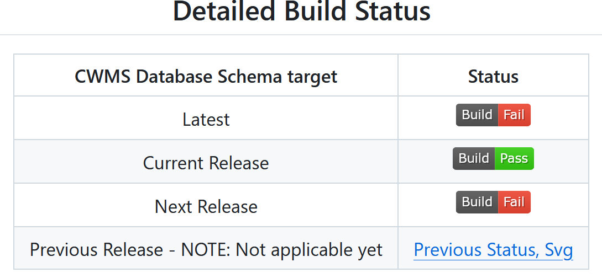
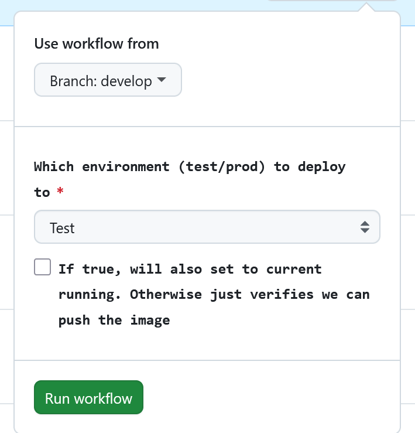

# Releases and Deployments

(NOTE: except for dev/develop) this procedure is not in place, at least for deployments. Up to test will work, but is not active. The
current process is not easily shared and is getting replace within the next few months so we will not spend time documenting them.
However, developers authorized to generated a release that should go to one of the environents can still use this process to prepare
release for that manual deployment.

Releases are anything publish to the (releases)[https://github.com/usace/cwms-data-api/releases] page and can be uses for a local 
deployment or testing.

Deployments are specific to USACE's official CWMS dev,test, and prod environments and are controlled by authorized USACE staff.
Additionally deployments are made from a specific release, except for the dev environment and develop branch a deployment cannot be 
made without a release.

For deployments there are github action "environemnts" that hold appropriate secrets and properties for values specific to that given
environment. Github actions that perform deployments are environment aware and will use them as required.

## Naming

Calendar Version is used in this project. Previous attempts are SemVer ened up, to say the least, non-sensical. There were
too many changes too fast, and continue to be. Additionally the database schema backing the API uses Calender Versioning as well 
and the use of the same here makes it more obivious how out-of-sync they may be.

Releases and deployments are based on tags. Tags must follow the following formatting (regular expressions are used for variable 
portions):

| environment | tag/branch  | description |
| ------------ | ---- | ----- |
| dev          | tag -> `\d\d\d\d\.\d\d\.\d\d-dev[a-z]+` | Tagged can be deployed to the dev environment if desired. That deployment will be overridden at night. These tags are most useful for downstream testing |
| test | tag -> `\d\d\d\d\.\d\d\.\d\d-test[a-z]+` | Releases with this tag and be pushed to the test environment. The `[a-z]+` section is used for times where an additional deployment is required within a day, such as a simple bug fix. |
| prod | tag -> `\d\d\d\d\.\d\d\.\d\d(-[a-z]+)?` | Production releases, tags matching this environment can be deployed to production. Most downstream usages should target these releases if not running tests in a matrix. |
| n/a | branch -> develop | The current develop branch is "released" and deployed nightly. OCI Images are tagged with the `develop` , `sha-<sha hash>`,  `develop-YYYY.MM.DD-HHMMSS`, and  `develop-YYYY.MM.DD`  |

## Releases

The actual release will consist of the following elements:

1. A war file available under the (releases)[https://github.com/usace/cwms-data-api/releases] page
2. OCI container images available at `docker pull ghcr.io/usace/cwms-data-api:<tag>`
    1. Note that there may be multiple tags for the same image, use what is appropriate to your current operation.

### Creating a Release

The project uses trunk based development. All releases are directly from the develop branch, *except* for specific hotfixes on an
as-needed basis. More information available in the deployment section

Tag as follows:

1. A given version is behaving in dev and it should be in test
2. Tag that commit with the appropriate test tag.
3. Once that version has shown to behave in the test environment, tag that *same* commit with the appropriate release tag

To create a release perform the following steps

1. Go to the (releases)[https://github.com/usace/cwms-data-api/releases] and draft a new release (unless directly releasing or deploying) the `develop` target, that release already exists
1. If deploying/releasing develop directly, skip the following steps. The process is different.
2. Select "draft new release"
3. If tagging the current state of develop follow github release prodecures to create a tag in the CalVer format and select "create new tag" and use the same name for the release as the tag.
4. Publish release. Unless a prod release, check the pre-release box.
5. NOTE: the details will be filled in by the triggered github actions.

#### Releasing "develop"

Go to the repositories "actions" tab and find the Nightly Releases - Build action. Click "Run workflow" and accept the defaults:

# Deployments

## Deploying Develop

Deployment of develop can be done without the initial release step. The process is the same as generating a release for develop except
that the Nightly Releases - Schedule action is used. This action will build the release and they deploy it.

## Deployments in general

Deployments in the various environment are expected to work. However, Each environment may be targetting a different database schema
version. 

The projects automated tests target the latest developemnt version of the database, the current release version of the database, and
the previous release version of the database, and the next version of the database. The main (README.md)[README.md] will show the
compatility of the API with each schema version as shown below:

Verify which database version your target environment is using before deploying a new version of CDA to that environment.

Test for the latest schema are usually failing. Most often this is for a known database change that hasn't been accounted for yet.
While it is recommended that a deployed version be compatible with the next release there are valid reasons to bypass that restriction
for testing.

A CDA version that is not passing for the Current Release *should never be deployed* to test or prod, especially prod.

### To perform a deployment.

First, except for deploying `develop` to `dev`, create a release with the appropriate tag. You will then need to wait for the OCI 
images to be build. You may monitor the "Tagged Release" action for progress.

After the images are ready go to the Deploy action in the actions tab and select "Run workflow".

To choose your release, use the "workflow from" selector and switch viewing by "tag", select the desired version.

Choose your environment as appropriate to the tag. The logic of the deployment prevents tags that don't match the expected naming 
scheme from running. E.g. you can't tag something test and deploy it to prod.

By default, the containers are pushed to the appropriate register, but only tagged (in the OCI naming sense) with the given Release tag.
If you check the activate checkbox, with the descripotion "If true, will also..." the given release will become live in that
environment.

Once you have configured the options appropriately, click "Run workflow."

You can monitor the progress of the action from the new instances that will show up in the list.

As this is just pushing images to the registry it *should* be fast. However, the actual activation by the environment is not
deterministic, this action only pushes the images. It does not verify if anything actually changed or worked. You will have to use the
monitoring tools appropriate to the given environment to determine if the new version is getting used.

