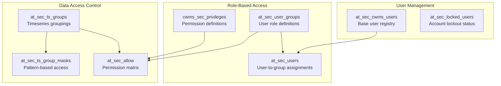

# Current Oracle VPD Architecture & Analysis

## Executive Summary

Oracle Virtual Private Database (VPD) has served as the core authorization mechanism for CWMS, providing row-level security and office-based data isolation. While effective for basic access control, VPD cannot meet the modern, persona-driven, and policy-based requirements outlined in the PWS. This section analyzes the current VPD implementation, its strengths and limitations, and outlines a migration path to a more flexible, auditable, and future-proof authorization architecture using Open Policy Agent (OPA).

Note on Q‑38: Throughout this report we reference “Q‑38,” the solicitation Q&A item that documents the limitations of the current office‑centric RBAC approach. In short: “You can modify data for a given office” and “You can administer users in a given office,” with sensitive third‑party data withheld from public systems to avoid embargo issues. Q‑38 defines today’s baseline (Modifier/Admin at the office scope) and motivates the persona‑ and policy‑based model. A deeper analysis appears in [Section 4: CRUD‑Permission Gap Analysis](./RptSec4-CRUDGapAnalysis.md#q-38-role-model-and-its-limitations), including the [verbatim source](./RptSec4-CRUDGapAnalysis.md#verbatim-source-from-solicitation-qa).

## The Q-38 Model: Background

“Q‑38” refers to Question 38 from the solicitation’s Q&A, which describes the current RBAC baseline and its constraints. In practical terms:

- Modify data only within your assigned office (district)
- Administer users only within your assigned office
- To avoid embargo conflicts, sensitive third‑party data is not published to public national systems

Why this matters: these office‑centric constraints cannot express the persona‑specific, time‑based, and parameter‑level rules required by PWS Exhibit 3 and interview‑refined roles, motivating a persona‑driven, policy‑as‑code approach (OPA) elaborated in [Section 3](./RptSec3-UseCases.md) and [Section 5](./RptSec5-PolicyCandidates.md).

This baseline is summarized here and analyzed in detail in [Section 4](./RptSec4-CRUDGapAnalysis.md#q-38-role-model-and-its-limitations).

The Q‑38 model refers to the legacy CWMS role-based access control scheme, which defines only two privileges at the office (district) level:

| Role            | Description                                                                 |
|-----------------|-----------------------------------------------------------------------------|
| **Modifier**     | Can create, update, and delete data for their assigned office.             |
| **Administrator** | Includes modifier rights, and can also manage user roles in their office. |

This model is simple and office-centric, but lacks support for fine-grained personas, time-based rules, and modern audit requirements. See the CRUD Gap Analysis section for a detailed comparison.

### Security and Audit Gaps in Current VPD

- **No justification logging**: Modifications are not accompanied by user-provided reasons or justifications.
- **Limited auditability**: VPD enforces access but does not provide a detailed audit trail of authorization decisions or policy evaluations.
- **No support for two-person approval**: Cannot enforce workflows requiring multiple approvals for sensitive actions.
- **No parameter-level filtering**: Cannot restrict access to specific parameters or data fields.
- **No time-based or contextual rules**: Lacks support for embargoes, shift windows, or emergency overrides.

## Glossary

- **VPD**: Virtual Private Database (Oracle feature for row-level security)
- **OPA**: Open Policy Agent (policy-as-code engine)
- **CRUD**: Create, Read, Update, Delete (basic data operations)
- **PWS**: Performance Work Statement (requirements document)
- **Persona**: A user type or role with specific access needs
- **Q-38**: Legacy CWMS role model with office-centric permissions


## Current VPD Implementation

The CWMS database uses Oracle's Virtual Private Database (VPD) technology to enforce row-level security through database policies. The implementation consists of security tables, stored procedures, and database policies that automatically filter data based on user context.

### Security Schema Structure

#### Core Security Tables



#### Current User Groups (Q-38 Compatible)

| Group Code | Group ID         | Description                     | Current Usage              |
| ---------- | ---------------- | ------------------------------- | -------------------------- |
| 0          | CWMS DBA Users   | Super users with all privileges | System administration      |
| 1          | CWMS PD Users    | Full database write access      | Data collection/management |
| 7          | CWMS User Admins | User management capabilities    | Account administration     |
| 10         | All Users        | General CWMS users              | Basic access               |
| 11         | CWMS Users       | Routine users                   | Standard operations        |
| 12         | Viewer Users     | Limited access users            | Read-only access           |

### VPD Session Context Management

The current implementation uses the `CWMS_ENV` package to set database session context:

#### Session Context Setup (AuthDao.java:60-65)

```java
private static final String SET_API_USER_DIRECT = "begin "
    + "cwms_env.set_session_user_direct(upper(?));"
    + "end;";

private static final String SET_API_USER_DIRECT_WITH_OFFICE = "begin "
    + "cwms_env.set_session_user_direct(upper(?),upper(?)); end;";
```

#### Data Filtering Process

1. **Authentication**: User credentials validated via API key or JWT
2. **Session Setup**: `CWMS_ENV.set_session_user_direct()` establishes user context
3. **Automatic Filtering**: VPD policies automatically apply WHERE clauses
4. **Office Isolation**: Data restricted to user's assigned office(s)

### Current VPD Limitations vs PWS Requirements

#### What VPD Handles Well

- **Office-based filtering**: Automatic restriction to assigned offices
- **Basic role enforcement**: Simple read/write permissions
- **User group management**: Hierarchical role assignments

#### Critical Gaps for PWS Exhibit 3 Personas

| PWS Persona          | VPD Limitation              | Required Enhancement                    |
| -------------------- | --------------------------- | --------------------------------------- |
| **Dam Operator**     | No data source restrictions | Cannot enforce MANUAL-only constraint   |
| **Water Manager**    | No time-based rules         | Cannot implement embargo override       |
| **Data Manager**     | No audit requirements       | Cannot enforce justification logging    |
| **Auto Collector**   | No append-only enforcement  | Cannot prevent historical modifications |
| **Auto Processor**   | No derived data distinction | Cannot restrict to calculated outputs   |
| **External Partner** | No parameter filtering      | Cannot whitelist specific parameters    |

### Database Schema Modifications Needed

These are the database schema modifications we believe would be needed in order to support our proposed solution.  We are proposing to add three new tables and make two small DDL alterations to existing tables.


#### New Tables for OPA Integration

```sql
-- User persona assignments (replacing simple user groups)
CREATE TABLE cwms_auth_user_personas (
    user_id VARCHAR2(128),
    persona_code VARCHAR2(32),
    office_code NUMBER,
    effective_date DATE,
    expiry_date DATE,
    constraints JSON  -- Persona-specific constraints
);

-- Office-specific configuration
CREATE TABLE cwms_auth_office_config (
    office_code NUMBER,
    embargo_hours NUMBER DEFAULT 168,  -- 7 days
    timezone VARCHAR2(32),
    manual_entry_window_hours NUMBER DEFAULT 24
);

-- Authorization audit trail
CREATE TABLE cwms_auth_decisions (
    decision_id NUMBER,
    user_id VARCHAR2(128),
    resource_type VARCHAR2(64),
    operation VARCHAR2(16),
    decision VARCHAR2(16),  -- ALLOW/DENY
    policy_version VARCHAR2(32),
    timestamp TIMESTAMP,
    context JSON
);
```

#### Existing Table Enhancements

```sql
-- Add persona tracking to existing user table
ALTER TABLE at_sec_cwms_users ADD (
    primary_persona VARCHAR2(32),
    persona_constraints JSON,
    last_policy_sync TIMESTAMP
);

-- Add data source tracking to timeseries
ALTER TABLE at_cwms_ts_data ADD (
    data_source VARCHAR2(16) DEFAULT 'UNKNOWN',
    source_system VARCHAR2(64),
    entry_method VARCHAR2(16)  -- MANUAL, AUTOMATED, CALCULATED
);
```

### VPD Migration Strategy

#### Phase 1: Parallel Operation

- **Current VPD**: Continues operating for existing functionality
- **OPA Layer**: Added as overlay for enhanced authorization
- **Data Flow**: Authorization Service → OPA decision → VPD context

#### Phase 2: Gradual Migration

- **Office-by-office**: Migrate one office at a time
- **Validation**: Compare OPA vs VPD decisions
- **Rollback**: Ability to disable OPA per office

#### Phase 3: VPD Removal

Once OPA proves reliable and complete:

```sql
-- Remove VPD policies
DROP POLICY cwms_ts_data_policy ON at_cwms_ts_data;
DROP POLICY cwms_location_policy ON at_physical_location;

-- Remove security context procedures
DROP PROCEDURE cwms_env.set_session_user_direct;
DROP PROCEDURE cwms_env.set_session_office_id;

-- Simplify schema by removing VPD-specific tables
DROP TABLE at_sec_allow;
DROP TABLE at_sec_ts_group_masks;
-- (Keep user/group tables for reference)
```

### Integration Points with Authorization Service

#### Current Java API Integration (AuthDao.java)

- **Line 179-192**: Session context setup for database connections
- **Line 291-307**: Role retrieval for authorization decisions
- **Line 346-361**: Basic role validation logic

#### Enhanced Integration with OPA

The Authorization Service will:

1. **Intercept requests** before they reach Java API
2. **Make authorization decisions** using OPA policies
3. **Set enhanced context** via `x-cwms-auth-context` header
4. **Maintain VPD compatibility** during transition period

### Performance Considerations

#### Current VPD Performance

- **Query Performance**: VPD adds WHERE clauses to every query
- **Cache Efficiency**: Database-level security context caching
- **Scalability**: Limited by database connection pool size

#### OPA Performance Benefits

- **API-Level Filtering**: Decisions made before database queries
- **Intelligent Caching**: Policy decisions cached independently
- **Reduced Database Load**: Fewer complex queries with VPD conditions

### Migration Phases

| Phase       | Key Activities                                   |
| ----------- | ------------------------------------------------ |
| **Phase 1** | Deploy Authorization Service, parallel operation |
| **Phase 2** | Office-by-office migration, validation           |
| **Phase 3** | VPD removal, schema cleanup                      |

## Conclusion

The proposed OPA-based Authorization Service will:

1. **Maintain compatibility** with existing VPD during migration
2. **Enable complex authorization rules** not possible with database-only policies
3. **Provide better performance** by making decisions at the API layer
4. **Support future migration** to PostgreSQL with minimal changes

The VPD system can be completely removed once the OPA-based authorization is proven reliable, eliminating the complexity of database-level security policies while providing more flexible and maintainable authorization.

