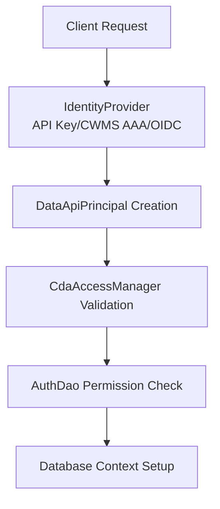

# Section 2: CWMS Data API Inventory and Authorization Architecture Analysis

This section provides a comprehensive inventory and analysis of the CWMS Data API, with a focus on its current authentication and authorization mechanisms. The purpose of this section is to document the structure, endpoints, and security model of the API, serving as a foundation for identifying gaps and recommending improvements to meet the requirements of the PWS (Performance Work Statement). Readers will gain an understanding of the API’s organization, available resources, and how access is currently controlled.

Reference: [CWMS Data API Issue #1153](https://github.com/USACE/cwms-data-api/issues/1153)


## API Reference

The full, interactive API documentation for the CWMS Data API is available via Swagger UI:

[CWMS Data API Swagger UI](https://cwms-data.usace.army.mil/cwms-data/swagger-ui.html)


## API Endpoint Inventory

### Overall Statistics

- **Total Controller Classes**: 96
- **Total REST Endpoints**: 279 (all HTTP methods)
- **Logical Resource Groups**: 62
- **Authentication Methods**: 3 (API Key, CWMS AAA, OpenID Connect)
- **Current Authorization Roles**: 2 primary (CWMS Users, CWMS User Admins)


### Endpoint Categories

The API endpoints are organized into the following categories:

#### Core Data Entities (23 resource types)
Primary data resources, including:
- **Timeseries** (standard, binary, text, profile)
- **Locations** and location metadata
- **Levels** and specified levels
- **Ratings** and rating templates
- **Projects** and project components
- **Streams** and stream reaches
- **Forecasts** (specs and instances)

#### Configuration & Metadata (15 resource types)
System configuration resources, such as:
- **Offices** and office settings
- **Units** and unit conversions
- **Parameters** and parameter definitions
- **Categories** and groupings
- **Lookup types** and standard text

#### Project Sub-entities (12 resource types)
Specialized project components, including:
- **Outlets** and virtual outlets
- **Gate changes** and turbine changes
- **Water users** and contracts
- **Pumps** and accounting

#### Authentication & Authorization (7 resource types)
Security-related endpoints:
- **API Keys** management
- **Users** and user profiles
- **Roles** (limited implementation)
- **Project locks** and lock rights


## Current Authorization Architecture

### Authentication and Authorization Flow




### Key Components

#### 1. CdaAccessManager (`cwms/cda/security/CdaAccessManager.java`)
- Central authorization enforcement point
- Manages rate limiting for protected endpoints
- Prepares database connection context
- Delegates authorization to AuthDao

#### 2. AuthDao (`cwms/cda/data/dao/AuthDao.java`)
- Validates user permissions against required roles
- Manages API key authentication
- Sets Oracle session context via `cwms_env.set_session_user_direct()`
- Interfaces with Oracle VPD for data filtering

#### 3. Role Definition (`cwms/cda/security/Role.java`)
- Simple role implementation
- Currently defines only:
   - CWMS Users (basic authenticated access)
   - CWMS User Admins (user management)
   - CAC User (certificate-based auth)


### Authorization Touchpoints

1. **Route Registration** (`ApiServlet.java`)
   - Example:
     ```java
     crud("/auth/keys/{key-name}", controller, new Role[]{CAC_USER, CWMS_USERS_ROLE})
     ```
2. **Controller Layer**
   - Each controller specifies required roles
   - CRUD operations inherit base permissions
   - No resource-level authorization
3. **Database Layer**
   - Oracle VPD enforces office-based filtering
   - Session context determines data visibility
   - Controls are limited to the database level


## Analysis & Conclusions

The CWMS Data API is comprehensive, supporting a wide range of data and configuration operations through numerous endpoints and resource types. However, the current authorization model is simple and coarse-grained, relying on just two main roles and lacking resource-level (fine-grained) access controls. Security enforcement is centralized in the CdaAccessManager and AuthDao, with Oracle VPD providing office-based data filtering at the database level. While this architecture is robust for basic role-based access and office-level data segregation, it offers limited support for advanced authorization scenarios such as attribute-based access control (ABAC), delegated permissions, or dynamic policy enforcement. The API supports multiple authentication methods, but these are not fully integrated into a unified authorization strategy. To meet more complex or evolving security requirements, enhancements are needed to expand the role model, introduce resource-level permissions, and improve the flexibility and auditability of authorization decisions. The current design does provide a clear integration point for enhanced authorization middleware, which will be necessary to support more granular access control and compliance with future policy requirements.


