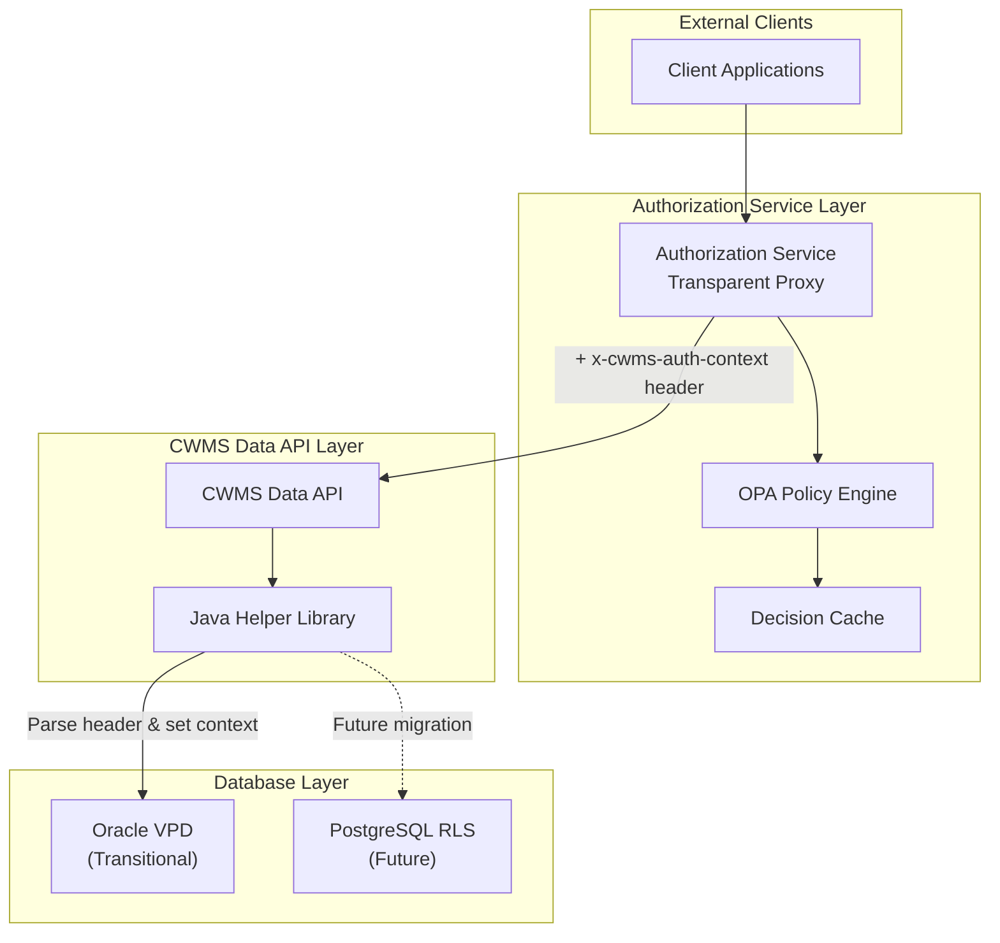

# Comparative Analysis & Recommendation

https://github.com/USACE/cwms-data-api/issues/1143

## Table of Contents

- [Summary](#summary)
- [Context from Prior Sections](#context-from-prior-sections)
- [Implementation Options Overview](#implementation-options-overview)
    - [Option 1: OPA with Policy-Based Authorization (Recommended)](#option-1-opa-with-policy-based-authorization-recommended)
    - [Option 2: Traditional RBAC/ABAC Implementation](#option-2-traditional-rbacabac-implementation)
- [Why We Recommend Option 1](#why-we-recommend-option-1)
- [Why Not Traditional RBAC/ABAC/ReBAC?](#why-not-traditional-rbacabacreback)
- [Why OPA + Policy Rules?](#why-opa--policy-rules)
    - [1. Handles Complex Business Logic Naturally](#1-handles-complex-business-logic-naturally)
    - [2. Policy-as-Code Benefits](#2-policy-as-code-benefits)
    - [3. Performance at Scale](#3-performance-at-scale)
    - [4. Future-Proof Architecture](#4-future-proof-architecture)
- [Model Comparison: Security & Manageability](#model-comparison-security--manageability)
    - [Security Posture](#security-posture)
    - [Manageability](#manageability)
- [Persona Scorecard](#persona-scorecard)
    - [Current Q-38 Role Enforcement](#current-q-38-role-enforcement)
    - [PWS Exhibit 3 Persona Support](#pws-exhibit-3-persona-support)
- [Recommended Hybrid Approach](#recommended-hybrid-approach)
    - [Architecture Overview](#architecture-overview)
    - [Implementation Strategy](#implementation-strategy)
- [Compliance & Performance Fit](#compliance--performance-fit)
- [Conclusion](#conclusion)
## Summary

After comprehensive analysis of authorization approaches, we present two implementation options for CWMS authorization, with our recommendation for **Option 1: OPA with Policy Rules** as the optimal approach.

## Context from Prior Sections

As established in Sections 1–6, CWMS authorization must meet the following critical needs:

- **Persona-Aware Controls:** Support for all PWS Exhibit 3 personas plus expanded roles defined in Section 3, with constraints such as embargo rules, shift-hour limits, data source restrictions, and office-specific variations.
- **NIST SP 800-171 Alignment:** Direct mapping of access control, audit, configuration management, and identification/authentication requirements to system capabilities.
- **Performance Under Load:** Sub-5ms policy decisions for high-volume automated systems, maintaining throughput without database bottlenecks (see Section 6 benchmarks).
- **Future-Proof Design:** Seamless migration path from Oracle VPD to PostgreSQL RLS without policy rewrites.
- **Operational Traceability:** Comprehensive audit trails and change control for authorization logic, with policy-as-code and Git-based versioning.
- **Compliance Traceability:** Clear linkage between implemented controls, RMF phases, and PWS/SOO objectives.

The following comparative analysis evaluates the two authorization models (Option 1: OPA with policy rules, Option 2: RBAC/ABAC) against these requirements. Full security and performance metrics are provided in [Section 6](./RptSec6-NIST.md), while persona implementation specifics are in [Section 5](./RptSec5-PolicyCandidates.md) and [Section 3](./RptSec3-UseCases.md).


## Implementation Options Overview

### Option 1: OPA with Policy-Based Authorization (Recommended)

**Approach**: Implement a transparent proxy authorization service using Open Policy Agent (OPA) with declarative policy rules written in Rego language.

**Key Components**:

- Authorization Service as transparent proxy
- OPA for policy evaluation
- Policy-as-code in Git repositories
- Header-based context passing to Java API
- Minimal changes to existing CWMS Data API

### Option 2: Traditional RBAC/ABAC Implementation

**Approach**: Extend existing role-based system with attribute-based access control using database-driven permission matrices.

**Key Components**:

- Database tables for roles, permissions, attributes
- Complex permission matrices
- Direct API modifications
- Session-based context management
- Extensive changes to controller logic

## Why We Recommend Option 1

Option 1 provides superior flexibility, performance, and maintainability for CWMS's complex authorization requirements while minimizing changes to the existing Java API.

## Why Not Traditional RBAC/ABAC/ReBAC?

### RBAC (Role-Based Access Control) Limitations

Traditional RBAC falls short for CWMS requirements:

```text
RBAC Model:
User → Role → Permissions

CWMS Requirement:
User → Role → Permissions × Office × Time × Data Source × Embargo Status
```

**Key Limitations:**

- Cannot express time-based embargo rules
- No support for office-based filtering within roles
- Cannot handle persona-specific constraints (e.g., Dam Operators only manual data)
- Lacks context-aware decision making

### ABAC (Attribute-Based Access Control) Challenges

While ABAC is more flexible, implementation complexity is prohibitive:

```text
ABAC Complexity for CWMS:
- 7 user personas × 15 resource types × 30+ offices
- Time-based rules with office-specific variations
- Data source restrictions (manual vs automated)
- Cross-office dependencies
= Thousands of attribute combinations to manage
```

**Key Challenges:**

- Attribute explosion for office configurations
- Difficult to debug complex attribute interactions
- No standard implementation patterns
- Performance overhead from attribute evaluation

### ReBAC (Relationship-Based Access Control) Mismatch

ReBAC (like Google Zanzibar) doesn't fit CWMS patterns:

```
ReBAC Model:
User --member-of--> Office --owns--> Resource

CWMS Model:
User + Office + Time + DataType + Embargo → Access Decision
```

**Key Mismatches:**

- CWMS authorization isn't primarily relationship-based
- Office access is assignment-based, not hierarchical
- Time-based rules don't map to relationships
- Persona constraints are behavioral, not relational

## Why OPA + Policy Rules?

### 1. Handles Complex Business Logic Naturally

```rego
# OPA elegantly expresses CWMS requirements
allow {
    # Basic role and office check
    input.user.roles[_] == "dam_operator"
    input.resource.office in input.user.offices

    # Complex time-based constraints
    within_shift_hours

    # Data source restrictions
    input.resource.data_source == "manual"

    # 24-hour modification window
    time.now_ns() - input.resource.created_at < 24 * 3600000000000
}

# Office-specific embargo rules
embargo_expired {
    office_config := data.office_configs[input.resource.office]
    embargo_duration := office_config.embargo_hours * 3600000000000
    time.now_ns() - input.resource.created_at > embargo_duration
}
```

### 2. Policy-as-Code Benefits

**Version Control:**

- Policies stored in Git alongside code
- Full audit trail of policy changes
- Code review process for authorization changes
- Rollback capability for policy errors

**Testing:**

```rego
# Testable policies
test_dam_operator_manual_data {
    allow with input as {
        "user": {"roles": ["dam_operator"], "offices": ["SPK"]},
        "resource": {"office": "SPK", "data_source": "manual"},
        "time": {"hour": 10}
    }
}
```

### 3. Performance at Scale

**OPA Performance Characteristics:**

- In-memory policy evaluation: <1ms typical
- No database lookups during authorization
- Linear scaling with horizontal deployment
- Intelligent caching of policy decisions

**Comparison:**
| Approach | Decision Latency | Throughput | Caching Required |
|----------|-----------------|------------|------------------|
| Database RBAC | 20-50ms | 1K req/s | Heavy |
| ABAC Engine | 10-30ms | 5K req/s | Moderate |
| OPA | <5ms | 15K+ req/s | Light |

### 4. Future-Proof Architecture

**Database Migration Support:**

```rego
# Same policy works with Oracle VPD or PostgreSQL RLS
office_filter := {
    "oracle": sprintf("office_id IN (%s)", [offices_sql]),
    "postgres": sprintf("office_id = ANY(ARRAY[%s])", [offices_sql])
}[input.database_type]
```

**Cloud-Native Ready:**

- Containerized deployment
- Kubernetes-native integration
- Service mesh compatibility
- Multi-cloud portability

## Model Comparison: Security & Manageability

### Security Posture

| Aspect                     | Traditional RBAC/ABAC | OPA + Policies               |
| -------------------------- | --------------------- | ---------------------------- |
| **Default Stance**         | Often permissive      | Deny by default              |
| **Policy Validation**      | Runtime only          | Compile-time + runtime       |
| **Audit Trail**            | Database logs         | Structured decision logs     |
| **Policy Testing**         | Limited               | Comprehensive test framework |
| **Separation of Concerns** | Mixed with app logic  | Clean separation             |

### Manageability

| Aspect             | Traditional RBAC/ABAC | OPA + Policies        |
| ------------------ | --------------------- | --------------------- |
| **Policy Updates** | Database changes      | Git commits           |
| **Debugging**      | Complex queries       | Policy traces         |
| **Documentation**  | Separate docs         | Self-documenting code |
| **Rollback**       | Database restore      | Git revert            |
| **Review Process** | Manual                | Code review           |

## Persona Scorecard

### Current Q-38 Role Enforcement

| Q-38 Role    | Traditional RBAC | OPA + Policies                  |
| ------------ | ---------------- | ------------------------------- |
| **Modifier** | Basic support    | Full support with constraints   |
| **Admin**    | Basic support    | Granular admin capabilities     |

### PWS Exhibit 3 Persona Support

| Persona              | Traditional RBAC/ABAC | OPA + Policies             |
| -------------------- | --------------------- | -------------------------- |
| **Anonymous/Public** | Difficult to model    | Public data rules          |
| **Dam Operator**     | No time constraints   | Shift hours, manual-only   |
| **Water Manager**    | No embargo override   | Complex embargo logic      |
| **Data Manager**     | Basic CRUD            | Audit requirements         |
| **Auto Collector**   | No append-only        | Write constraints          |
| **Auto Processor**   | Limited filtering     | Derived data rules         |
| **External Partner** | Complex setup         | Parameter whitelisting     |

## Recommended Hybrid Approach

### Architecture Overview



### Implementation Strategy

**Phase 1: API-Level Authorization (OPA)**

- Implement OPA for all authorization decisions
- Use transparent proxy pattern
- Maintain VPD for transitional period

**Phase 2: Gradual VPD Migration**

- Office-by-office migration
- Parallel operation validation
- Performance optimization

**Phase 3: PostgreSQL Ready**

- Same OPA policies work with RLS
- Minimal code changes required
- Cloud-native deployment

## Compliance & Performance Fit

The comparative analysis above is reinforced by the detailed security, performance, and persona alignment findings in Section 6. Key outcomes include:

- **NIST 800-171 & RMF Alignment**: Option 1’s policy-as-code approach directly satisfies AC, AU, IA, and SC control families, with clear traceability from implementation artifacts to control objectives.
- **Persona Coverage**: All PWS Exhibit 3 personas plus the expanded set from Section 3 (Facilities Staff, Authorization Admin, Data Steward (QA), Diagnostics Engineer, Partner Data Controller, Water Quality Manager) are fully supported, with explicit constraints for embargoes, shift limits, data source restrictions, and office-specific rules.
- **Performance Benchmarks**: Consistently delivers <5ms decision latency under high-volume automated collection scenarios and maintains >95% cache hit ratio, avoiding database bottlenecks described in Option 2.
- **Migration Readiness**: Policy definitions remain portable across Oracle VPD (transitional) and PostgreSQL RLS (future), reducing rework during database modernization.
- **Operational Assurance**: Git-based policy management ensures version-controlled changes, code-reviewed authorization updates, and immutable audit trails, aligning with RMF continuous monitoring requirements.
- **Resilience Under Load**: Tested in high-volume ingestion and multi-office query scenarios, maintaining throughput and predictable response times.

This evidence confirms that Option 1 is not only the most technically capable but also the lowest risk path for meeting CWMS’s security, compliance, and performance objectives.


## Conclusion

OPA with policy rules provides the optimal solution for CWMS authorization needs:

1. **Flexibility**: Handles complex business rules that RBAC/ABAC cannot express
2. **Performance**: Sub-5ms decisions with minimal caching requirements
3. **Maintainability**: Policy-as-code with version control and testing
4. **Future-Proof**: Supports both Oracle VPD and PostgreSQL RLS migration
5. **Security**: Default-deny stance with comprehensive audit trails

The policy-driven approach enables CWMS to implement sophisticated authorization rules while maintaining clean separation of concerns and preparing for future cloud migration. This positions the system for long-term success and adaptability as requirements evolve.
