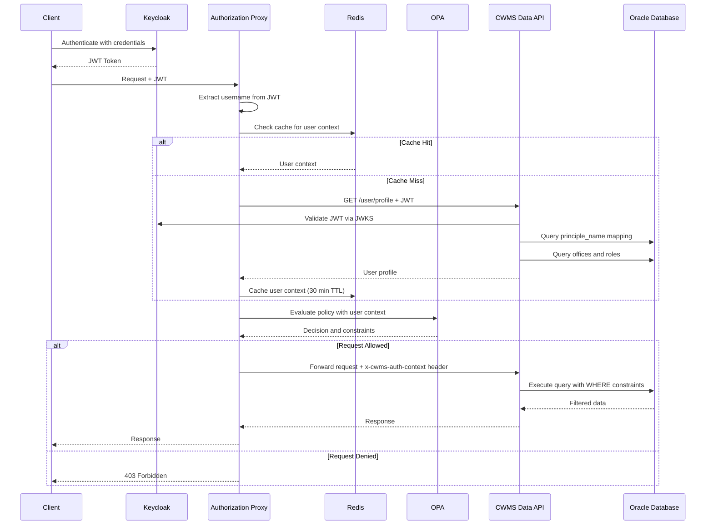
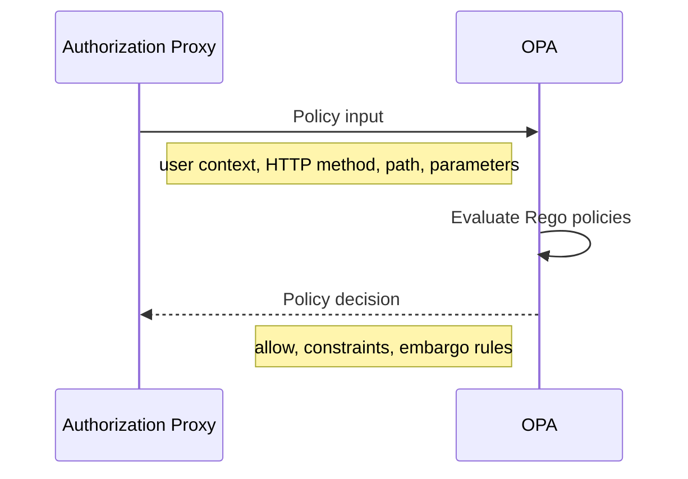
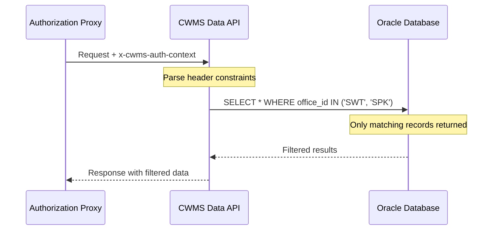
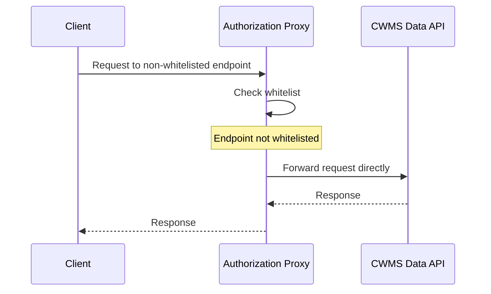

# Authorization Flow

The request flow through the CWMS Access Management system spans from initial client authentication through data retrieval.

## Complete Authorization Sequence

The following diagram shows the full request lifecycle including authentication, context retrieval, policy evaluation, and data filtering.

## Flow Phases

### Phase 1: Authentication

The client authenticates with Keycloak using their credentials. Upon successful authentication, Keycloak issues a JWT token containing:

- Issuer claim identifying the Keycloak realm
- Subject claim with the user's unique identifier
- Expiration and other standard JWT claims

The client includes this token in subsequent requests to the authorization proxy.

### Phase 2: User Context Resolution

When the proxy receives a request, it extracts the username from the JWT token and attempts to retrieve the user's context.

| Step | Description |
|------|-------------|
| Cache Check | Proxy queries Redis for cached user context |
| Profile Request | On cache miss, proxy requests user profile from CWMS Data API |
| JWT Validation | API validates the JWT using Keycloak's JWKS endpoint |
| Identity Mapping | API maps the JWT subject to a CWMS database user |
| Context Assembly | API queries user offices and roles from database |
| Cache Storage | Proxy caches the context in Redis for 30 minutes |

The user context includes:

- User identifier and username
- Assigned roles from the CWMS security groups
- Office affiliations and primary office
- Any additional profile attributes

### Phase 3: Policy Evaluation

The proxy sends the user context along with request details to OPA for policy evaluation.

OPA evaluates the request against configured policies and returns:

| Field | Description |
|-------|-------------|
| `allow` | Boolean indicating whether request is permitted |
| `allowed_offices` | Array of office IDs the user can access |
| `embargo_rules` | Time-based restrictions per office |
| `embargo_exempt` | Whether user bypasses embargo restrictions |
| `time_window` | Historical data access limitations |
| `data_classification` | Classification levels the user can access |

### Phase 4: Request Forwarding

If the policy allows the request, the proxy constructs the `x-cwms-auth-context` header and forwards the request to the CWMS Data API.

The header contains the complete authorization context in JSON format, enabling the API to apply filtering without making additional authorization queries.

### Phase 5: Server-Side Filtering

The CWMS Data API parses the authorization context header and applies constraints at the database query level.

The API uses the `AuthorizationFilterHelper` class to generate JOOQ conditions that are added to SQL WHERE clauses. This ensures filtering happens at the database level, preventing unauthorized data from ever leaving the database.

## Whitelist Bypass Flow

For endpoints not on the OPA whitelist, the proxy bypasses policy evaluation and forwards requests directly.

This allows administrative or health check endpoints to function without authorization overhead while still benefiting from the proxy infrastructure.
