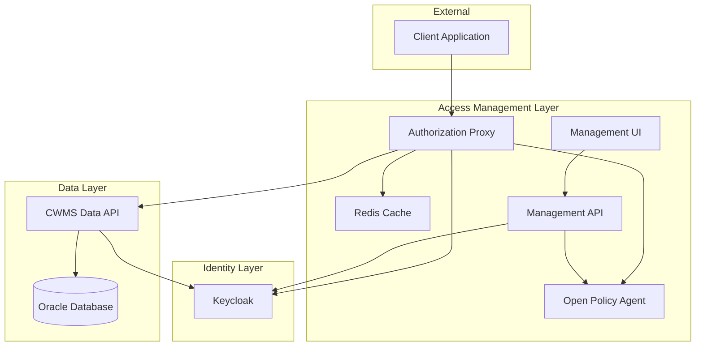
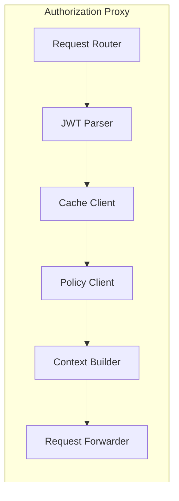
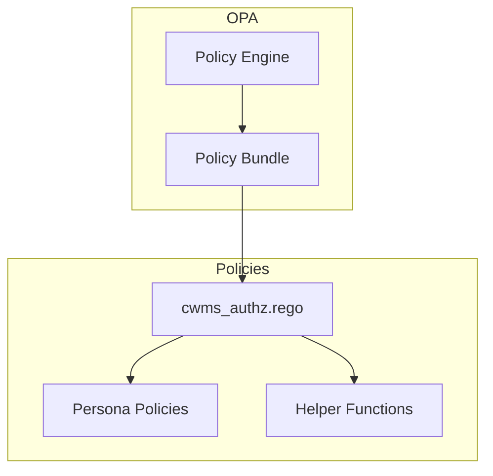
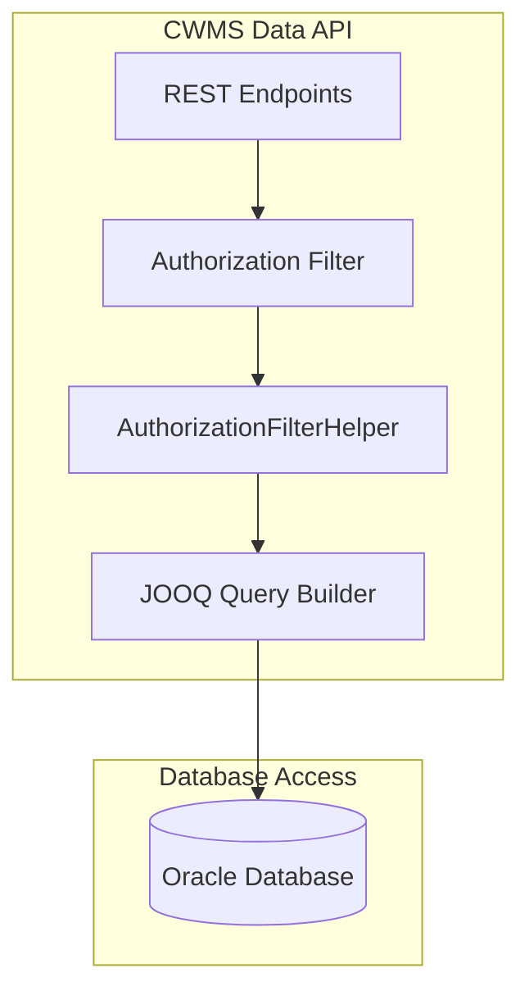
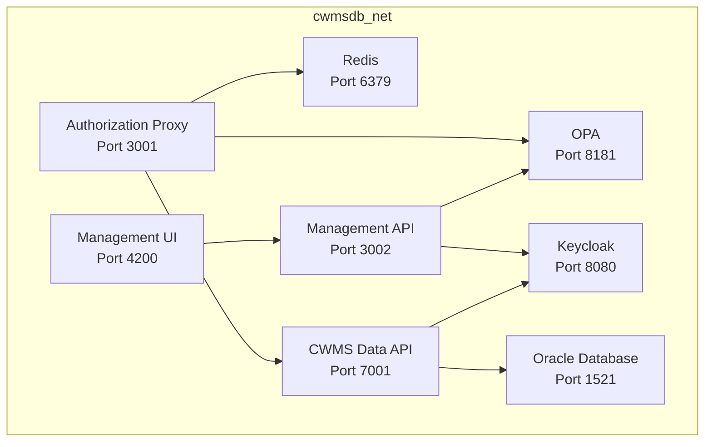
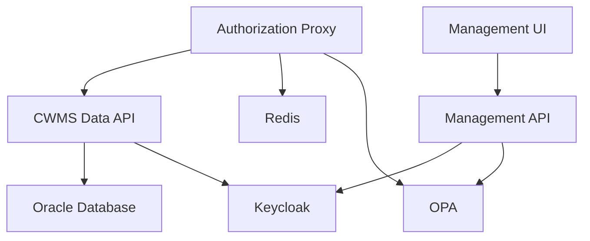

# Component Diagram

The CWMS Access Management system consists of several interconnected components that work together to provide authorization services.

## System Component Diagram

## Component Details

### Authorization Proxy

The authorization proxy is the entry point for all client requests to the CWMS Data API.

| Subcomponent | Responsibility |
|--------------|----------------|
| Request Router | Routes incoming requests based on whitelist configuration |
| JWT Parser | Extracts user identity from JWT tokens |
| Cache Client | Interfaces with Redis for user context caching |
| Policy Client | Communicates with OPA for policy evaluation |
| Context Builder | Constructs the x-cwms-auth-context header |
| Request Forwarder | Forwards authorized requests to the backend API |

### Open Policy Agent

OPA provides policy-based authorization decisions using Rego policies.

Policy structure:

| Policy File | Purpose |
|-------------|---------|
| cwms_authz.rego | Main orchestrator policy |
| personas/public.rego | Anonymous access rules |
| personas/dam_operator.rego | Operational staff rules |
| personas/water_manager.rego | Management staff rules |
| personas/data_manager.rego | Regional manager rules |
| personas/automated_collector.rego | Data collection system rules |
| personas/automated_processor.rego | Data processing system rules |
| personas/external_cooperator.rego | External partner rules |
| helpers/offices.rego | Office metadata and relationships |
| helpers/time_rules.rego | Embargo and time window rules |

### Redis Cache

Redis stores user context to reduce database queries and improve response times.

| Configuration | Value |
|---------------|-------|
| Key Format | `user:context:{username}` |
| TTL | 1800 seconds (30 minutes) |
| Max Memory | 256 MB |
| Eviction Policy | allkeys-lru |
| Persistence | AOF (append-only file) |

### CWMS Data API

The Java backend API provides data access with authorization filtering.

| Component | Responsibility |
|-----------|----------------|
| REST Endpoints | Handle HTTP requests for various data types |
| Authorization Filter | Intercepts requests to extract auth context |
| AuthorizationFilterHelper | Parses header and generates SQL conditions |
| JOOQ Query Builder | Constructs filtered SQL queries |

### Keycloak

Keycloak provides identity management and authentication services.

| Feature | Usage |
|---------|-------|
| User Management | Stores user credentials and attributes |
| JWT Issuance | Issues tokens upon successful authentication |
| JWKS Endpoint | Provides public keys for token validation |
| Realm Configuration | Defines client applications and roles |

### Management Components

The management UI and API provide administrative interfaces for the access management system.

| Component | Technology | Port | Purpose |
|-----------|------------|------|---------|
| Management UI | React 18, Vite, Tailwind | 4200 | Web-based policy management |
| Management API | Node.js, Fastify | 3002 | Backend for management operations |

## Network Topology

All components communicate over a shared container network.

## Data Flow Summary

| Flow | Path | Data |
|------|------|------|
| Client Request | Client to Proxy | JWT token, HTTP request |
| Context Lookup | Proxy to Redis | Username key |
| Profile Request | Proxy to API | JWT token |
| Policy Check | Proxy to OPA | User context, request details |
| Data Request | Proxy to API | Auth context header, original request |
| Database Query | API to Oracle | Filtered SQL query |

## Dependency Graph

Startup order:

1. Oracle Database
2. Keycloak (depends on database for persistence)
3. Redis (no dependencies)
4. OPA (no dependencies)
5. CWMS Data API (depends on database and Keycloak)
6. Authorization Proxy (depends on Redis, OPA, and CWMS Data API)
7. Management API (depends on OPA and Keycloak)
8. Management UI (depends on Management API)
