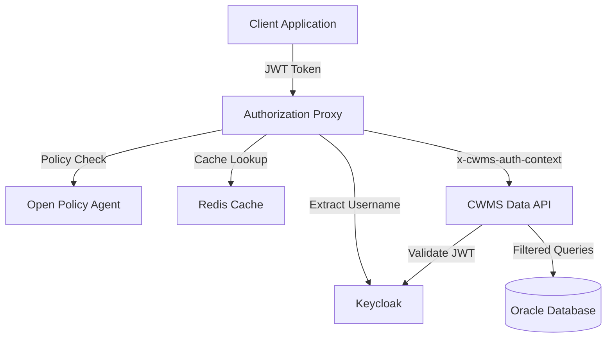

# Architecture Overview

The CWMS Access Management system uses a transparent proxy architecture to provide fine-grained authorization without modifying the core CWMS Data API.

## High-Level Architecture



## Component Overview

### Authorization Proxy

The authorization proxy is a TypeScript application built with Fastify that intercepts all requests to the CWMS Data API. It serves as the central coordination point for authorization.

| Aspect | Details |
|--------|---------|
| Technology | Node.js 24, TypeScript, Fastify |
| Port | 3001 |
| Function | Request interception, policy evaluation, context injection |

Key responsibilities:

- Extract JWT tokens from incoming requests
- Query user context from the CWMS Data API (with Redis caching)
- Evaluate authorization policies via OPA
- Construct and attach the `x-cwms-auth-context` header
- Forward authorized requests to the CWMS Data API

The proxy uses a whitelist pattern where only specified endpoints are subject to OPA policy evaluation. Non-whitelisted endpoints bypass authorization checks and are forwarded directly.

### Open Policy Agent

OPA serves as the centralized policy decision point. All authorization logic resides in Rego policies evaluated by OPA.

| Aspect | Details |
|--------|---------|
| Technology | OPA 0.68.0 |
| Port | 8181 |
| Function | Policy evaluation and constraint generation |

Policy decisions include:

- Whether the request is allowed (`allow: true/false`)
- Filtering constraints to apply at the database level
- Embargo rules for time-sensitive data
- Office-based access restrictions

### Redis Cache

Redis provides caching for user context to reduce database load and improve response times.

| Aspect | Details |
|--------|---------|
| Technology | Redis 7.x |
| Port | 6379 |
| Function | User context caching |

Cache characteristics:

- Key format: `user:context:{username}`
- TTL: 1800 seconds (30 minutes)
- Performance improvement: 10x (2ms vs 20ms)
- Database load reduction: approximately 95%

### CWMS Data API

The Java-based CWMS Data API is the backend service that provides access to water management data stored in the Oracle database.

| Aspect | Details |
|--------|---------|
| Technology | Java 11 |
| Port | 7001 |
| Function | Data retrieval with SQL-level filtering |

The API parses the `x-cwms-auth-context` header and applies constraints at the SQL level using JOOQ conditions. The API does not make authorization decisions; it only enforces constraints specified by the authorization layer.

### Keycloak

Keycloak provides identity management and JWT token services.

| Aspect | Details |
|--------|---------|
| Technology | Keycloak 19.0.1 |
| Port | 8080 |
| Function | Authentication, JWT issuance, token validation |

Users authenticate with Keycloak and receive a JWT token. The token contains the issuer and subject claims used to map the user to their CWMS database identity.

### Oracle Database

The Oracle database stores all CWMS data along with user security information.

| Aspect | Details |
|--------|---------|
| Technology | Oracle 23c Free |
| Port | 1521 |
| Function | Data storage and security metadata |

Key tables and views:

- `at_sec_cwms_users`: Maps user identities to CWMS offices
- `av_sec_users`: Provides user role information

## Detailed Documentation

- [Authorization Flow](authorization-flow.md): Sequence diagrams showing request processing
- [Component Diagram](component-diagram.md): Detailed component relationships

```{toctree}
:maxdepth: 2

authorization-flow
component-diagram
```
