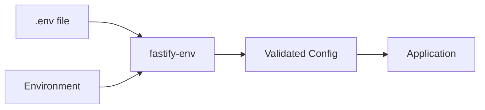

# Configuration Overview

The CWMS Authorization Proxy uses environment variables for all configuration. This approach enables flexible deployment across development, staging, and production environments without code changes.

## Configuration System

The proxy uses [@fastify/env](https://github.com/fastify/fastify-env) to load and validate environment variables at startup. Configuration is validated against a JSON schema, ensuring required values are present and types are correct before the server starts.



## Configuration Categories

| Category | Purpose | Key Variables |
|----------|---------|---------------|
| Server | HTTP server settings | `PORT`, `HOST`, `LOG_LEVEL` |
| CWMS API | Downstream API connection | `CWMS_API_URL`, `CWMS_API_TIMEOUT`, `CWMS_API_KEY` |
| OPA | Policy engine integration | `OPA_URL`, `OPA_POLICY_PATH`, `OPA_WHITELIST_ENDPOINTS` |
| Redis | User context caching | `REDIS_URL` |
| Cache | In-memory cache settings | `CACHE_TTL_SECONDS`, `CACHE_MAX_SIZE` |
| Authorization | Auth behavior control | `BYPASS_AUTH` |

## Loading Configuration

Configuration loads from two sources, with environment variables taking precedence:

1. `.env` file in the application root (loaded via dotenv)
2. Process environment variables

### Development Setup

```bash
# Copy example configuration
cp .env.example .env

# Edit with your local settings
vi .env
```

### Container Deployment

For container deployments, pass environment variables directly:

```bash
podman run -d \
  -e PORT=3001 \
  -e CWMS_API_URL=http://data-api:7000/cwms-data \
  -e OPA_URL=http://opa:8181 \
  -e REDIS_URL=redis://redis:6379 \
  cwms-authorizer-proxy:local-dev
```

Or use the docker-compose file which references the `.env` file:

```bash
podman compose -f docker-compose.podman.yml up -d authorizer-proxy
```

## Applying Configuration Changes

Configuration is read at startup. To apply changes:

### Development Mode

Restart the development server:

```bash
pnpm nx serve authorizer-proxy
```

### Container Mode

Recreate the container (restart alone does not reload environment variables):

```bash
podman compose -f docker-compose.podman.yml down authorizer-proxy
podman compose -f docker-compose.podman.yml up -d authorizer-proxy
```

## Validation

The proxy validates all configuration at startup. If required variables are missing or invalid, the server will fail to start with a descriptive error message.

Required variables:
- `PORT` - Server port (has default)
- `CWMS_API_URL` - Downstream CWMS Data API URL (required, no default in production)

## Related Documentation

```{toctree}
:maxdepth: 1

environment-variables
```
