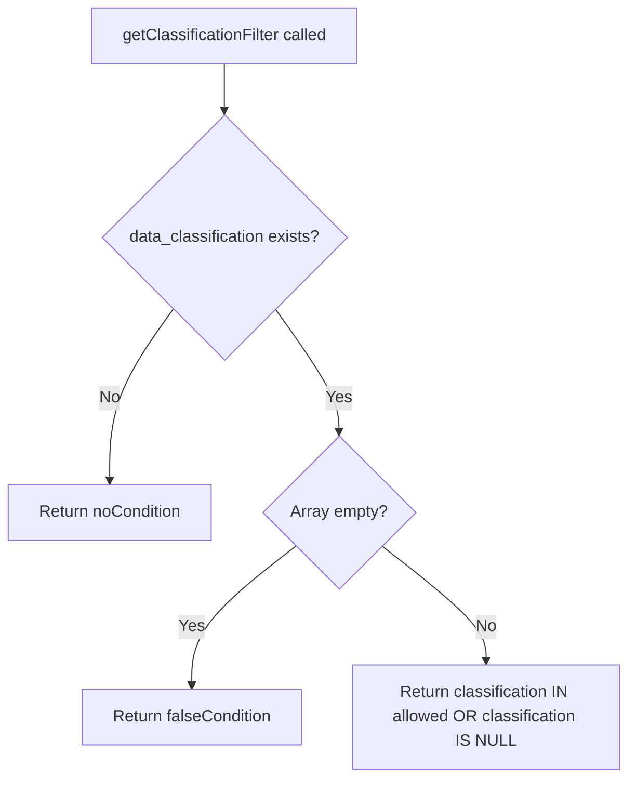

# Data Classification Filtering

Data classification filtering restricts access based on the sensitivity level of data. Each data record can have a classification level, and users can only access data that matches their allowed classifications.

## Classification Levels

CWMS supports multiple classification levels for data:

| Level | Description |
|-------|-------------|
| `public` | Accessible to all authenticated users |
| `internal` | Restricted to internal USACE users |
| `restricted` | Limited to specific authorized personnel |
| `confidential` | Highest sensitivity, very limited access |

## Constraint Format

The authorization proxy includes allowed classifications in the constraints:

```json
{
  "constraints": {
    "data_classification": ["public", "internal"]
  }
}
```

Users with this constraint can access data classified as either "public" or "internal" but not "restricted" or "confidential".

## Filter Behavior



## Implementation

The `getClassificationFilter` method generates the appropriate JOOQ condition:

```java
public Condition getClassificationFilter(Field<String> classificationField) {
    if (constraints == null || !constraints.has("data_classification")) {
        return DSL.noCondition();
    }

    JsonNode classificationNode = constraints.get("data_classification");
    List<String> allowedClassifications = new ArrayList<>();

    if (classificationNode.isArray()) {
        for (JsonNode classification : classificationNode) {
            allowedClassifications.add(classification.asText());
        }
    }

    if (allowedClassifications.isEmpty()) {
        return DSL.falseCondition();
    }

    // Allow matching classifications OR null (unclassified data)
    return DSL.or(
        classificationField.in(allowedClassifications),
        classificationField.isNull()
    );
}
```

## Handling Unclassified Data

The filter explicitly allows records where the classification field is `NULL`. This ensures that unclassified or legacy data remains accessible to users who have at least one classification level authorized.

```java
return DSL.or(
    classificationField.in(allowedClassifications),
    classificationField.isNull()
);
```

## Scenarios

### Standard User Access

User with `data_classification: ["public", "internal"]`:

```sql
SELECT * FROM at_cwms_ts_id
WHERE (data_classification IN ('public', 'internal')
       OR data_classification IS NULL)
```

### Elevated Access

User with all classification levels:

```json
{
  "constraints": {
    "data_classification": ["public", "internal", "restricted", "confidential"]
  }
}
```

```sql
SELECT * FROM at_cwms_ts_id
WHERE (data_classification IN ('public', 'internal', 'restricted', 'confidential')
       OR data_classification IS NULL)
```

### No Classification Access

If the `data_classification` array is empty, all access is denied:

```sql
SELECT * FROM at_cwms_ts_id
WHERE 1 = 0
```

### No Constraint Defined

If no `data_classification` constraint exists in the header, no filtering is applied:

```sql
SELECT * FROM at_cwms_ts_id
-- No classification condition
```

## Usage Example

```java
AuthorizationFilterHelper filterHelper = new AuthorizationFilterHelper(ctx);

// Get classification filter
Condition classFilter = filterHelper.getClassificationFilter(
    TIMESERIES.DATA_CLASSIFICATION
);

// Apply to query
SelectQuery<?> query = dsl.selectFrom(TIMESERIES)
    .where(classFilter)
    .getQuery();
```

## Combined Filtering

In practice, classification filtering is combined with other filter types using the `getAllFilters` method:

```java
public Condition getAllFilters(
        Field<String> officeField,
        Field<Timestamp> timestampField,
        Field<String> classificationField,
        String requestedOffice,
        Timestamp userRequestedBeginTime) {

    if (constraints == null) {
        return DSL.noCondition();
    }

    Condition officeFilter = getOfficeFilter(officeField, requestedOffice);
    Condition embargoFilter = getEmbargoFilter(timestampField, officeField, requestedOffice);
    Condition timeWindowFilter = getTimeWindowFilter(timestampField, userRequestedBeginTime);
    Condition classificationFilter = classificationField != null
        ? getClassificationFilter(classificationField)
        : DSL.noCondition();

    return DSL.and(officeFilter, embargoFilter, timeWindowFilter, classificationFilter);
}
```

This ensures that a record must pass all filters to be returned.

## Generated SQL Example

For a user with office restrictions, embargo rules, and classification limits:

```sql
SELECT * FROM at_cwms_ts_id
WHERE office_id IN ('SWT', 'SPK')
  AND version_date < TIMESTAMP '2024-01-13 10:00:00'
  AND (data_classification IN ('public', 'internal')
       OR data_classification IS NULL)
```

