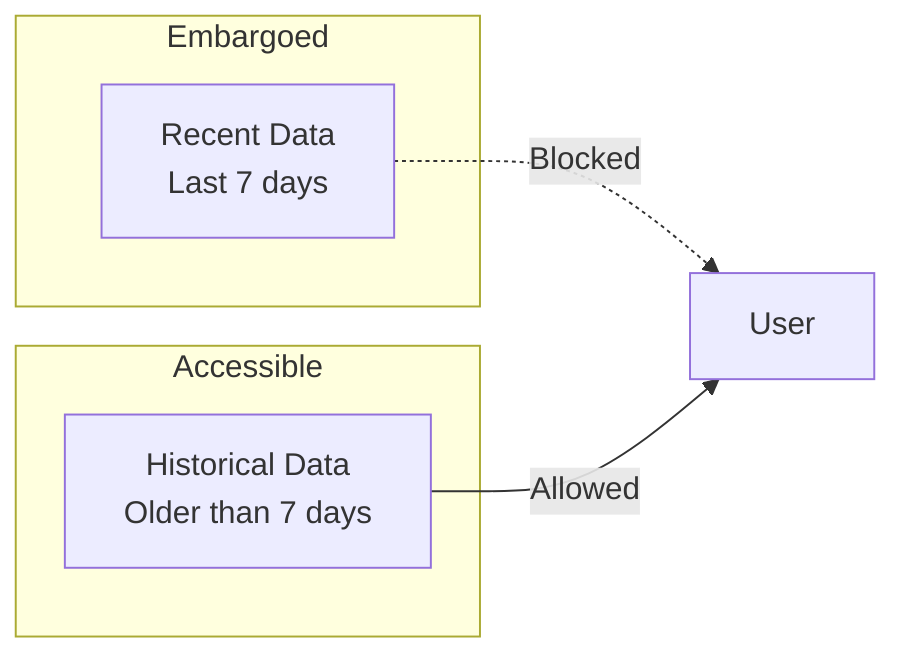
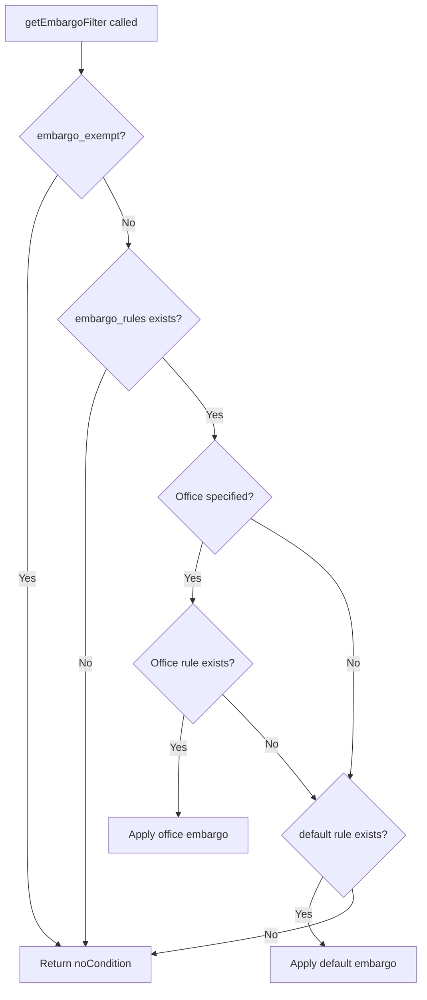

# Embargo Rules

Embargo rules restrict access to recent data. Data that is newer than the embargo period is considered "embargoed" and will not be returned to users who are not exempt. This is commonly used to give data owners time to review and validate data before it becomes publicly accessible.

## Embargo Concept

The embargo period defines how old data must be before a user can access it. For example, a 168-hour (7-day) embargo means users can only see data that is at least 7 days old.



## Constraint Format

Embargo rules appear in the `x-cwms-auth-context` header in two forms:

### Office-Based Embargo

```json
{
  "constraints": {
    "embargo_rules": {
      "SPK": 168,
      "SWT": 72,
      "default": 168
    },
    "embargo_exempt": false
  }
}
```

| Field | Description |
|-------|-------------|
| `embargo_rules.<office>` | Hours of embargo for specific office |
| `embargo_rules.default` | Default embargo when office not specified |
| `embargo_exempt` | If true, user bypasses all embargo rules |

### Time Series Group Embargo

```json
{
  "constraints": {
    "ts_group_embargo": {
      "Streamflow": 72,
      "Stage": 24,
      "Precipitation": 0
    },
    "embargo_exempt": false
  }
}
```

Time series group embargo allows different embargo periods based on data type rather than office.

## Implementation

### Office-Based Embargo Filter

The `getEmbargoFilter` method applies office-based embargo rules:

```java
public Condition getEmbargoFilter(
        Field<Timestamp> timestampField,
        Field<String> officeField,
        String requestedOffice) {

    if (constraints == null) {
        return DSL.noCondition();
    }

    // Check exemption first
    boolean embargoExempt = constraints.has("embargo_exempt") &&
                            constraints.get("embargo_exempt").asBoolean();
    if (embargoExempt) {
        return DSL.noCondition();
    }

    JsonNode embargoRulesNode = constraints.get("embargo_rules");
    if (embargoRulesNode == null || embargoRulesNode.isNull()) {
        return DSL.noCondition();
    }

    // Apply office-specific embargo
    if (requestedOffice != null && embargoRulesNode.has(requestedOffice)) {
        int embargoHours = embargoRulesNode.get(requestedOffice).asInt();
        Timestamp cutoff = Timestamp.from(
            Instant.now().minus(embargoHours, ChronoUnit.HOURS)
        );
        return timestampField.lessThan(cutoff);
    }

    // Fall back to default embargo
    if (embargoRulesNode.has("default")) {
        int defaultHours = embargoRulesNode.get("default").asInt();
        Timestamp defaultCutoff = Timestamp.from(
            Instant.now().minus(defaultHours, ChronoUnit.HOURS)
        );
        return timestampField.lessThan(defaultCutoff);
    }

    return DSL.noCondition();
}
```

### Time Series Group Embargo Filter

The `getTsGroupEmbargoFilter` method applies embargo based on time series group:

```java
public Condition getTsGroupEmbargoFilter(
        Field<Timestamp> timestampField,
        String tsGroupId) {

    if (constraints == null) {
        return DSL.noCondition();
    }

    boolean embargoExempt = constraints.has("embargo_exempt") &&
                            constraints.get("embargo_exempt").asBoolean();
    if (embargoExempt) {
        return DSL.noCondition();
    }

    JsonNode tsGroupEmbargoNode = constraints.get("ts_group_embargo");
    if (tsGroupEmbargoNode == null || tsGroupEmbargoNode.isNull()) {
        return DSL.noCondition();
    }

    if (tsGroupId != null && tsGroupEmbargoNode.has(tsGroupId)) {
        int embargoHours = tsGroupEmbargoNode.get(tsGroupId).asInt();
        if (embargoHours == 0) {
            return DSL.noCondition();  // Zero means no embargo
        }
        Timestamp cutoff = Timestamp.from(
            Instant.now().minus(embargoHours, ChronoUnit.HOURS)
        );
        return timestampField.lessThan(cutoff);
    }

    // Default to 7 days for unknown groups
    int defaultHours = 168;
    Timestamp defaultCutoff = Timestamp.from(
        Instant.now().minus(defaultHours, ChronoUnit.HOURS)
    );
    return timestampField.lessThan(defaultCutoff);
}
```

## Filter Behavior



## Embargo Exemption

Certain user personas are exempt from embargo rules. In OPA policy:

```rego
embargo_exempt_personas := ["data_manager", "water_manager", "system_admin", "hec_employee"]

user_embargo_exempt(user) if {
    user.persona in embargo_exempt_personas
}
```

When `embargo_exempt: true` is set in constraints, no embargo filtering is applied.

## Generated SQL Examples

For a user with 168-hour embargo on SPK:

```sql
SELECT * FROM at_cwms_ts_id
WHERE version_date < TIMESTAMP '2024-01-13 10:00:00'
```

For an exempt user:
```sql
SELECT * FROM at_cwms_ts_id
-- No embargo condition applied
```

## Time Window Restrictions

Time window restrictions are the inverse of embargo rules. Instead of blocking recent data, they limit how far back a user can query historical data. This is useful for operational users who only need current data.

### Constraint Format

```json
{
  "constraints": {
    "time_window": {
      "restrict_hours": 8
    }
  }
}
```

### Implementation

```java
public Condition getTimeWindowFilter(
        Field<Timestamp> timestampField,
        Timestamp userRequestedBeginTime) {

    if (constraints == null || !constraints.has("time_window")) {
        return DSL.noCondition();
    }

    JsonNode timeWindowNode = constraints.get("time_window");
    if (timeWindowNode.isNull() || !timeWindowNode.has("restrict_hours")) {
        return DSL.noCondition();
    }

    int restrictHours = timeWindowNode.get("restrict_hours").asInt();
    Timestamp cutoffTime = Timestamp.from(
        Instant.now().minus(restrictHours, ChronoUnit.HOURS)
    );

    // If user requested older data, enforce cutoff
    if (userRequestedBeginTime == null || userRequestedBeginTime.before(cutoffTime)) {
        return timestampField.greaterOrEqual(cutoffTime);
    }

    return timestampField.greaterOrEqual(userRequestedBeginTime);
}
```

### Comparison: Embargo vs Time Window

| Rule Type | Blocks | Allows | Use Case |
|-----------|--------|--------|----------|
| Embargo | Recent data (newer than X hours) | Historical data | Data validation period |
| Time Window | Historical data (older than X hours) | Recent data | Operational dashboards |

## Usage Example

```java
AuthorizationFilterHelper filterHelper = new AuthorizationFilterHelper(ctx);

// Get embargo filter for office-based data
Condition embargoFilter = filterHelper.getEmbargoFilter(
    TIMESERIES.VERSION_DATE,
    TIMESERIES.OFFICE_ID,
    "SPK"
);

// Get time window filter
Condition timeWindowFilter = filterHelper.getTimeWindowFilter(
    TIMESERIES.VERSION_DATE,
    userRequestedBeginTime
);

// Combine filters
SelectQuery<?> query = dsl.selectFrom(TIMESERIES)
    .where(DSL.and(embargoFilter, timeWindowFilter))
    .getQuery();
```

