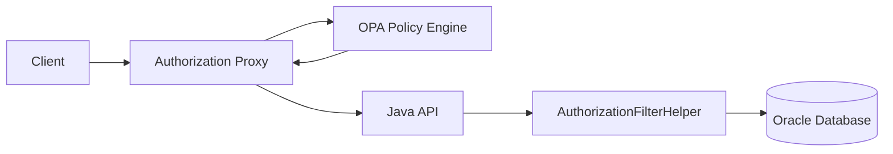

# Data Filtering Overview

The CWMS Access Management system enforces data access controls through database-level filtering. The authorization proxy passes filtering constraints to the Java API via the `x-cwms-auth-context` header, and the API applies these constraints directly to database queries using JOOQ conditions.

## Architecture



The key principle is that all filtering happens at the database level. The authorization proxy determines what constraints apply to a user, but the Java API enforces them by modifying SQL queries. This ensures data never leaves the database unless the user is authorized to see it.

## Filtering Mechanism

The `AuthorizationFilterHelper` class parses the `x-cwms-auth-context` header and generates JOOQ `Condition` objects that are applied to WHERE clauses:

```java
AuthorizationFilterHelper filterHelper = new AuthorizationFilterHelper(ctx);

Condition allFilters = filterHelper.getAllFilters(
    OFFICE_ID,              // office field
    VERSION_DATE,           // timestamp field
    DATA_CLASSIFICATION,    // classification field
    requestedOffice,        // user-requested office (optional)
    userRequestedBeginTime  // user-requested start time (optional)
);

SelectQuery<?> query = dsl.selectFrom(TABLE)
    .where(allFilters)
    .getQuery();
```

## Filter Types

| Filter Type | Purpose | Constraint Field |
|-------------|---------|------------------|
| [Office Filtering](office-filtering.md) | Restrict access to specific offices | `allowed_offices` |
| [Embargo Rules](embargo-rules.md) | Restrict access to recent data | `embargo_rules`, `ts_group_embargo` |
| [Time Window](embargo-rules.md) | Limit historical data access | `time_window` |
| [Data Classification](classification.md) | Control access by sensitivity level | `data_classification` |

## Authorization Context Header

The proxy sends filtering constraints in the `x-cwms-auth-context` header as JSON:

```json
{
  "policy": {
    "allow": true,
    "decision_id": "proxy-abc123"
  },
  "user": {
    "id": "m5hectest",
    "username": "m5hectest",
    "roles": ["cwms_user"],
    "offices": ["SWT"],
    "primary_office": "SWT"
  },
  "constraints": {
    "allowed_offices": ["SWT", "SPK"],
    "embargo_rules": {
      "SPK": 168,
      "SWT": 72,
      "default": 168
    },
    "embargo_exempt": false,
    "time_window": {
      "restrict_hours": 8
    },
    "data_classification": ["public", "internal"]
  }
}
```

## Filter Combination

When multiple filters apply, they are combined with AND logic:

```java
return DSL.and(officeFilter, embargoFilter, timeWindowFilter, classificationFilter);
```

This means a record must pass all filters to be returned. For example, a user with office restrictions and embargo rules will only see data that:

1. Belongs to one of their allowed offices
2. Is older than the embargo period
3. Falls within their time window
4. Matches their allowed classifications

## Disabled Mode

When access management is disabled (via configuration), the `AuthorizationFilterHelper` returns `DSL.noCondition()` for all filters, effectively allowing unrestricted access. This is determined by checking `AuthorizationContextHelper.isEnabled()` at construction time.

## Related Documentation

- [Office-Based Filtering](office-filtering.md)
- [Embargo Rules](embargo-rules.md)
- [Data Classification](classification.md)

```{toctree}
:maxdepth: 2

office-filtering
embargo-rules
classification
```
