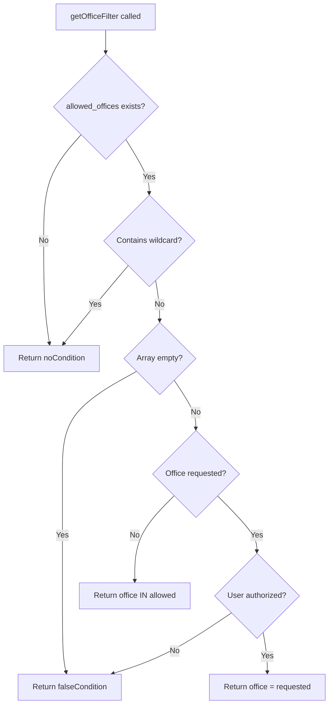

# Office-Based Filtering

Office-based filtering restricts data access based on the user's authorized offices. Each CWMS user is associated with one or more offices, and the filtering ensures they can only query data belonging to those offices.

## How It Works

The authorization proxy evaluates the user's office permissions and includes an `allowed_offices` array in the constraints:

```json
{
  "constraints": {
    "allowed_offices": ["SWT", "SPK", "NWD"]
  }
}
```

The Java API uses this array to generate a JOOQ condition that filters query results.

## Filter Behavior



## Implementation

The `getOfficeFilter` method in `AuthorizationFilterHelper` handles all office filtering scenarios:

```java
public Condition getOfficeFilter(Field<String> officeField, String requestedOffice) {
    if (constraints == null || !constraints.has("allowed_offices")) {
        return DSL.noCondition();
    }

    JsonNode allowedOfficesNode = constraints.get("allowed_offices");
    List<String> allowedOffices = new ArrayList<>();

    if (allowedOfficesNode.isArray()) {
        for (JsonNode office : allowedOfficesNode) {
            allowedOffices.add(office.asText());
        }
    }

    // Wildcard grants access to all offices
    if (allowedOffices.contains("*")) {
        return DSL.noCondition();
    }

    // Empty array denies all access
    if (allowedOffices.isEmpty()) {
        return DSL.falseCondition();
    }

    // Specific office requested - verify authorization
    if (requestedOffice != null && !requestedOffice.isEmpty()) {
        if (!allowedOffices.contains(requestedOffice)) {
            return DSL.falseCondition();
        }
        return officeField.eq(requestedOffice);
    }

    // No specific office - filter to all allowed
    return officeField.in(allowedOffices);
}
```

## Scenarios

### Wildcard Access

Users with administrative roles may have wildcard access to all offices:

```json
{
  "constraints": {
    "allowed_offices": ["*"]
  }
}
```

The filter returns `noCondition()`, allowing access to data from any office.

### Specific Office Request

When a user requests data from a specific office (via query parameter):

| User's allowed_offices | Requested office | Result |
|------------------------|------------------|--------|
| `["SWT", "SPK"]` | `SWT` | `office_id = 'SWT'` |
| `["SWT", "SPK"]` | `NWD` | `false` (denied) |
| `["*"]` | `NWD` | No condition (allowed) |

### Multiple Office Access

When no specific office is requested, the filter returns data from all allowed offices:

```sql
WHERE office_id IN ('SWT', 'SPK', 'NWD')
```

### No Office Access

If the `allowed_offices` array is empty, all access is denied:

```java
if (allowedOffices.isEmpty()) {
    return DSL.falseCondition();
}
```

This results in a WHERE clause that always evaluates to false, returning no records.

## Usage Example

```java
AuthorizationFilterHelper filterHelper = new AuthorizationFilterHelper(ctx);

// Get the office filter condition
Condition officeFilter = filterHelper.getOfficeFilter(
    TIMESERIES.OFFICE_ID,    // The office field in the table
    requestedOffice           // Office from query parameter (may be null)
);

// Apply to query
SelectQuery<?> query = dsl.selectFrom(TIMESERIES)
    .where(officeFilter)
    .getQuery();
```

## Generated SQL Examples

For a user with `allowed_offices: ["SWT", "SPK"]`:

No specific office requested:
```sql
SELECT * FROM at_cwms_ts_id
WHERE office_id IN ('SWT', 'SPK')
```

Specific office requested (authorized):
```sql
SELECT * FROM at_cwms_ts_id
WHERE office_id = 'SWT'
```

Specific office requested (unauthorized):
```sql
SELECT * FROM at_cwms_ts_id
WHERE 1 = 0
```

