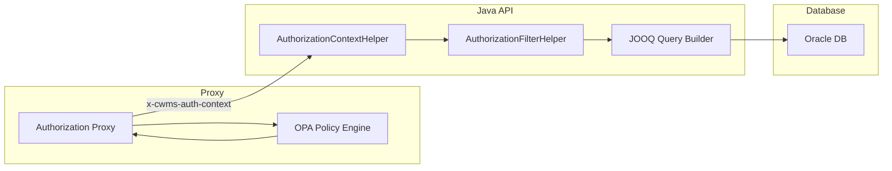
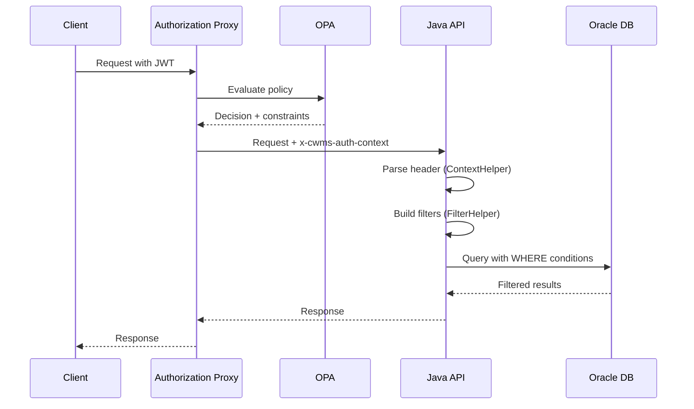

# Java API Integration

This section documents how the CWMS Data API integrates with the Authorization Proxy to enforce access control at the database level.

## Overview

The authorization architecture follows a clear separation of concerns:



## Key Principle

The Authorization Proxy makes authorization decisions and passes filtering constraints to the Java API via the `x-cwms-auth-context` header. The Java API does not make authorization decisions. Instead, it applies the constraints at the database query level to filter results.

| Component | Responsibility |
|-----------|----------------|
| Authorization Proxy | Makes allow/deny decisions via OPA |
| OPA Policy Engine | Evaluates policies, determines constraints |
| AuthorizationContextHelper | Parses header, provides user context |
| AuthorizationFilterHelper | Generates JOOQ conditions from constraints |
| Database | Returns filtered results |

## Helper Classes

The Java API provides two helper classes for integration:

### AuthorizationContextHelper

Parses the `x-cwms-auth-context` header and provides access to user information and constraints. This class handles:

- Extracting user identity (id, username, email)
- Retrieving user roles and office assignments
- Accessing constraint values
- Checking authorization header presence

See [AuthorizationContextHelper](authorization-context-helper.md) for detailed documentation.

### AuthorizationFilterHelper

Generates JOOQ `Condition` objects from the constraints in the authorization context. This class handles:

- Office-based filtering
- Embargo rules (time-based data restrictions)
- Time window restrictions
- Data classification filtering

See [AuthorizationFilterHelper](authorization-filter-helper.md) for detailed documentation.

## Enabling Authorization Mode

Authorization integration is controlled by the `cwms.dataapi.access.management.enabled` configuration property.

### Configuration Options

| Method | Example |
|--------|---------|
| Environment Variable | `cwms.dataapi.access.management.enabled=true` |
| System Property | `-Dcwms.dataapi.access.management.enabled=true` |

### Behavior by Mode

**When Enabled (`true`)**:
- Authorization context header is parsed and validated
- Helper classes extract user context and constraints
- Filters are applied to database queries
- Requests without valid headers may be restricted

**When Disabled (`false`, default)**:
- Authorization context header is ignored
- Helper classes return empty contexts
- No filters are applied to queries
- API behaves as if no authorization system exists

```java
// Check if authorization mode is enabled
if (AuthorizationContextHelper.isEnabled()) {
    // Apply authorization filters
    AuthorizationContextHelper authContext = new AuthorizationContextHelper(ctx);
    // ...
}
```

## Integration Flow



## Usage in Controllers

Controllers integrate authorization filtering by:

1. Creating helper instances from the Javalin context
2. Extracting relevant filter conditions
3. Applying conditions to JOOQ queries

```java
public class TimeSeriesController extends BaseHandler {

    @Override
    public void handle(Context ctx) {
        AuthorizationContextHelper authContext = new AuthorizationContextHelper(ctx);
        AuthorizationFilterHelper filterHelper = new AuthorizationFilterHelper(ctx);

        String requestedOffice = ctx.queryParam("office");

        // Build query with authorization filters
        Condition authFilters = filterHelper.getAllFilters(
            TIMESERIES.OFFICE_ID,
            TIMESERIES.DATE_TIME,
            TIMESERIES.CLASSIFICATION,
            requestedOffice,
            userRequestedBeginTime
        );

        // Apply filters to query
        List<TimeSeries> results = dsl.selectFrom(TIMESERIES)
            .where(authFilters)
            .fetch();
    }
}
```

## Contents

```{toctree}
:maxdepth: 2

authorization-context-helper
authorization-filter-helper
testing
```
