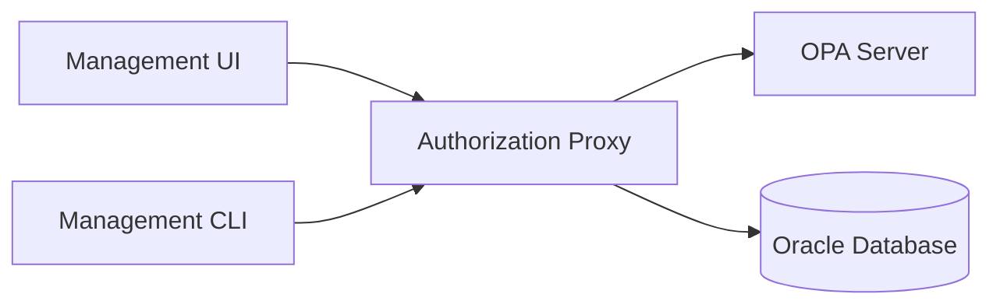

# Management Applications

The CWMS Access Management system provides two management interfaces for administrators to view users, roles, and authorization policies: a web-based Management UI and a command-line Management CLI.

## Overview

Both applications connect to the Authorization Proxy management API to retrieve and display authorization data. They are read-only interfaces designed for monitoring and administration purposes.



## Comparison

| Feature | Management UI | Management CLI |
|---------|--------------|----------------|
| Interface | Web browser | Terminal |
| Authentication | Form-based login | Token-based login |
| User listing | Searchable table | Formatted table |
| User details | Detailed view | Show command |
| Role listing | Card view | Formatted table |
| Role details | Card expansion | Show command |
| Policy listing | Card view | Formatted table |
| Policy details | Card expansion | Show command |
| Session storage | Browser localStorage | Config file |
| Deployment | Container or static | Standalone binary |
| Best for | Interactive browsing | Scripting and automation |

## When to Use Each Tool

### Management UI

Use the web interface when:

- Browsing and searching through users interactively
- Presenting authorization data to non-technical stakeholders
- Working from a machine without CLI access
- Training new administrators

### Management CLI

Use the command-line interface when:

- Automating administrative tasks with scripts
- Working in headless or SSH environments
- Integrating with CI/CD pipelines
- Performing quick lookups from the terminal

## Common Capabilities

Both applications support:

- Secure authentication with JWT tokens
- View all registered users and their status
- View role definitions and descriptions
- View OPA authorization policies
- Automatic session management

## Technology Stack

| Component | Management UI | Management CLI |
|-----------|--------------|----------------|
| Runtime | Browser | Node.js 24+ |
| Language | TypeScript | TypeScript |
| Framework | React 18 | Commander |
| Bundler | Vite 6 | esbuild |
| State | Zustand, TanStack Query | Local config file |
| Styling | Tailwind CSS | Ink, Chalk |
| HTTP Client | Axios | Axios |
| Validation | Zod | Zod |

## Port Assignments

| Service | Default Port |
|---------|-------------|
| Management UI | 4200 |
| Management CLI | N/A (connects to proxy) |
| Authorization Proxy API | 3001 (proxy), 3002 (management) |

## Detailed Documentation

```{toctree}
:maxdepth: 1

management-ui
management-cli
```
