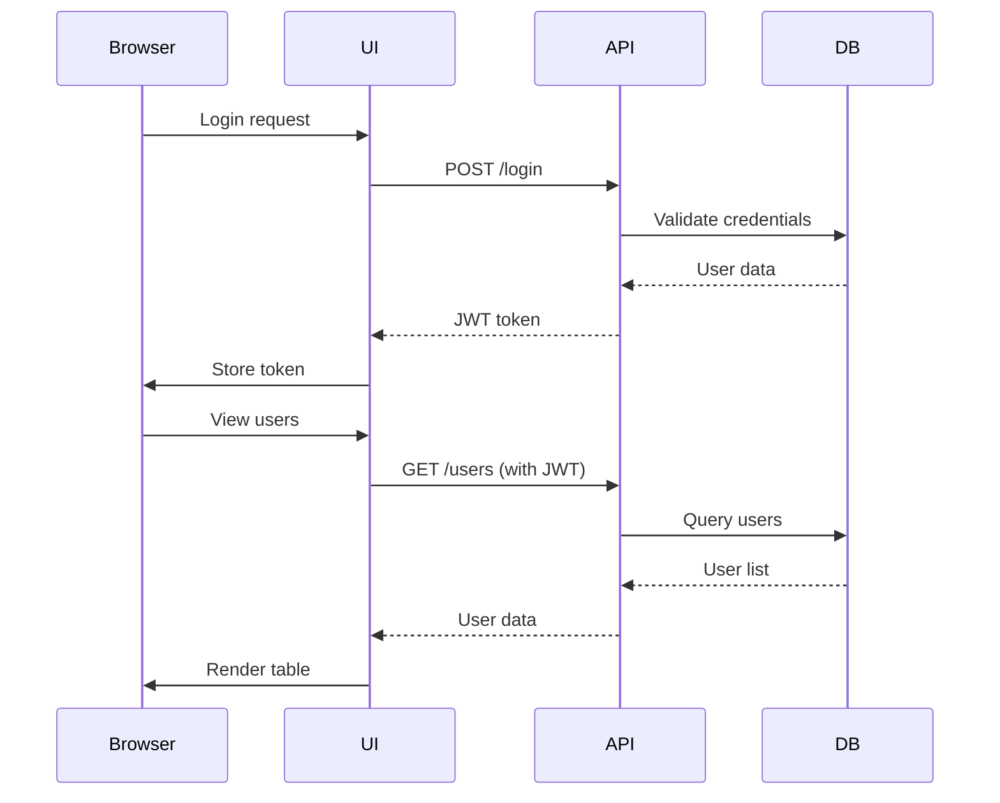

# Management UI

The Management UI is a web-based interface for viewing CWMS authorization data including users, roles, and OPA policies. It provides a responsive, modern interface for administrators to browse and search authorization information.

## Purpose

The Management UI serves as the primary visual interface for:

- Browsing registered users and their account status
- Viewing role definitions and their descriptions
- Inspecting OPA authorization policies
- Searching and filtering user lists

This is a read-only interface. Administrative operations that modify data require the Management CLI or direct API access.

## Technology Stack

| Component | Technology | Version |
|-----------|------------|---------|
| UI Library | React | 18.3.1 |
| Build Tool | Vite | 6.x |
| Language | TypeScript | 5.6+ |
| Routing | React Router | 7.x |
| Data Fetching | TanStack Query | 5.x |
| State Management | Zustand | 5.x |
| Styling | Tailwind CSS | 3.4.x |
| HTTP Client | Axios | 1.x |
| Logging | Pino | 10.x |
| Testing | Vitest | 3.x |
| API Mocking | MSW | 2.x |

## Features

### Authentication

- Form-based login with username and password
- JWT token storage in browser localStorage
- Automatic redirect to login on session expiration
- Logout functionality with token cleanup

### Users Page

- Paginated table of all registered users
- Real-time search filtering by username, email, or name
- User status indicators (active/inactive)
- Display of user ID, email, and full name

### Roles Page

- List view of all role definitions
- Role name and description display
- Role ID for reference

### Policies Page

- List view of OPA authorization policies
- Policy name and description display
- Policy ID for reference

### Navigation

- Responsive navigation bar
- Current user display with logout option
- Protected routes requiring authentication

## Installation

### Prerequisites

- Node.js 24 or higher
- pnpm 10 or higher

### From Monorepo

Install dependencies from the monorepo root:

```bash
pnpm install
```

## Configuration

### Environment Variables

Create a `.env` file in the application directory or set environment variables:

| Variable | Description | Default |
|----------|-------------|---------|
| `VITE_API_URL` | Authorization Proxy management API URL | `http://localhost:3002` |
| `VITE_LOG_LEVEL` | Logging level (debug, info, warn, error) | `info` |
| `VITE_ENABLE_MSW` | Enable Mock Service Worker for development | `false` |

### Example Configuration

```bash
VITE_API_URL=http://localhost:3002
VITE_LOG_LEVEL=info
VITE_ENABLE_MSW=false
```

## Running in Development

Start the development server with hot reload:

```bash
pnpm nx serve management-ui
```

The application will be available at [http://localhost:4200](http://localhost:4200).

### Development Features

- Hot module replacement for instant updates
- Source maps for debugging
- MSW integration for API mocking
- TypeScript type checking

## Building for Production

Build the optimized production bundle:

```bash
pnpm nx build management-ui --configuration=production
```

Output location: `dist/apps/web/management-ui/`

### Preview Production Build

Test the production build locally:

```bash
pnpm nx preview management-ui
```

Available at [http://localhost:4300](http://localhost:4300).

## Docker Deployment

### Building the Image

Build the Docker image from the monorepo root:

```bash
podman build \
  -t cwms-management-ui:local-dev \
  -f apps/web/management-ui/Dockerfile \
  --build-arg VITE_API_URL=http://localhost:3002 \
  .
```

The build argument `VITE_API_URL` is baked into the static assets at build time.

### Running the Container

```bash
podman run -d \
  --name management-ui \
  -p 4200:80 \
  cwms-management-ui:local-dev
```

### Docker Compose

The application is included in the monorepo docker-compose configuration:

```bash
podman compose -f docker-compose.podman.yml up -d management-ui
```

## Project Structure

```
src/
├── components/         # Reusable UI components
│   └── ui/            # Base UI components (Button, Card, Input, Label)
├── contexts/          # React context providers
│   └── AuthContext.tsx    # Authentication state management
├── pages/             # Page components for routing
│   ├── HomePage.tsx       # Dashboard landing page
│   ├── LoginPage.tsx      # Authentication page
│   ├── UsersPage.tsx      # User listing and search
│   ├── RolesPage.tsx      # Role listing
│   └── PoliciesPage.tsx   # Policy listing
├── services/          # API clients
│   └── api.service.ts     # Management API client
├── utils/             # Utility functions
│   ├── logger.ts          # Pino logger configuration
│   └── utils.ts           # General utilities
├── lib/               # Third-party integrations
│   └── utils.ts           # Tailwind class utilities
├── App.tsx            # Main application with routing
├── main.tsx           # Application entry point
└── index.css          # Global styles and Tailwind imports
```

## API Integration

The UI connects to the Authorization Proxy management API:



### API Endpoints

| Endpoint | Method | Description |
|----------|--------|-------------|
| `/login` | POST | Authenticate and receive JWT token |
| `/users` | GET | List all users |
| `/users/:id` | GET | Get user details |
| `/roles` | GET | List all roles |
| `/roles/:id` | GET | Get role details |
| `/policies` | GET | List all policies |
| `/policies/:id` | GET | Get policy details |

## Available Scripts

| Command | Description |
|---------|-------------|
| `pnpm nx serve management-ui` | Start development server |
| `pnpm nx build management-ui` | Build for production |
| `pnpm nx build management-ui --configuration=production` | Production build with optimizations |
| `pnpm nx preview management-ui` | Preview production build |
| `pnpm nx lint management-ui` | Run ESLint |
| `pnpm nx test management-ui` | Run tests |
| `pnpm nx test management-ui --coverage` | Run tests with coverage |
| `pnpm nx typecheck management-ui` | Run TypeScript type checking |

## Authentication Flow

1. User navigates to application
2. Protected routes check for existing token in localStorage
3. If no token, redirect to login page
4. User submits credentials
5. API returns JWT token on success
6. Token stored in localStorage and Zustand state
7. Subsequent API requests include token in Authorization header
8. On 401 response, token cleared and user redirected to login

## Component Library

The UI uses a custom component library built on Radix UI primitives:

| Component | Description |
|-----------|-------------|
| Button | Action buttons with variants |
| Card | Container with header and content sections |
| Input | Form text input |
| Label | Form field labels |

Components use Tailwind CSS for styling with the `class-variance-authority` library for variant management.

## Testing

Run the test suite:

```bash
pnpm nx test management-ui
```

Run tests with the visual UI:

```bash
pnpm nx test management-ui --ui
```

Generate coverage report:

```bash
pnpm nx test management-ui --coverage
```

The test setup includes:

- Vitest as the test runner
- MSW for API mocking
- React Testing Library for component tests

## Troubleshooting

### Application shows loading indefinitely

Verify the API URL configuration matches the running Authorization Proxy:

```bash
# Check if proxy is running
podman ps | grep authorizer-proxy

# Verify API URL in .env
cat .env | grep VITE_API_URL
```

### Login fails with network error

Ensure the Authorization Proxy management server is accessible:

```bash
curl http://localhost:3002/health
```

### Build fails with TypeScript errors

Run type checking to identify issues:

```bash
pnpm nx typecheck management-ui
```

### Styles not loading in production

Verify Tailwind CSS is properly configured and PostCSS is processing styles:

```bash
pnpm nx build management-ui --verbose
```
