# Benchmark Results

This page documents benchmark results from testing the authorization proxy. These numbers provide a baseline for capacity planning, though actual production performance will vary based on hardware, network conditions, and workload patterns.

## Test Environment

The benchmarks were run on a local development machine with all services running in Podman containers.

| Component | Details |
|-----------|---------|
| Machine | Apple M3 Max |
| Memory | 36GB RAM |
| OS | macOS Tahoe (Darwin 25.2.0) |
| Container Runtime | Podman 5.x |
| Node.js | 24.x (in container) |
| k6 Version | 1.5.0 |

All services ran with default container resource limits. Production deployments with dedicated resources will see different numbers.

## Request Latency

The proxy adds minimal overhead to requests. Most of the time is spent in cache lookups and, when necessary, OPA policy evaluation.

| Endpoint | Requests | Avg Latency | p95 Latency | Throughput |
|----------|----------|-------------|-------------|------------|
| `/health` | 6,695 | 1.2ms | 2ms | ~220 req/s |
| `/authorize` | 2,092 | 2.2ms | 3ms | ~70 req/s |
| `/cwms-data/timeseries` | 2,153 | 12ms | 15ms | ~70 req/s |
| Overall | 10,940 | 5.7ms | 12.4ms | ~177 req/s |

The `/health` endpoint shows the baseline proxy overhead. The `/authorize` endpoint includes JWT decoding and OPA cache lookup. Authenticated proxy requests include the full authorization flow plus time spent waiting for the downstream API.

## Cache Performance

Caching dramatically reduces latency for repeated requests. The proxy uses two cache layers:

| Cache Type | Hits | Misses | Hit Rate | Avg Lookup Time |
|------------|------|--------|----------|-----------------|
| User Context (Redis) | 4,235 | 10 | 99.76% | 0.23ms |
| OPA Decisions (In-Memory) | 4,238 | 7 | 99.84% | <0.1ms |

The high hit rates reflect typical workloads where the same users make many requests. New users or cache expiration will cause misses that require backend lookups.

### Cache Miss Impact

When caches miss, latency increases significantly:

| Operation | Cached | Uncached |
|-----------|--------|----------|
| User context lookup | <1ms | ~175ms |
| OPA decision | <0.1ms | 6-11ms |
| Total proxy overhead | 2-3ms | 180-200ms |

The user context lookup dominates uncached latency because it requires an API call to fetch user profile information from the CWMS Data API.

## OPA Policy Evaluation

Policy evaluation happens only on cache misses. The evaluation time depends on policy complexity and the authorization decision:

| Decision | Count | Avg Duration | p95 Duration |
|----------|-------|--------------|--------------|
| Allow | 3 | 6.4ms | ~10ms |
| Deny | 4 | 11ms | ~25ms |
| Total | 7 | 9ms | ~20ms |

Deny decisions take longer because OPA often needs to evaluate more rules before determining that access should be blocked.

## Latency Breakdown

For an authenticated request, here is where time is spent:

```mermaid
flowchart LR
    subgraph Proxy["Authorization Proxy"]
        JWT[JWT Decode<br/>less than 1ms]
        Redis[Redis Lookup<br/>0.23ms hit / 1.2ms miss]
        OPA[OPA Check<br/>less than 0.1ms hit / 6-11ms miss]
    end
    subgraph Backend["Backend API"]
        API[Request Processing<br/>variable]
    end
    Client --> JWT --> Redis --> OPA --> API --> Client
```

Best case (cache hits): 2-3ms total proxy overhead
Worst case (cache misses): 180-200ms (dominated by user lookup API call)

## Resource Utilization

During the 30-second benchmark with 10 concurrent users:

| Resource | Measurement |
|----------|-------------|
| CPU (proxy container) | 7.6 seconds total |
| Heap Size | 175MB |
| GC Events | 24 minor, 6 major |
| Peak Connections | 13 |

The proxy maintains a steady memory footprint without significant growth over the test duration.

## Throughput Under Load

The stress test ramped from 5 to 50 virtual users over 60 seconds:

| VU Count | Throughput | p95 Latency | Error Rate |
|----------|------------|-------------|------------|
| 5 | ~50 req/s | 8ms | 0% |
| 20 | ~150 req/s | 15ms | 0% |
| 50 | ~180 req/s | 45ms | 0% |

Throughput scaled linearly up to about 30 VUs, then began to plateau as the proxy approached its capacity on the test hardware.

## Comparison with Direct API Access

To isolate the proxy overhead, we compared requests through the proxy versus direct API calls:

| Path | Direct API | Through Proxy | Overhead |
|------|------------|---------------|----------|
| `/cwms-data/offices` | 8ms | 10ms | +2ms |
| `/cwms-data/timeseries` | 10ms | 13ms | +3ms |

The 2-3ms overhead includes JWT decoding, cache lookups, and header injection. For most use cases, this is negligible compared to the security benefits.

## Recommendations

Based on these benchmarks:

**For Production Deployment:**
- Deploy multiple proxy instances behind a load balancer for horizontal scaling
- Use Redis Cluster or Sentinel for cache high availability
- Monitor cache hit rates; rates below 90% may indicate configuration issues

**For Performance Tuning:**
- Increase OPA decision cache TTL if policies change infrequently
- Consider pre-warming the cache for known high-traffic users
- Ensure Redis connection pooling is properly sized

**Alerting Thresholds:**

| Metric | Warning | Critical |
|--------|---------|----------|
| p95 latency | >100ms | >500ms |
| Cache hit rate | <90% | <80% |
| OPA evaluation p95 | >50ms | >100ms |
| Error rate | >1% | >5% |

