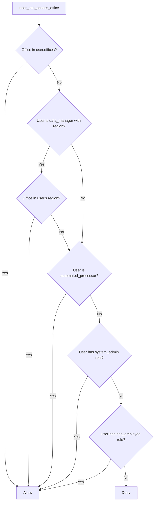
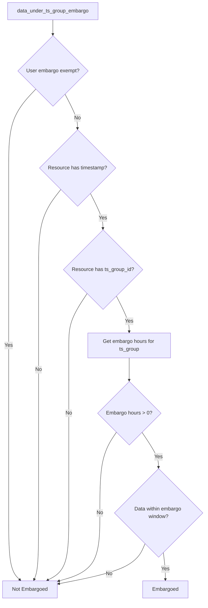
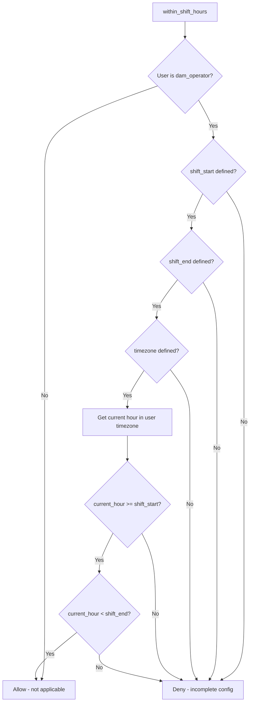

# Helper Functions

Helper modules provide reusable functions for common authorization checks. These modules encapsulate complex logic for office hierarchy validation and time-based access rules.

## Office Hierarchy Helper

Location: `policies/helpers/offices.rego`

The office helper manages hierarchical office relationships and determines if a user can access data from a specific office.

### Office Data Structure

Offices are organized in a hierarchy with metadata:

```rego
offices := {
    "HQ": {
        "type": "headquarters",
        "parent": null,
        "region": "headquarters"
    },
    "SPK": {
        "type": "district",
        "parent": "SPD",
        "region": "south_pacific",
        "timezone": "America/Los_Angeles"
    },
    "SWT": {
        "type": "district",
        "parent": "SWD",
        "region": "southwestern",
        "timezone": "America/Chicago"
    }
}
```

### Regional Organization

Districts are grouped by region with their parent division:

| Region | Division | Districts |
|--------|----------|-----------|
| South Pacific | SPD | SPK, SPN, SPL |
| Southwestern | SWD | SWT, SPA, GAL, FTW |
| Mississippi | MVD | MVR, MVS, MVP, MVM, MVN |

```rego
regions := {
    "southwestern": {
        "division": "SWD",
        "districts": ["SWT", "SPA", "GAL", "FTW"]
    },
    "south_pacific": {
        "division": "SPD",
        "districts": ["SPK", "SPN", "SPL"]
    },
    "mississippi": {
        "division": "MVD",
        "districts": ["MVR", "MVS", "MVP", "MVM", "MVN"]
    }
}
```

### Office Access Rules

The `user_can_access_office` function evaluates multiple conditions:



### Access Rule Details

**Direct Office Assignment**:

```rego
user_can_access_office(user, office_id) if {
    office_id in user.offices
}
```

User has explicit access to offices listed in their `offices` array.

**Regional Access (Data Managers)**:

```rego
user_can_access_office(user, office_id) if {
    user.persona == "data_manager"
    user.region != null
    office_id in regions[user.region].districts
}
```

Data managers with a region assignment can access all districts within that region.

**Cross-Regional Access (Automated Processors)**:

```rego
user_can_access_office(user, office_id) if {
    user.persona == "automated_processor"
}
```

Automated processors can access all offices for cross-regional data processing.

**Privileged Role Access**:

```rego
user_can_access_office(user, office_id) if {
    "system_admin" in user.roles
}

user_can_access_office(user, office_id) if {
    "hec_employee" in user.roles
}
```

System admins and HEC employees have unrestricted office access.

## Time Rules Helper

Location: `policies/helpers/time_rules.rego`

The time rules helper manages embargo periods, shift-based access, and modification windows.

### Embargo System

Embargo rules restrict access to recent data to prevent premature release.

**Exempt Personas**:

```rego
embargo_exempt_personas := ["data_manager", "water_manager", "system_admin", "hec_employee"]
```

| Persona | Embargo Exempt |
|---------|----------------|
| data_manager | Yes |
| water_manager | Yes |
| system_admin | Yes |
| hec_employee | Yes |
| All others | No |

**Exemption Check**:

```rego
user_embargo_exempt(user) if {
    user.persona in embargo_exempt_personas
}
```

### TS Group Embargo

Embargo periods are configured per time series group, allowing fine-grained control:



**TS Group Embargo Lookup**:

```rego
get_ts_group_embargo_hours(user, ts_group_id) := hours if {
    priv := user.ts_privileges[_]
    priv.ts_group_id == ts_group_id
    hours := priv.embargo_hours
}

get_ts_group_embargo_hours(user, ts_group_id) := 168 if {
    not ts_group_in_privileges(user, ts_group_id)
}
```

The function returns:
- Configured embargo hours if the TS group is in the user's privileges
- Default of 168 hours (7 days) if not found

**Embargo Check**:

```rego
data_under_ts_group_embargo(resource, user) if {
    not user_embargo_exempt(user)
    resource.timestamp_ns != null
    resource.ts_group_id != null
    embargo_hours := get_ts_group_embargo_hours(user, resource.ts_group_id)
    embargo_hours > 0
    embargo_ns := embargo_hours * 60 * 60 * 1000000000
    time.now_ns() - resource.timestamp_ns < embargo_ns
}
```

### Legacy Office-Based Embargo

A legacy system exists for backward compatibility with office-based embargo periods:

| Office | Embargo Period |
|--------|----------------|
| SPK | 7 days |
| SWT | 3 days |
| DEFAULT | 7 days |

```rego
embargo_periods := {
    "SPK": 7 * 24 * 60 * 60 * 1000000000,
    "SWT": 3 * 24 * 60 * 60 * 1000000000,
    "DEFAULT": 7 * 24 * 60 * 60 * 1000000000
}

data_under_embargo(resource, user) if {
    not user.persona in embargo_exempt_personas
    resource.timestamp_ns != null
    embargo_period := object.get(embargo_periods, resource.office, embargo_periods.DEFAULT)
    time.now_ns() - resource.timestamp_ns < embargo_period
}
```

### Shift Hours

Dam operators can only create or update data during their assigned shift hours.

```rego
within_shift_hours(user) if {
    user.persona == "dam_operator"
    user.shift_start != null
    user.shift_end != null
    user.timezone != null

    current_hour := time.clock([time.now_ns(), user.timezone])[0]
    current_hour >= user.shift_start
    current_hour < user.shift_end
}

within_shift_hours(user) if {
    user.persona != "dam_operator"
}
```

**Evaluation Logic**:



**User Configuration Example**:

```json
{
  "persona": "dam_operator",
  "shift_start": 6,
  "shift_end": 18,
  "timezone": "America/Chicago"
}
```

This configuration allows operations between 6:00 AM and 6:00 PM Central Time.

### Modification Window

Dam operators can only update data within 24 hours of its creation:

```rego
within_modification_window(resource, user) if {
    user.persona == "dam_operator"
    resource.created_ns != null
    time.now_ns() - resource.created_ns < 24 * 60 * 60 * 1000000000
}
```

| Constraint | Window |
|------------|--------|
| Creation to modification | 24 hours |
| Calculation | `current_time - created_time < 24h` |

## Helper Usage in Personas

Personas import and use helpers for authorization decisions:

```rego
package cwms.personas.dam_operator

import data.cwms.helpers.offices
import data.cwms.helpers.time_rules

allow if {
    "dam_operator" in input.user.roles
    input.action == "read"
    input.resource in ["timeseries", "measurements", "levels", "gates", "locations"]
    offices.user_can_access_office(input.user, input.context.office_id)
    not time_rules.data_under_ts_group_embargo(input.context, input.user)
}
```

## Configuration Loading

The office hierarchy and regions are currently defined statically in the policy. Future implementations may load this data dynamically from:

- OPA Data API (`PUT /v1/data/cwms/offices`)
- CDA API queries
- Configuration files mounted at startup

```rego
# In production, load data dynamically from:
# - OPA Data API: curl -X PUT http://localhost:8181/v1/data/cwms/offices -d @offices.json
# - Database Query: Query CDA API to get current office list
# - Configuration File: Load from config/offices.json at startup
```

