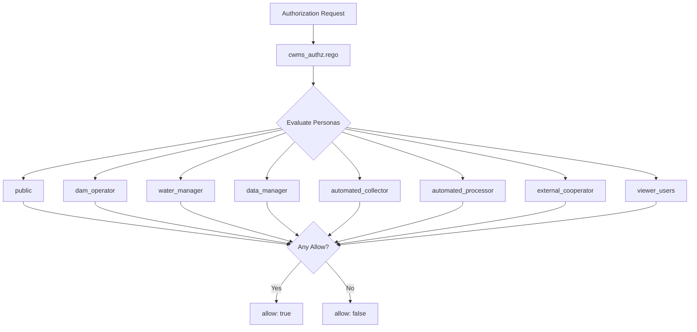

# Policy System Overview

The CWMS Access Management system uses Open Policy Agent (OPA) to evaluate authorization decisions. This document describes the policy architecture, evaluation flow, and how policies interact with the authorization proxy.

## Policy Architecture

The policy system consists of three main components:

1. **Main Orchestrator** (`cwms_authz.rego`) - Entry point that evaluates all persona policies
2. **Persona Policies** - Role-specific authorization rules in the `personas/` directory
3. **Helper Modules** - Reusable functions for office hierarchy and time-based rules



## Policy Evaluation

### Input Structure

OPA policies receive a standardized input structure from the authorization proxy:

```json
{
  "user": {
    "id": "m5hectest",
    "roles": ["dam_operator", "cwms_user"],
    "offices": ["SWT"],
    "persona": "dam_operator",
    "timezone": "America/Chicago",
    "ts_privileges": [
      {"ts_group_id": "PRECIP", "embargo_hours": 72}
    ]
  },
  "action": "read",
  "resource": "timeseries",
  "context": {
    "office_id": "SWT",
    "classification": "public",
    "data_source": "AUTOMATED",
    "ts_group_id": "PRECIP",
    "timestamp_ns": 1705708800000000000
  }
}
```

### Evaluation Order

The main orchestrator (`cwms_authz.rego`) evaluates persona policies in sequence. Authorization succeeds if any persona policy returns `allow = true`:

```rego
default allow := false

allow if { public.allow }
allow if { dam_operator.allow }
allow if { water_manager.allow }
allow if { data_manager.allow }
allow if { automated_collector.allow }
allow if { automated_processor.allow }
allow if { external_cooperator.allow }
allow if { viewer_users.allow }
```

### Privileged Roles

Two roles bypass persona-based evaluation entirely:

| Role | Description |
|------|-------------|
| `system_admin` | Full system access, bypasses all persona checks |
| `hec_employee` | HEC staff access, bypasses all persona checks |

```rego
allow if { "system_admin" in input.user.roles }
allow if { "hec_employee" in input.user.roles }
```

## Policy Decision Response

OPA returns a decision that the authorization proxy uses to construct the `x-cwms-auth-context` header:

```json
{
  "allow": true,
  "decision_id": "opa-12345",
  "constraints": {
    "allowed_offices": ["SWT"],
    "embargo_rules": {"SWT": 72, "default": 168},
    "embargo_exempt": false
  }
}
```

## Helper Module Integration

Persona policies import helper modules to evaluate complex conditions:

```rego
import data.cwms.helpers.offices
import data.cwms.helpers.time_rules
```

Helpers provide:

- **Office Validation** - Checks if user can access a specific office based on assignments, region, or role
- **Time Rules** - Evaluates embargo periods, shift hours, and modification windows

See [helpers.md](helpers.md) for detailed documentation.

## Policy File Organization

```
policies/
    cwms_authz.rego          # Main orchestrator
    personas/
        public.rego          # Unauthenticated/public access
        dam_operator.rego    # Dam operators
        water_manager.rego   # Water managers
        data_manager.rego    # Data managers
        automated_collector.rego   # Automated data collection
        automated_processor.rego   # Automated data processing
        external_cooperator.rego   # External partners
        viewer_users.rego    # Read-only users
    helpers/
        offices.rego         # Office hierarchy and access
        time_rules.rego      # Embargo and time window rules
```

## Related Documentation

- [Persona Policies](personas.md) - Detailed documentation for each persona
- [Helper Functions](helpers.md) - Office hierarchy and time rule helpers

```{toctree}
:maxdepth: 2

personas
helpers
```
