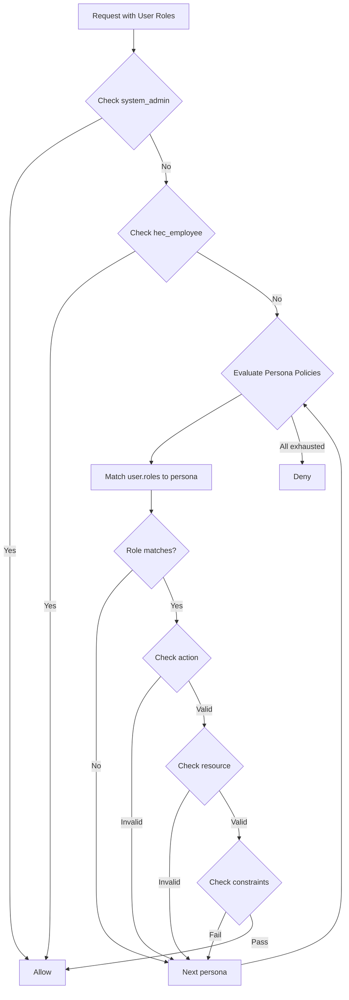

# Persona Policies

Each persona represents a distinct user role with specific access patterns and constraints. The policy system evaluates the user's roles against these persona definitions to determine authorization.

## Persona Summary

| Persona | Role Identifier | Read | Create | Update | Delete | Embargo Exempt |
|---------|-----------------|------|--------|--------|--------|----------------|
| Public | (none required) | Limited | No | No | No | No |
| Dam Operator | `dam_operator` | Yes | Manual only | Manual only | No | No |
| Water Manager | `water_manager` | Yes | Yes | Yes | No | Yes |
| Data Manager | `data_manager` | Yes | Yes | Yes | Approved only | Yes |
| Automated Collector | `automated_collector` | No | Automated only | No | No | No |
| Automated Processor | `automated_processor` | Yes | Calculated only | Calculated only | No | No |
| External Cooperator | `external_cooperator` | Limited | Limited | No | No | No |
| Viewer Users | `Viewer Users` | Yes | No | No | No | No |

## Public Access

The public persona allows unauthenticated access to non-sensitive endpoints.

### Allowed Operations

**System Endpoints** (no authentication required):

- `health`, `ready`, `metrics`

**Reference Data** (read-only):

- `offices`, `units`, `parameters`, `timezones`

**Public Timeseries Data**:

- Classification must be `public`
- Subject to TS group embargo rules

**Public Locations**:

- Classification must be `public`

### Policy Logic

```rego
package cwms.personas.public

allow if {
    input.resource in ["health", "ready", "metrics"]
}

allow if {
    input.action == "read"
    input.resource in ["offices", "units", "parameters", "timezones"]
}

allow if {
    input.action == "read"
    input.resource == "timeseries"
    input.context.classification == "public"
    not time_rules.data_under_ts_group_embargo(input.context, input.user)
}

allow if {
    input.action == "read"
    input.resource == "locations"
    input.context.classification == "public"
}
```

## Dam Operator

Dam operators monitor and manually enter operational data for their assigned facilities.

### Constraints

| Constraint | Value |
|------------|-------|
| Office Access | Assigned offices only |
| Embargo | Subject to TS group embargo |
| Shift Hours | Create/update restricted to shift hours |
| Modification Window | Updates limited to 24 hours after creation |
| Data Source | Manual entries only |

### Allowed Operations

**Read Access**:

- `timeseries`, `measurements`, `levels`, `gates`, `locations`
- Must have office access
- Subject to embargo rules

**Create Access**:

- `timeseries`, `measurements`
- Data source must be `MANUAL`
- Must be within shift hours
- Must have office access

**Update Access**:

- `timeseries`, `measurements`
- Data source must be `MANUAL`
- Must be within shift hours
- Resource must be within 24-hour modification window
- Must have office access

### Policy Logic

```rego
package cwms.personas.dam_operator

allow if {
    "dam_operator" in input.user.roles
    input.action == "read"
    input.resource in ["timeseries", "measurements", "levels", "gates", "locations"]
    offices.user_can_access_office(input.user, input.context.office_id)
    not time_rules.data_under_ts_group_embargo(input.context, input.user)
}

allow if {
    "dam_operator" in input.user.roles
    input.action == "create"
    input.resource in ["timeseries", "measurements"]
    input.context.data_source == "MANUAL"
    offices.user_can_access_office(input.user, input.context.office_id)
    time_rules.within_shift_hours(input.user)
}

allow if {
    "dam_operator" in input.user.roles
    input.action == "update"
    input.resource in ["timeseries", "measurements"]
    input.context.data_source == "MANUAL"
    offices.user_can_access_office(input.user, input.context.office_id)
    time_rules.within_shift_hours(input.user)
    time_rules.within_modification_window(input.context, input.user)
}
```

## Water Manager

Water managers have broad access for hydrological analysis and forecasting within their assigned offices.

### Constraints

| Constraint | Value |
|------------|-------|
| Office Access | Assigned offices only |
| Embargo | Exempt |
| Data Classification | All levels |

### Allowed Operations

**Read Access**:

- `timeseries`, `locations`, `forecasts`, `models`, `scenarios`, `ratings`, `levels`
- Must have office access

**Create/Update Access**:

- `timeseries`, `locations`, `forecasts`, `models`, `scenarios`
- Must have office access

### Policy Logic

```rego
package cwms.personas.water_manager

allow if {
    "water_manager" in input.user.roles
    input.action == "read"
    input.resource in ["timeseries", "locations", "forecasts", "models", "scenarios", "ratings", "levels"]
    offices.user_can_access_office(input.user, input.context.office_id)
}

allow if {
    "water_manager" in input.user.roles
    input.action in ["create", "update"]
    input.resource in ["timeseries", "locations", "forecasts", "models", "scenarios"]
    offices.user_can_access_office(input.user, input.context.office_id)
}
```

## Data Manager

Data managers have full data lifecycle control with approval workflows for destructive operations.

### Constraints

| Constraint | Value |
|------------|-------|
| Office Access | Assigned offices and regional offices |
| Embargo | Exempt |
| Delete | Requires approval from different user |

### Allowed Operations

**Read/Create/Update Access**:

- `timeseries`, `locations`, `catalogs`, `ratings`, `measurements`, `levels`
- Must have office access (direct or regional)

**Delete Access**:

- `timeseries`, `locations`, `catalogs`, `ratings`
- Must have office access
- Requires `approval_status == "approved"`
- Approver must be different from requester

### Policy Logic

```rego
package cwms.personas.data_manager

allow if {
    "data_manager" in input.user.roles
    input.action in ["read", "create", "update"]
    input.resource in ["timeseries", "locations", "catalogs", "ratings", "measurements", "levels"]
    offices.user_can_access_office(input.user, input.context.office_id)
}

allow if {
    "data_manager" in input.user.roles
    input.action == "delete"
    input.resource in ["timeseries", "locations", "catalogs", "ratings"]
    offices.user_can_access_office(input.user, input.context.office_id)
    input.context.approval_status == "approved"
    input.context.approver_id != input.user.id
}
```

## Automated Collector

Service accounts for automated data collection systems.

### Constraints

| Constraint | Value |
|------------|-------|
| Office Access | Assigned offices only |
| Authentication | API key required |
| Data Source | Automated only |

### Allowed Operations

**Create Access**:

- `timeseries` only
- Data source must be `AUTOMATED`
- Authentication method must be `api_key`
- Must have office access

### Policy Logic

```rego
package cwms.personas.automated_collector

allow if {
    "automated_collector" in input.user.roles
    input.action == "create"
    input.resource == "timeseries"
    input.context.data_source == "AUTOMATED"
    offices.user_can_access_office(input.user, input.context.office_id)
    input.user.auth_method == "api_key"
}
```

## Automated Processor

Service accounts for data processing pipelines that read raw data and write calculated results.

### Constraints

| Constraint | Value |
|------------|-------|
| Office Access | All offices (cross-regional processing) |
| Embargo | Subject to TS group embargo for reads |
| Data Source | Read: AUTOMATED/MANUAL, Write: CALCULATED only |

### Allowed Operations

**Read Access**:

- `timeseries` only
- Data source must be `AUTOMATED` or `MANUAL`
- Subject to embargo rules
- No office restriction (cross-regional processing)

**Create/Update Access**:

- `timeseries` only
- Data source must be `CALCULATED`
- Must include `calculation_metadata`

### Policy Logic

```rego
package cwms.personas.automated_processor

allow if {
    "automated_processor" in input.user.roles
    input.action == "read"
    input.resource == "timeseries"
    input.context.data_source in ["AUTOMATED", "MANUAL"]
    not time_rules.data_under_ts_group_embargo(input.context, input.user)
}

allow if {
    "automated_processor" in input.user.roles
    input.action in ["create", "update"]
    input.resource == "timeseries"
    input.context.data_source == "CALCULATED"
    input.context.calculation_metadata != null
}
```

## External Cooperator

External partners with limited access governed by partnership agreements.

### Constraints

| Constraint | Value |
|------------|-------|
| Office Access | Assigned offices only |
| Partnership | Must have active (non-expired) partnership |
| Parameters | Limited to allowed parameter types |
| Classification | Cannot access sensitive data |
| Embargo | Subject to TS group embargo |

### Allowed Operations

**Read Access**:

- `timeseries` only
- Parameter must be in user's `allowed_parameters` list
- Classification cannot be `sensitive`
- Partnership must be active (not expired)
- Subject to embargo rules

**Create Access**:

- `timeseries` only
- Parameter must be in user's `allowed_parameters` list
- Must have office access
- Partnership must be active

### Policy Logic

```rego
package cwms.personas.external_cooperator

partnership_active(user) if {
    user.partnership_expiry_ns != null
    user.partnership_expiry_ns > time.now_ns()
}

allow if {
    "external_cooperator" in input.user.roles
    input.action == "read"
    input.resource == "timeseries"
    input.context.parameter in input.user.allowed_parameters
    input.context.classification != "sensitive"
    partnership_active(input.user)
    not time_rules.data_under_ts_group_embargo(input.context, input.user)
}

allow if {
    "external_cooperator" in input.user.roles
    input.action == "create"
    input.resource == "timeseries"
    input.context.parameter in input.user.allowed_parameters
    offices.user_can_access_office(input.user, input.context.office_id)
    partnership_active(input.user)
}
```

## Viewer Users

Read-only users with basic access to data within their assigned offices.

### Constraints

| Constraint | Value |
|------------|-------|
| Office Access | Assigned offices only |
| Embargo | Subject to TS group embargo |
| Actions | Read-only |

### Allowed Operations

**Reference Data** (read-only, no office restriction):

- `offices`, `units`, `parameters`, `timezones`

**Operational Data** (read-only):

- `timeseries`, `locations`, `levels`
- Must have office access
- Subject to embargo rules

### Policy Logic

```rego
package cwms.personas.viewer_users

allow if {
    "Viewer Users" in input.user.roles
    input.action == "read"
    input.resource in ["offices", "units", "parameters", "timezones"]
}

allow if {
    "Viewer Users" in input.user.roles
    input.action == "read"
    input.resource in ["timeseries", "locations", "levels"]
    offices.user_can_access_office(input.user, input.context.office_id)
    not time_rules.data_under_ts_group_embargo(input.context, input.user)
}
```

## Policy Matching Logic

When a request arrives, the main orchestrator evaluates each persona policy. The first matching rule grants access:



## Constraint Comparison

| Constraint | Public | Dam Op | Water Mgr | Data Mgr | Auto Collect | Auto Process | Ext Coop | Viewer |
|------------|--------|--------|-----------|----------|--------------|--------------|----------|--------|
| Embargo Exempt | No | No | Yes | Yes | N/A | No | No | No |
| Office Restricted | No | Yes | Yes | Yes | Yes | No | Yes | Yes |
| Shift Hours | No | Yes | No | No | No | No | No | No |
| Mod Window | No | Yes | No | No | No | No | No | No |
| API Key Required | No | No | No | No | Yes | No | No | No |
| Partnership Required | No | No | No | No | No | No | Yes | No |
| Delete Approval | N/A | N/A | N/A | Yes | N/A | N/A | N/A | N/A |

