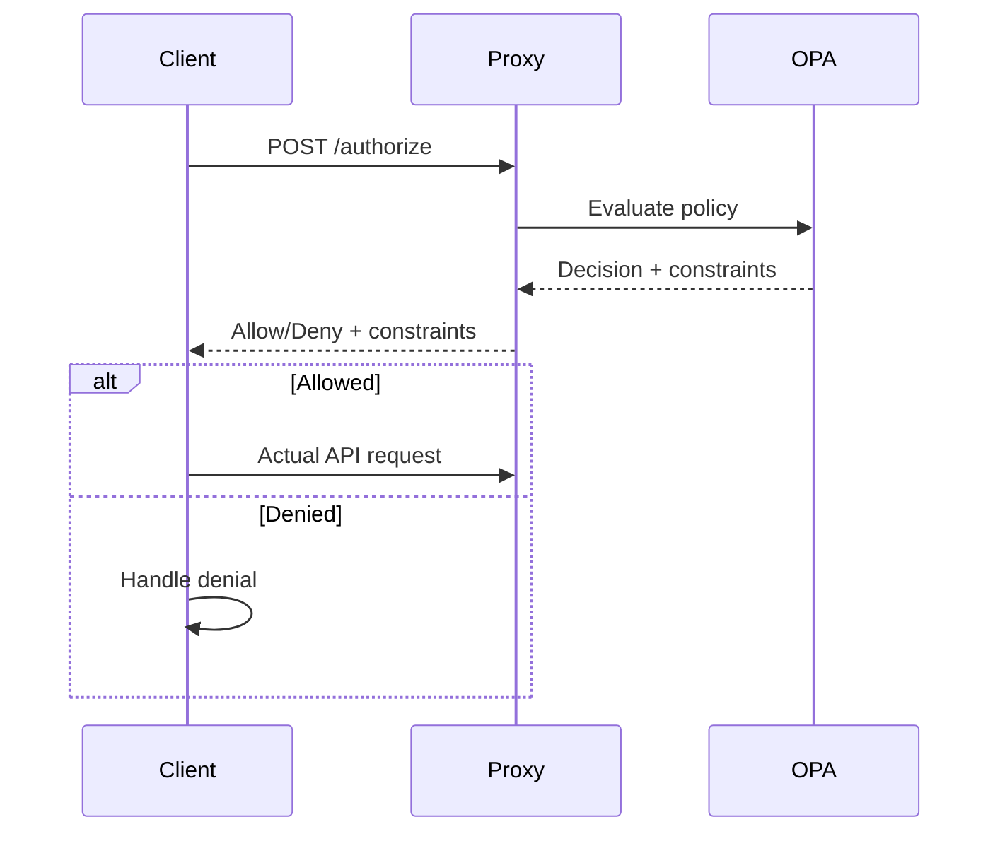

# POST /authorize Endpoint

The `/authorize` endpoint provides authorization decisions for external services. It evaluates whether a user is allowed to perform a specific action on a resource based on OPA policies.

## Request

### URL

```
POST /authorize
```

### Headers

| Header | Required | Description |
|--------|----------|-------------|
| `Content-Type` | Yes | Must be `application/json` |

### Request Body

```json
{
  "resource": "timeseries",
  "action": "read",
  "user": {
    "id": "m5hectest",
    "username": "m5hectest",
    "roles": ["CWMS Users", "TS ID Creator"],
    "offices": ["SWT"],
    "persona": "operator",
    "shift_start": 6,
    "shift_end": 18,
    "timezone": "America/Chicago"
  },
  "context": {
    "office_id": "SWT",
    "data_source": "USGS"
  }
}
```

### Body Parameters

| Parameter | Type | Required | Description |
|-----------|------|----------|-------------|
| `resource` | string | Yes | Resource being accessed (e.g., `timeseries`, `locations`, `offices`) |
| `action` | string | Yes | Action being performed: `read`, `create`, `update`, `delete` |
| `user` | object | No | User context object (alternative to `jwt_token`) |
| `context` | object | No | Additional context for authorization decision |
| `jwt_token` | string | No | JWT token for user authentication (alternative to `user` object) |

### User Object Fields

| Field | Type | Description |
|-------|------|-------------|
| `id` | string | User identifier |
| `username` | string | Username |
| `roles` | array | List of user roles |
| `offices` | array | List of offices the user belongs to |
| `persona` | string | Active persona (e.g., `operator`, `analyst`) |
| `shift_start` | number | Shift start hour (0-23) |
| `shift_end` | number | Shift end hour (0-23) |
| `timezone` | string | User timezone (IANA format) |

### Context Object Fields

| Field | Type | Description |
|-------|------|-------------|
| `office_id` | string | Office ID for the requested data |
| `data_source` | string | Data source identifier |
| `created_ns` | number | Creation timestamp in nanoseconds |
| `timestamp_ns` | number | Data timestamp in nanoseconds |

Additional fields can be included as needed by the OPA policy.

## Response

### Success Response (200 OK)

```json
{
  "decision": {
    "allow": true,
    "decision_id": "proxy-a1b2c3d4",
    "reason": "User has read access to timeseries in office SWT"
  },
  "user": {
    "id": "m5hectest",
    "username": "m5hectest",
    "email": "m5hectest@example.com",
    "roles": ["CWMS Users", "TS ID Creator"],
    "offices": ["SWT"],
    "primary_office": "SWT",
    "persona": "operator"
  },
  "constraints": {
    "allowed_offices": ["SWT"],
    "embargo_rules": {
      "SWT": 72,
      "default": 168
    },
    "embargo_exempt": false,
    "time_window": {
      "restrict_hours": 8
    },
    "data_classification": ["public", "internal"]
  },
  "timestamp": "2024-01-15T10:30:00.000Z"
}
```

### Response Fields

| Field | Type | Description |
|-------|------|-------------|
| `decision.allow` | boolean | Whether the action is allowed |
| `decision.decision_id` | string | Unique identifier for this decision (for audit logging) |
| `decision.reason` | string | Human-readable explanation of the decision |
| `user` | object | Resolved user information |
| `constraints` | object | Data filtering constraints to apply |
| `timestamp` | string | ISO 8601 timestamp of the decision |

### Constraints Object

| Field | Type | Description |
|-------|------|-------------|
| `allowed_offices` | array | Offices the user can access, or `["*"]` for all |
| `embargo_rules` | object | Hours of embargo per office (data newer than X hours restricted) |
| `embargo_exempt` | boolean | Whether user is exempt from embargo rules |
| `time_window` | object | Time window restrictions for historical data |
| `data_classification` | array | Classification levels the user can access |

### Error Responses

#### 400 Bad Request

Missing required fields:

```json
{
  "error": "Bad Request",
  "message": "resource and action are required fields"
}
```

Invalid action value:

```json
{
  "error": "Bad Request",
  "message": "action must be one of: read, create, update, delete"
}
```

#### 500 Internal Server Error

```json
{
  "error": "Internal Server Error",
  "message": "Authorization processing failed"
}
```

## Examples

### Using curl with User Object

```bash
curl -X POST http://localhost:3001/authorize \
  -H "Content-Type: application/json" \
  -d '{
    "resource": "timeseries",
    "action": "read",
    "user": {
      "id": "m5hectest",
      "username": "m5hectest",
      "roles": ["CWMS Users"],
      "offices": ["SWT"]
    },
    "context": {
      "office_id": "SWT"
    }
  }'
```

### Using curl with JWT Token

```bash
curl -X POST http://localhost:3001/authorize \
  -H "Content-Type: application/json" \
  -d '{
    "resource": "timeseries",
    "action": "create",
    "jwt_token": "eyJhbGciOiJSUzI1NiIsInR5cCI6IkpXVCJ9...",
    "context": {
      "office_id": "SWT"
    }
  }'
```

### Checking Write Permission

```bash
curl -X POST http://localhost:3001/authorize \
  -H "Content-Type: application/json" \
  -d '{
    "resource": "timeseries",
    "action": "update",
    "user": {
      "id": "m5hectest",
      "username": "m5hectest",
      "roles": ["CWMS Users", "TS ID Creator"],
      "offices": ["SWT"]
    },
    "context": {
      "office_id": "SWT",
      "data_source": "manual"
    }
  }'
```

## Use Cases

### Pre-flight Authorization Check

External services can check authorization before attempting an operation:



### Batch Authorization

For batch operations, check authorization once and cache the constraints:

```bash
# Get constraints for the session
CONSTRAINTS=$(curl -s -X POST http://localhost:3001/authorize \
  -H "Content-Type: application/json" \
  -d '{"resource": "timeseries", "action": "read", "jwt_token": "'$TOKEN'"}' \
  | jq -r '.constraints')

# Use constraints for multiple requests
echo $CONSTRAINTS
```

## Related Documentation

- [Data Filtering](../filtering/index.md) - How constraints affect data filtering
- [Authorization Context Header](../header-format/index.md) - Header format passed to downstream API
