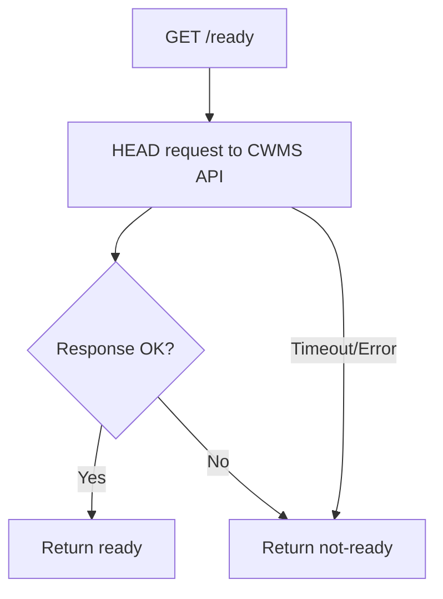

# Health Endpoints

The CWMS Authorization Proxy provides health and readiness endpoints for monitoring and container orchestration.

## GET /health

Basic health check endpoint that returns immediately if the service is running.

### Request

```
GET /health
```

### Response

```json
{
  "status": "healthy",
  "timestamp": "2024-01-15T10:30:00.000Z",
  "service": "authorizer-proxy"
}
```

### Response Fields

| Field | Type | Description |
|-------|------|-------------|
| `status` | string | Always `healthy` when the service is running |
| `timestamp` | string | ISO 8601 timestamp of the response |
| `service` | string | Service identifier (`authorizer-proxy`) |

### Example

```bash
curl http://localhost:3001/health
```

Response:

```json
{
  "status": "healthy",
  "timestamp": "2024-01-15T10:30:00.000Z",
  "service": "authorizer-proxy"
}
```

## GET /ready

Readiness check that verifies the proxy can reach the downstream CWMS Data API.

### Request

```
GET /ready
```

### Response (Ready)

```json
{
  "status": "ready",
  "downstream": "available",
  "timestamp": "2024-01-15T10:30:00.000Z"
}
```

### Response (Not Ready)

```json
{
  "status": "not-ready",
  "downstream": "unavailable",
  "timestamp": "2024-01-15T10:30:00.000Z"
}
```

### Response Fields

| Field | Type | Description |
|-------|------|-------------|
| `status` | string | `ready` or `not-ready` |
| `downstream` | string | `available` or `unavailable` |
| `timestamp` | string | ISO 8601 timestamp of the response |

### Example

```bash
curl http://localhost:3001/ready
```

## Behavior

### Health Check

The `/health` endpoint:
- Returns immediately without external checks
- Always returns 200 OK if the server is accepting connections
- Lightweight check suitable for high-frequency polling

### Readiness Check

The `/ready` endpoint:
- Makes a HEAD request to the downstream CWMS Data API
- Uses a 5-second timeout for the downstream check
- Returns `ready` only if the downstream API responds successfully
- Returns `not-ready` if the downstream API is unreachable or returns an error



## Container Orchestration

### Kubernetes

Configure liveness and readiness probes:

```yaml
apiVersion: v1
kind: Pod
spec:
  containers:
  - name: authorizer-proxy
    livenessProbe:
      httpGet:
        path: /health
        port: 3001
      initialDelaySeconds: 5
      periodSeconds: 10
    readinessProbe:
      httpGet:
        path: /ready
        port: 3001
      initialDelaySeconds: 10
      periodSeconds: 5
      failureThreshold: 3
```

### Docker Compose

Configure healthcheck in docker-compose:

```yaml
services:
  authorizer-proxy:
    image: cwms-authorizer-proxy:local-dev
    healthcheck:
      test: ["CMD", "curl", "-f", "http://localhost:3001/health"]
      interval: 30s
      timeout: 10s
      retries: 3
      start_period: 10s
```

### Podman

Check container health manually:

```bash
# Basic health check
podman exec authorizer-proxy curl -sf http://localhost:3001/health

# Readiness check
podman exec authorizer-proxy curl -sf http://localhost:3001/ready
```

## Monitoring Scripts

### Simple Health Check Script

```bash
#!/bin/bash
response=$(curl -sf http://localhost:3001/health)
if [ $? -eq 0 ]; then
    echo "Proxy is healthy"
    exit 0
else
    echo "Proxy is not responding"
    exit 1
fi
```

### Readiness Check with Retry

```bash
#!/bin/bash
max_attempts=30
attempt=1

while [ $attempt -le $max_attempts ]; do
    response=$(curl -sf http://localhost:3001/ready)
    status=$(echo $response | jq -r '.status')

    if [ "$status" = "ready" ]; then
        echo "Proxy is ready"
        exit 0
    fi

    echo "Attempt $attempt: Proxy not ready, waiting..."
    sleep 2
    attempt=$((attempt + 1))
done

echo "Proxy failed to become ready after $max_attempts attempts"
exit 1
```

## Use Cases

### Startup Sequencing

Wait for the proxy to be ready before running integration tests:

```bash
# Wait for proxy to be ready
until curl -sf http://localhost:3001/ready | jq -e '.status == "ready"' > /dev/null; do
    echo "Waiting for proxy..."
    sleep 2
done

echo "Proxy ready, running tests..."
npm test
```

### Load Balancer Health Checks

Configure your load balancer to use the health endpoint:

| Setting | Value |
|---------|-------|
| Health check path | `/health` |
| Health check interval | 30 seconds |
| Healthy threshold | 2 consecutive successes |
| Unhealthy threshold | 3 consecutive failures |
| Timeout | 5 seconds |

### Alerting

Monitor the ready endpoint for downstream issues:

```bash
# Check every minute and alert if not ready
while true; do
    status=$(curl -sf http://localhost:3001/ready | jq -r '.status')
    if [ "$status" != "ready" ]; then
        echo "ALERT: Proxy not ready - downstream may be unavailable"
    fi
    sleep 60
done
```
