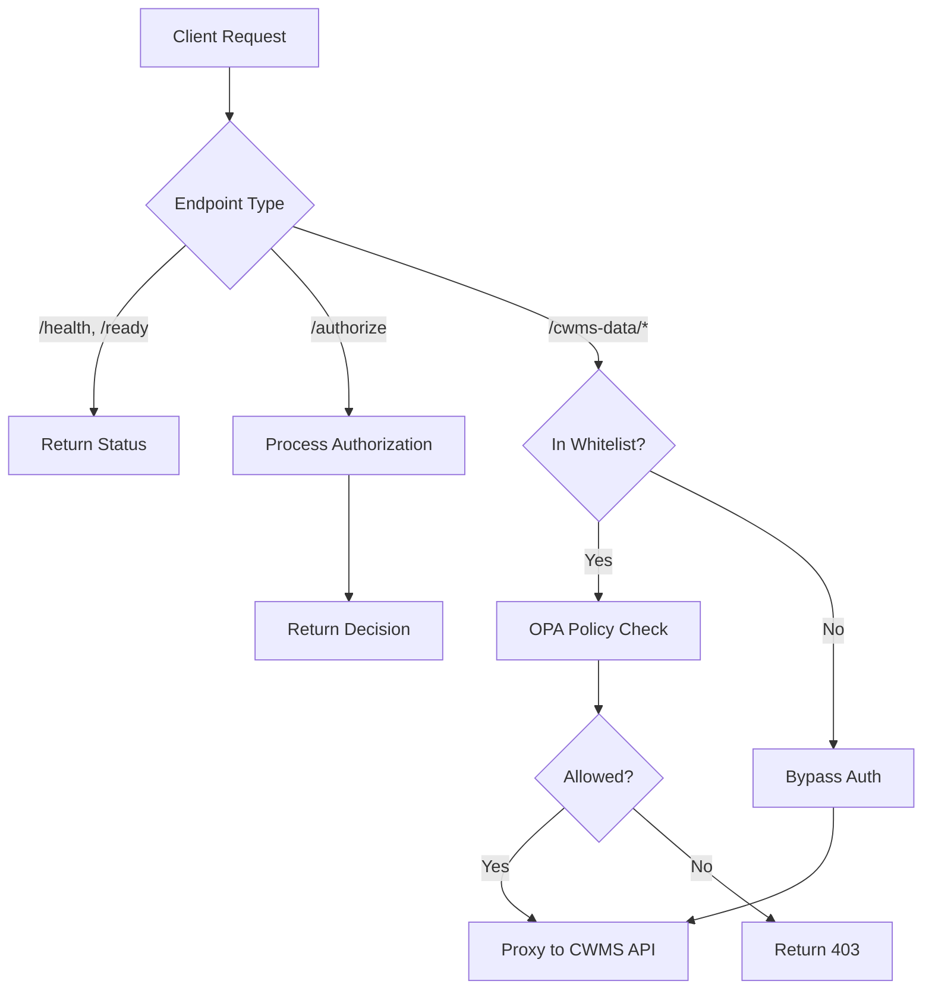

# Proxy API Overview

The CWMS Authorization Proxy exposes several API endpoints for authorization decisions, health monitoring, and transparent proxying of CWMS Data API requests.

## Base URL

The proxy listens on the configured `HOST` and `PORT` (default: `http://localhost:3001`).

## Endpoint Categories

### Authorization Endpoints

| Endpoint | Method | Description |
|----------|--------|-------------|
| `/authorize` | POST | Get authorization decision for a resource and action |

### Health Endpoints

| Endpoint | Method | Description |
|----------|--------|-------------|
| `/health` | GET | Basic health check |
| `/ready` | GET | Readiness check including downstream service availability |

### Proxy Endpoints

| Endpoint | Method | Description |
|----------|--------|-------------|
| `/cwms-data/*` | ALL | Transparent proxy to CWMS Data API with authorization |

## Authentication

### Authorization Endpoint

The `/authorize` endpoint accepts authentication via:

1. **JWT Token** - Pass a JWT token in the request body (`jwt_token` field)
2. **User Object** - Pass user context directly in the request body (`user` field)

### Proxy Endpoints

Proxied requests to `/cwms-data/*` extract authentication from:

1. **Authorization Header** - `Authorization: Bearer <jwt_token>`
2. **API Key Header** - `apikey: <key>` (for service-to-service communication)

## Request Flow



## Response Format

All API responses follow a consistent JSON structure:

### Success Response

```json
{
  "field": "value",
  "timestamp": "2024-01-15T10:30:00.000Z"
}
```

### Error Response

```json
{
  "error": "Error Type",
  "message": "Human-readable error description"
}
```

## HTTP Status Codes

| Code | Meaning |
|------|---------|
| 200 | Success |
| 400 | Bad Request - Invalid input |
| 401 | Unauthorized - Missing or invalid authentication |
| 403 | Forbidden - Authorization denied |
| 404 | Not Found - Endpoint does not exist |
| 500 | Internal Server Error - Unexpected error |
| 502 | Bad Gateway - Downstream service unavailable |

## CORS Support

The proxy enables CORS for all origins with the following settings:

- Allowed methods: GET, POST, PUT, PATCH, DELETE, OPTIONS
- Credentials: Enabled
- All origins allowed (configurable for production)

## OpenAPI Documentation

The proxy includes Swagger/OpenAPI documentation available at:

- Swagger UI: `http://localhost:3001/docs`
- OpenAPI JSON: `http://localhost:3001/docs/json`

## Endpoint Documentation

```{toctree}
:maxdepth: 1

authorize-endpoint
health-endpoints
```
