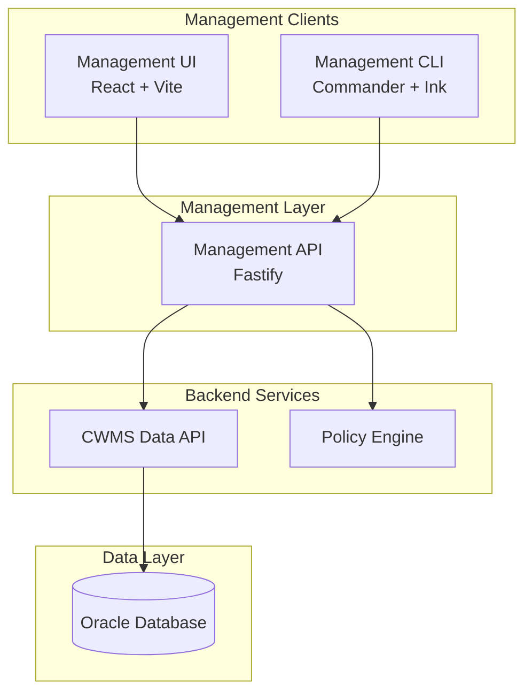
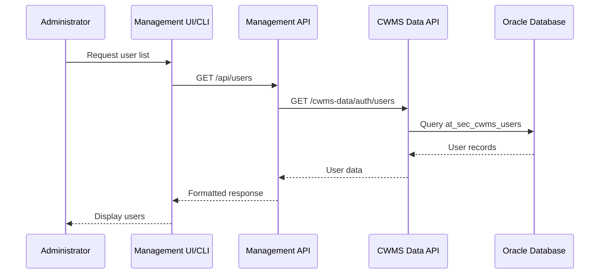

# Access Management Clients

| Status         | Proposed                                                                                                                   |
| :------------- | :------------------------------------------------------------------------------------------------------------------------- |
| **ADR #**      | 0007                                                                                                                       |
| **Author(s)**  | Solid Logix Team<br/>  [J. Hassan](https://github.com/jolitinh)<br/> [R. Cunningham](https://github.com/cunningryan)<br/> [V. Laxman](https://github.com/vairav)<br/> [M. Valenzuela](https://github.com/milver)<br/> [T. Boss](https://github.com/toddeboss)<br/> [C. Whitehead](https://github.com/ChristinaWhitehead) |
| **Sponsor**    | HEC/USACE                                                                                                                  |
| **Date**       | 2/2/2026                                                                                                                   |
| **Supersedes** | N/A                                                                                                                        |

## Objective

Document the management applications for CWMS access control, providing administrators with multiple interfaces to manage users, roles, and authorization policies. The management clients comprise a REST API, a web-based user interface, and a command-line interface, all designed to work together as a unified access management solution.

## Motivation

### Administrative Requirements

The CWMS Data API authorization system requires administrative tooling for:

- Managing user access and permissions across multiple offices
- Configuring role-based access control for the 7 user personas defined in PWS Exhibit 3
- Viewing and auditing authorization policies
- Supporting both technical and non-technical administrators

### Multiple Interface Requirements

Different administrator personas require different interfaces:

- **IT Administrators**: Prefer CLI for scripting and automation
- **Security Officers**: Require web UI for policy review and audit
- **Operations Team**: Need quick access to user management via web or CLI

## User Benefit

### Data Administrators

- Centralized user and role management
- Visual policy viewer for audit and compliance
- Multiple interface options based on preference and workflow

### IT Operations

- CLI for scripting and automation workflows
- JSON output format for integration with other tools
- Batch operations support

### Security and Compliance

- Complete audit trail visibility
- Policy review capabilities
- User access reporting

## Design Proposal

### Architecture Overview



### Data Flow



### Core Components

#### 1. Management API (management-api)

**Technology Stack:**

- Node.js 24.x runtime
- TypeScript 5.x for type safety
- Fastify framework for high-performance HTTP handling
- Pino for structured logging
- Zod for request/response validation

**Primary Responsibilities:**

- Provide RESTful endpoints for user and role management
- Aggregate data from CWMS Data API endpoints
- Transform and format responses for client consumption
- Handle authentication and session management

**API Endpoints:**

| Method | Endpoint | Description |
|--------|----------|-------------|
| GET | /api/users | List all users with pagination |
| GET | /api/users/:id | Get user details by ID |
| POST | /api/users | Create new user |
| PUT | /api/users/:id | Update user |
| GET | /api/roles | List all roles |
| GET | /api/roles/:id | Get role details |
| POST | /api/roles | Create new role |
| PUT | /api/roles/:id | Update role |
| GET | /api/policies | List authorization policies |
| GET | /api/policies/:id | Get policy details |

**Backend Integration:**

The Management API connects to CWMS Data API endpoints rather than accessing Keycloak or the database directly. This design ensures:

- Consistent data access through established API patterns
- Reuse of existing authentication and authorization logic
- Simplified deployment without direct database credentials

#### 2. Management UI (management-ui)

**Technology Stack:**

- React 18.x with functional components and hooks
- Vite 6.x for build tooling and development server
- TypeScript 5.x for type safety
- TanStack Query v5 for server state management
- Tailwind CSS 4.x for styling
- React Router for navigation

**Features:**

| Feature | Description |
|---------|-------------|
| User List | Paginated table with search and filter capabilities |
| User Detail | View and edit user information, office assignments, roles |
| Role List | Display all available roles with descriptions |
| Role Detail | View role permissions and assigned users |
| Policy Viewer | Read-only view of OPA policies for audit purposes |
| Dashboard | Summary statistics and recent activity |

**Component Architecture:**

```
src/
  components/
    users/
      user-list.tsx
      user-detail.tsx
      user-form.tsx
    roles/
      role-list.tsx
      role-detail.tsx
    policies/
      policy-viewer.tsx
    common/
      data-table.tsx
      search-input.tsx
      pagination.tsx
  hooks/
    use-users.ts
    use-roles.ts
    use-policies.ts
  services/
    api-client.ts
  pages/
    users.tsx
    roles.tsx
    policies.tsx
    dashboard.tsx
```

**State Management:**

TanStack Query handles all server state with:

- Automatic caching and background refetching
- Optimistic updates for improved UX
- Error handling and retry logic
- Request deduplication

#### 3. Management CLI (management-cli)

**Technology Stack:**

- Node.js 24.x runtime
- TypeScript 5.x for type safety
- Commander.js for command parsing
- Ink for terminal UI components
- Zod for input validation

**Commands:**

```
management-cli users list [--office <office>] [--format <table|json>]
management-cli users get <username> [--format <table|json>]
management-cli roles list [--format <table|json>]
management-cli roles get <role-id> [--format <table|json>]
management-cli policies list [--format <table|json>]
```

**Output Formats:**

- **Table**: Human-readable formatted output for terminal use
- **JSON**: Machine-readable output for scripting and automation

**Example Output (Table):**

```
Users
-----
Username     Office    Roles
-----------  --------  ---------------------------
m5hectest    SWT       CWMS Users, TS ID Creator
l2hectest    SPK       CWMS Users, TS ID Creator
l1hectest    SPL       (none)
```

**Example Output (JSON):**

```json
{
  "users": [
    {
      "username": "m5hectest",
      "office": "SWT",
      "roles": ["CWMS Users", "TS ID Creator"]
    }
  ]
}
```

### Implementation Approach

#### Phase 1: Management API Foundation

- Implement core Fastify service structure
- Create user and role endpoints
- Integrate with CWMS Data API
- Add request validation and error handling
- Deploy as containerized service

#### Phase 2: Management UI Development

- Set up React + Vite project structure
- Implement user list and detail views
- Implement role list and detail views
- Add policy viewer component
- Integrate TanStack Query for data fetching
- Deploy as static assets or containerized service

#### Phase 3: Management CLI Development

- Create Commander-based CLI structure
- Implement user commands
- Implement role commands
- Add output format options
- Package as standalone executable

### Alternatives Considered

#### Option 1: Direct Database Access

- **Pros**: Simpler architecture, fewer services
- **Cons**: Bypasses API authorization, requires database credentials in multiple places
- **Rejected**: Violates principle of API-first architecture

#### Option 2: Keycloak Admin UI Only

- **Pros**: No custom development required
- **Cons**: Limited to Keycloak capabilities, cannot show CWMS-specific data
- **Rejected**: Does not support CWMS-specific user attributes and office assignments

#### Option 3: Management Clients via CWMS Data API (Selected)

- **Pros**: Consistent access patterns, reuses existing authorization, single source of truth
- **Cons**: Requires Management API as intermediate layer
- **Selected**: Best alignment with API-first architecture and existing patterns

### Performance Implications

**Management API:**

- Response time target: <100ms for list operations, <50ms for single record
- Caching strategy: In-memory cache for frequently accessed data (roles, offices)
- Connection pooling to CWMS Data API

**Management UI:**

- Initial load: <2 seconds
- Subsequent navigation: <500ms with client-side routing
- TanStack Query stale time: 5 minutes for user/role data

**Management CLI:**

- Command execution: <2 seconds for list operations
- Startup time: <500ms with bundled executable

### Dependencies

**New Components:**

- Management API service (Fastify)
- Management UI application (React + Vite)
- Management CLI tool (Commander + Ink)

**Existing Integration:**

- CWMS Data API - Backend data source
- Authorization Proxy - Authentication passthrough
- Redis Cache - Session storage (optional)

**Development Dependencies:**

- Vitest for unit testing
- Playwright for E2E testing (UI)
- Supertest for API testing

### Engineering Impact

**Deployment:**

- Management API: Docker container (~150MB)
- Management UI: Static assets (~5MB) or Nginx container
- Management CLI: Single executable (~200KB)

**Maintenance:**

- Shared codebase in Nx monorepo
- Common TypeScript types across all clients
- Unified testing and CI/CD pipeline

### Platforms and Environments

**Local Development:**

- Podman/Docker containers
- Hot-reloading for UI and API development
- All services in docker-compose.podman.yml

**Service Ports:**

| Service | Port |
|---------|------|
| Management UI | 4200 |
| Management API | 3002 |
| Management CLI | N/A (local executable) |

### Best Practices

**Security:**

- All requests authenticated via JWT
- Role-based access to management functions
- Audit logging for all write operations
- No direct database credentials in clients

**User Experience:**

- Consistent design language across UI and CLI
- Helpful error messages with suggested actions
- Confirmation dialogs for destructive operations
- Keyboard navigation support in UI

**Code Quality:**

- TypeScript strict mode enabled
- Shared types between API and clients
- Comprehensive test coverage
- Automated linting and formatting

### Compatibility

**Backward Compatibility:**

- Management clients are new components, no backward compatibility concerns
- CWMS Data API endpoints remain unchanged

**Forward Compatibility:**

- API versioning support (/api/v1/users)
- Extensible command structure in CLI
- Component-based UI for easy feature additions

## Implementation Status

| Component | Status | Notes |
|-----------|--------|-------|
| Management API | In Progress | Refactoring to use CWMS Data API endpoints |
| Management UI | Development | React 18 + Vite 6 + TanStack Query v5 |
| Management CLI | Development | Commander + Ink, builds to 166KB executable |

## Success Criteria

### Functional Requirements

- Support user CRUD operations through all three interfaces
- Support role viewing and assignment
- Provide policy viewer for audit purposes
- Consistent data across all interfaces

### Performance Requirements

- API response time: <100ms for list operations
- UI initial load: <2 seconds
- CLI command execution: <2 seconds

### Usability Requirements

- CLI commands follow standard Unix conventions
- UI follows accessibility guidelines (WCAG 2.1 AA)
- Clear error messages with actionable guidance

## Conclusion

The Access Management Clients provide a comprehensive suite of tools for administering CWMS access control. By offering three distinct interfaces (API, UI, CLI), the solution accommodates different administrator workflows and preferences while maintaining consistency through a unified backend.

### Key Benefits

- **Flexibility**: Multiple interface options for different use cases
- **Consistency**: All clients share the same backend and data model
- **Maintainability**: Shared codebase in Nx monorepo with common types
- **Security**: All access flows through authenticated API endpoints

### Integration with Authorization System

These management clients complement the authorization middleware described in ADR 0005 by providing the administrative interface for:

- Managing users who will be subject to authorization policies
- Configuring roles that map to the 7 user personas
- Reviewing policies that govern access decisions

Together with the authorization proxy and policy engine, the management clients complete the access control solution for the CWMS Data API.
