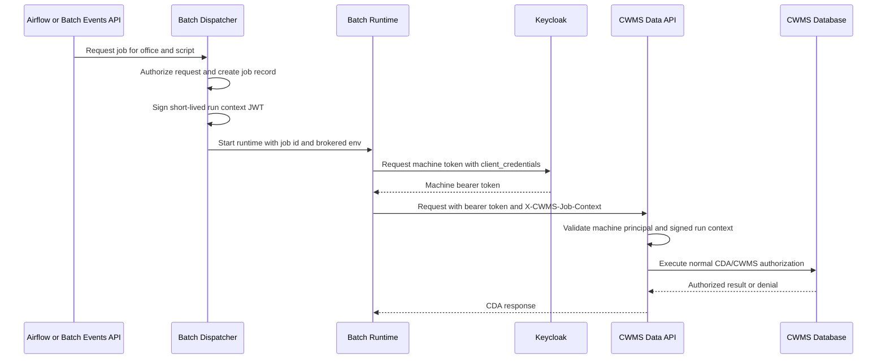

# Signed Batch Machine Run Context

| Status         | Proposed                |
| :------------- | :---------------------- |
| **ADR #**      | 0009                    |
| **Author(s)**  | CWBI Batch Runtime Team |
| **Sponsor**    | HEC/USACE               |
| **Date**       | 6/8/2026                |
| **Supersedes** | N/A                     |

## Objective

Provide CWMS Data API with a trusted batch run context for jobs that execute through a shared machine identity.

Batch runtimes will authenticate to CDA with a service account (via Keycloak). Each job will also provide a signed context token that identifies the authorized job launch context, including the office for which the scheduler or API approved the run.

The signed context is **not** a replacement for normal CDA or database authorization. It establishes **who** launched the machine runtime and why. CDA and the CWMS database remain responsible for deciding whether the machine principal may read or write the requested resource office.

## Motivation

A single machine service account reduces Keycloak and AWS Batch configuration requirements. It also removes the natural office-specific identity that existed when each office had its own API key or job role in AWS. CDA therefore needs trusted context from the dispatcher so scripts cannot choose their own run authority by changing an environment variable, URI parameter, or request body.

This is needed because CDA request office fields describe resource ownership, not caller authority. For example, a job approved for SWT (Tulsa District) may write data owned by another office when the mapped machine user has the required database roles. The request office identifies the target data; it does not identify who the job is running as. i.e. `&office=SWT` in the URI.

## User Benefit

### For Batch Operators

- Runtime job definitions can be managed by language or image instead of by office/image combinations.
- One machine service account can support scheduled and ad hoc batch execution.
- Office launch context is still available for audit and policy decisions.

### For Script Authors

- Scripts call CDA with standard bearer-token authentication.
- Scripts do not need per-office CDA API keys.
- Scripts can still read and write resource offices allowed by the mapped CDA database user.

### For Security and Operations

- CDA rejects machine requests that lack a signed dispatcher issued run context.
- Request parameters and payload fields are not trusted as caller authority.
- CDA audit records can include both the machine principal and the signed job context.

## Design Proposal

### Batch Run Flow

### Run Context Token

The dispatcher signs a short-lived JWT from the authoritative job record. The runner sends the token to CDA in the `X-CWMS-Job-Context` header.

The token contains:

| Claim                        | Description                                           |
| ---------------------------- | ----------------------------------------------------- |
| `iss`                        | Trusted dispatcher issuer                             |
| `aud`                        | CDA audience                                          |
| `iat`                        | Issued-at time                                        |
| `exp`                        | Expiration time                                       |
| `job_id`                     | Batch job identifier                                  |
| `script_id` or `script_slug` | Script identity                                       |
| `run_as_office`              | Office context authorized for the job launch          |
| `requested_by`               | User or system that requested the job, when available |
| `dispatch_source`            | Source such as `airflow` or `api`                     |

The `run_as_office` claim represents the authorized launch context. It is not the same as a resource office on a CDA endpoint.

### CDA Behavior

CDA validates signed run context only for configured batch machine users.

For those users, CDA will:

- Require `X-CWMS-Job-Context`.
- Validate signature, issuer, audience, and expiration.
- Read job and run context from signed claims.
- Reject missing, expired, forged, or wrong-audience tokens.
- Make the run context available for audit logging and default session context where appropriate.

CDA will not:

- Treat request `office`, `office-id`, or body office fields as caller authority.
- Reject a request solely because the target resource office differs from `run_as_office`.
- Use signed run context to bypass route roles or database office roles.

Normal CDA route authorization and CWMS database permissions determine whether the machine user can act on the requested resource office.

### Configuration

The Java API is configured with system properties or environment variables:

| Setting                                  | Description                                                    |
| ---------------------------------------- | -------------------------------------------------------------- |
| `cwms.dataapi.batch.jobContext.secret`   | Signing secret for validating HS256 job context tokens         |
| `cwms.dataapi.batch.jobContext.issuer`   | Expected dispatcher issuer                                     |
| `cwms.dataapi.batch.jobContext.audience` | Expected CDA audience                                          |
| `cwms.dataapi.batch.machineUsers`        | Comma-separated CDA users allowed to present batch run context |

The signing secret belongs in a managed secret store. A later hardening step should use asymmetric signing or KMS-backed verification so CDA can verify run context without sharing the signing key.

## Alternatives Considered

### Per-Office Keycloak Service Accounts

Create one service account per office or trust boundary.

- **Pros**: Office context is represented directly by the service account.
- **Cons**: Recreates service-account and secret sprawl as offices and runtimes grow.
- **Rejected**: The design goal is one machine identity for batch runtimes.

### Per-Office Batch Job Definitions and API Keys

Continue using separate Batch definitions and CDA API secrets per office/runtime combination.

- **Pros**: Uses the existing model.
- **Cons**: Requires hard-coded expansion across offices, runtimes, images, and secrets.
- **Rejected**: The dynamic runtime model is intended to remove this duplication.

### Trust Request or Environment Office

Use `OFFICE`, URI parameters, query parameters, or request body fields to decide who the job is running as.

- **Pros**: Simple to pass through the runtime.
- **Cons**: These values are controlled by scripts and often identify target data ownership rather than caller authority.
- **Rejected**: Request office is resource context, not trusted run context.

### Signed Dispatcher-Issued Run Context

Use one machine identity and require a short-lived signed token from the trusted dispatcher.

- **Pros**: Reduces runtime duplication while preserving trusted job launch context and normal CDA/DB authorization.
- **Cons**: Requires token validation and signing key management.
- **Selected**: Provides the required trust boundary without per-office machine identities.

## Compatibility

Existing user API key and user OIDC flows are unchanged.

Non-machine users do not need `X-CWMS-Job-Context`. Configured batch machine users must provide a valid signed run context.

Endpoint resource-office semantics are unchanged. Controllers and DAOs may continue to use request office values to retrieve or store CWMS resources. The database remains the source of truth for whether the active CDA user has roles for those resources.

## Implementation Status

### Proposed

- Add CDA validation for `X-CWMS-Job-Context` on configured batch machine users.
- Preserve signed run context separately from request resource office.
- Expose run context for audit logging and default session behavior where appropriate.
- Add dispatcher-side signing in the batch events service.
- Add runner support for forwarding `X-CWMS-Job-Context` with CDA requests.

## Criteria

### Functional Requirements

- A batch job launched through Airflow or the ad hoc API can call CDA using the shared machine Keycloak service account.
- CDA rejects configured machine-user requests that omit or forge signed run context.
- CDA records signed job/run context for audit.
- Resource office access remains controlled by CDA route roles and CWMS database roles.
- A job with `run_as_office=SWT` can act on another office's resource data only when the mapped machine user has the required roles for that resource office.

### Test Scenarios

- **Direct API path**: An authorized user submits an SWT job through the batch events API; CDA accepts the valid signed run context.
- **Airflow path**: Airflow triggers the same job path; CDA receives and validates the signed run context.
- **Cross-office allowed**: Signed run context is SWT, target resource office is MVS or SPK, and the request succeeds when the machine user has the needed DB roles.
- **Cross-office denied**: Signed run context is SWT, target resource office is unauthorized for the machine user, and CDA/DB returns `403`.
- **Forgery denied**: A script changes `OFFICE` or request `office` without a valid signed context; CDA rejects the request.

## Conclusion

Signed batch run context allows CDA to support dynamic batch runtimes with one Keycloak service account while preserving the existing CWMS authorization model.

The token represents trusted job launch context. It does not redefine resource office semantics and does not bypass normal CDA or database authorization for the data being read or written.
