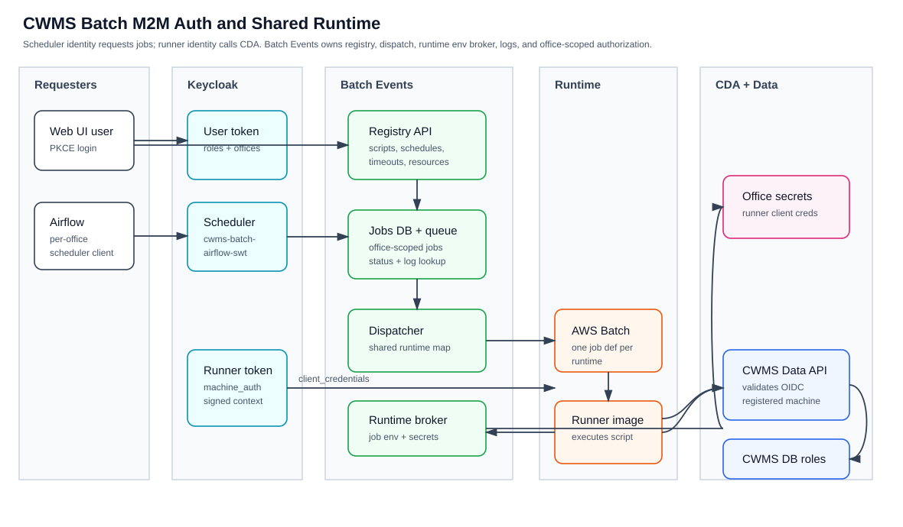
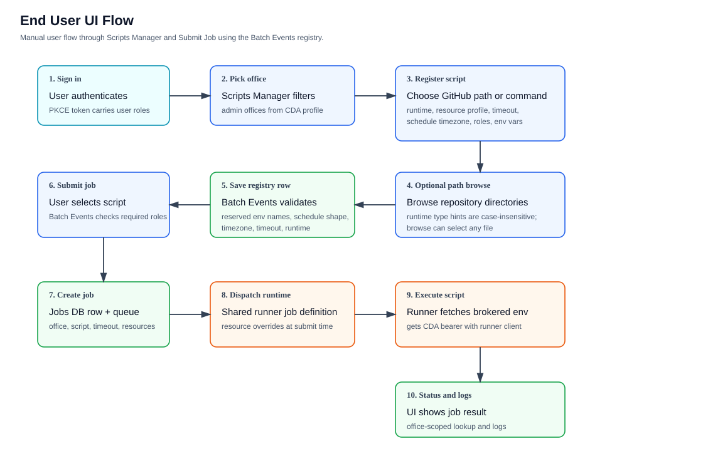
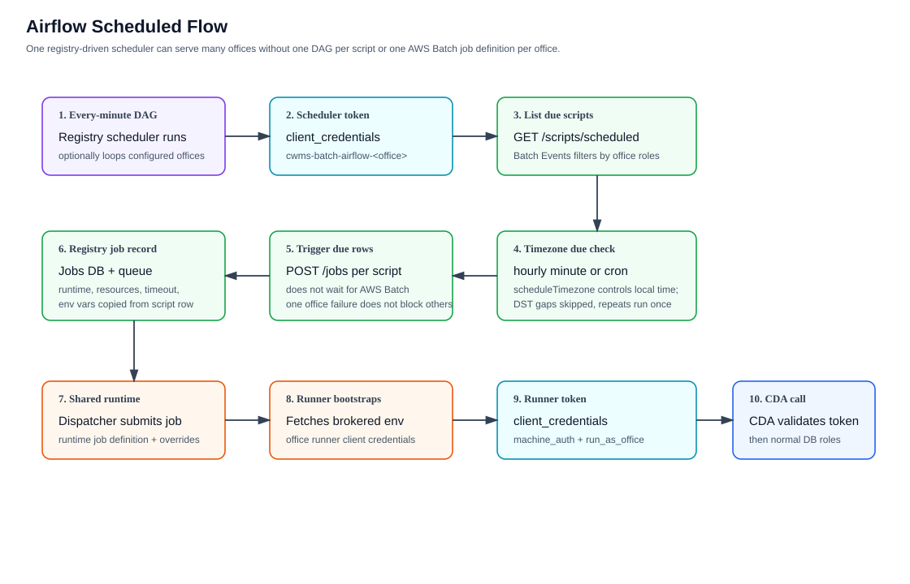

# Batch Machine Run Context

| Status         | Proposed                |
| :------------- | :---------------------- |
| **ADR #**      | 0010                    |
| **Author(s)**  | CWBI Batch Runtime Team |
| **Sponsor**    | HEC/USACE               |
| **Date**       | 6/8/2026                |
| **Supersedes** | N/A                     |

## Objective

Provide CWMS Data API with a trusted batch run context for jobs that execute through shared Batch runtime infrastructure.

Batch runtimes will authenticate to CDA with office-scoped service accounts through Keycloak. Each job will provide trusted launch context, including the office for which the scheduler or API approved the run. CDA will use Keycloak-minted access-token claims when Keycloak can mint that context into the normal access token. CDA will also support a signed dispatcher context header as a fallback when Keycloak cannot provide job context without a custom extension.

The signed context is **not** a replacement for normal CDA or database authorization. It establishes **who** launched the machine runtime and why. CDA and the CWMS database remain responsible for deciding whether the machine principal may read or write the requested resource office. The machine principal must already be registered in CDA and the CWMS database; CDA must not auto-create batch machine users.

## Motivation

Shared AWS Batch job definitions reduce AWS Batch configuration requirements, but they must not remove the office-specific machine identity used by CDA and the CWMS database. The current preferred shape is one scheduler service account and one runner service account per office or trust boundary. CDA still needs trusted context from Keycloak or the dispatcher so scripts cannot choose their own run authority by changing an environment variable, URI parameter, or request body.

This is needed because CDA request office fields describe resource ownership, not caller authority. For example, a job approved for SWT (Tulsa District) may write data owned by another office when the mapped machine user has the required database roles. The request office identifies the target data; it does not identify who the job is running as. i.e. `&office=SWT` in the URI.

## User Benefit

### For Batch Operators

- Runtime job definitions can be managed by language or image instead of by office/image combinations.
- Office service accounts can be managed in Keycloak while AWS Batch job definitions remain shared.
- Office launch context is available for audit and policy decisions.

### For Script Authors

- Scripts call CDA with standard bearer-token authentication.
- Scripts do not need per-office CDA API keys.
- Scripts can still read and write resource offices allowed by the mapped CDA database user.

### For Security and Operations

- CDA rejects machine requests that lack trusted Keycloak-minted or dispatcher-issued run context.
- Request parameters and payload fields are not trusted as caller authority.
- CDA audit records can include both the machine principal and the signed job context.

## Design Proposal

### Batch Run Flow

Editable source: [batch-m2m-overview.drawio](diagrams/batch-m2m-overview.drawio)

The scheduler and runner identities are intentionally separate. A user or
office scheduler can request an authorized job, but the running script calls CDA
with an office-scoped runner service account. Batch Events remains the source
of truth for script registry rows, job records, runtime env brokering, status,
and log lookup.

### End User UI Flow

Editable source: [batch-ui-job-flow.drawio](diagrams/batch-ui-job-flow.drawio)

The Batch Events UI is now registry-oriented. A script admin chooses an office,
creates or edits a script row, selects either a GitHub file path or an inline
command, configures runtime, resource profile, timeout, schedule, roles, env
vars, and secret names, then submits jobs from that registry row. GitHub file
paths can be browsed from the configured repository checkout and show
runtime-specific file type hints, while command rows intentionally allow trusted
users to run arbitrary commands in the trusted runtime image. The local executor
and AWS Batch both honor the configured timeout; local timeout handling was
verified with a command that sleeps longer than its one-minute timeout.

### Airflow Scheduled M2M Flow

Editable source: [batch-airflow-scheduler-flow.drawio](diagrams/batch-airflow-scheduler-flow.drawio)

The scheduler identity and runner identity are intentionally separate. Airflow's office-specific service account is authorized to request a job. The runner's office-specific service account is the machine principal used when the job calls CDA.

Airflow does not submit AWS Batch jobs directly for the registry-driven path.
Instead, the scheduled DAG lists due scripts through Batch Events, evaluates
hourly or cron schedules using each script's `scheduleTimezone`, and posts a
Batch Events job for each due row. Daylight-saving time gaps are skipped and
repeated local occurrences run once. Airflow does not wait for AWS Batch
completion; Batch Events owns dispatch, status, log lookup, and runtime broker
behavior after the job is accepted.

### Keycloak-Minted Run Context

When available, Keycloak mints the batch run context into the normal access token. CDA validates that token through the existing OIDC flow and reads these claims:

| Claim           | Description                                  |
| --------------- | -------------------------------------------- |
| `machine_auth`  | Marks the access token as a batch machine run |
| `run_as_office` | Office context authorized for the job launch |

The `run_as_office` claim represents the authorized launch context. It is not the same as a resource office on a CDA endpoint.

### Signed Run Context Fallback

The dispatcher signs a short-lived JWT from the authoritative job record. The runner sends the token to CDA in the `X-CWMS-Job-Context` header.

The token contains:

| Claim                        | Description                                           |
| ---------------------------- | ----------------------------------------------------- |
| `iss`                        | Trusted dispatcher issuer                             |
| `aud`                        | CDA audience                                          |
| `iat`                        | Issued-at time                                        |
| `exp`                        | Expiration time                                       |
| `job_id`                     | Batch job identifier                                  |
| `script_id` or `script_slug` | Script identity                                       |
| `run_as_office`              | Office context authorized for the job launch          |
| `requested_by`               | User or system that requested the job, when available |
| `dispatch_source`            | Source such as `airflow` or `api`                     |

### CDA Behavior

CDA validates batch run context for machine-authenticated requests.

For those requests, CDA will:

- Prefer validated OIDC claims from the access token.
- Fall back to `X-CWMS-Job-Context` for configured batch machine users.
- Validate signature, issuer, audience, and expiration.
- Read only the run office needed to establish session context from trusted run context claims.
- Reject missing, expired, forged, or wrong-audience tokens.
- Make additional job context available to logging only when a logging-specific mechanism exists.

CDA will not:

- Treat request `office`, `office-id`, or body office fields as caller authority.
- Reject a request solely because the target resource office differs from `run_as_office`.
- Use batch run context to bypass route roles or database office roles.
- Expose job identifiers or requester metadata as general request attributes for downstream controllers.

Normal CDA route authorization and CWMS database permissions determine whether the machine user can act on the requested resource office.

### Configuration

The Java API is configured with system properties or environment variables:

| Setting                                  | Description                                                    |
| ---------------------------------------- | -------------------------------------------------------------- |
| `cwms.dataapi.batch.jobContext.secret`   | Signing secret for validating HS256 job context tokens         |
| `cwms.dataapi.batch.jobContext.issuer`   | Expected dispatcher issuer                                     |
| `cwms.dataapi.batch.jobContext.audience` | Expected CDA audience                                          |
| `cwms.dataapi.batch.machineUsers`        | Comma-separated CDA users allowed to present batch run context |

The signing secret belongs in a managed secret store. A later hardening step should use asymmetric signing or KMS-backed verification so CDA can verify run context without sharing the signing key.

When Keycloak mints the batch run context directly, CDA does not need the signing secret for those requests. The machine principal must still be registered in CDA and the CWMS database.

### Keycloak Client and Service Account Shape

The local Keycloak realm uses confidential OIDC clients with service accounts to model non-human batch actors. In CWBI/cloud Keycloak, the same shape needs to be recreated for each environment. These are Keycloak clients and service-account users, not AWS Batch job definitions.

Some configuration is common to all offices:

| Item | Purpose |
| ---- | ------- |
| `machine_auth` access-token claim | Marks a service-account token as a CDA batch machine token. CDA uses this to distinguish machine run tokens from normal user OIDC tokens. |
| `run_as_office` access-token claim | Carries the office context authorized for the launch. For office-specific clients this value is stable, such as `SWT`, `SPK`, or another office code. |
| CDA/CWMS user registration for runner service accounts | CDA rejects unregistered machine principals. The corresponding service-account principal must exist in CDA and the CWMS database with the roles needed for the resource offices it will access. |
| Batch Events user/CAC roles | Human users keep using normal Keycloak/CAC sessions. Batch Events checks those user roles before allowing interactive job creation, editing, or submission. |

Office-specific clients are replicated per office or per trust boundary. In the examples below, `swt` is the office suffix; a production rollout would create equivalent clients such as `cwms-batch-runner-spk` or `cwms-batch-airflow-mvp` where those offices are enabled.

| Name pattern | Local example | Replicate per office? | Used by | Why it exists |
| ------------ | ------------- | --------------------- | ------- | ------------- |
| `cwms-batch-runner-<office>` | `cwms-batch-runner-swt` | Yes | The job runner container | This is the identity used by the running script when it calls CDA. Its token should include `machine_auth=true` and `run_as_office=<office>`. CDA maps the token subject to a registered machine principal and then normal CDA/database roles decide which resource offices it may access. |
| `cwms-batch-airflow-<office>` | `cwms-batch-airflow-swt` | Yes, when Airflow schedules jobs for that office | Airflow scheduled DAGs | This is the scheduler identity used to call Batch Events and request due jobs for an office. It should be allowed to list and submit scheduled Batch Events jobs for that office, but it is not the CDA write identity used inside the running job. |
| Normal user/OIDC client and CAC user roles | Existing user login clients and users | No per-office service-account pattern, but user roles are office-scoped | Interactive Batch Events UI/API users | Human users authenticate with their CAC-backed Keycloak session. Batch Events authorizes whether the user may create scripts, manage schedules, or submit jobs for an office. The user's login does not become the CDA token used by the runner. |

Keeping scheduler and runner identities separate prevents permission bleed. Airflow needs permission to trigger jobs for an office; the runner needs CDA/database roles to read or write data while the job executes. A user logged into the Batch Events UI needs permission to request a job, but the job itself still uses the office runner service account and trusted run context.

## Alternatives Considered

### Per-Office Keycloak Service Accounts

Create one scheduler service account and one runner service account per office or trust boundary.

- **Pros**: Office context is represented directly by the service account.
- **Cons**: Recreates service-account and secret sprawl as offices and runtimes grow.
- **Selected for current rollout**: This avoids Keycloak custom extensions while still allowing AWS Batch job definitions and runner images to be shared across offices.

### Per-Office Batch Job Definitions and API Keys

Continue using separate Batch definitions and CDA API secrets per office/runtime combination.

- **Pros**: Uses the existing model.
- **Cons**: Requires hard-coded expansion across offices, runtimes, images, and secrets.
- **Rejected**: The dynamic runtime model is intended to remove this AWS Batch and API-key duplication.

### Trust Request or Environment Office

Use `OFFICE`, URI parameters, query parameters, or request body fields to decide who the job is running as.

- **Pros**: Simple to pass through the runtime.
- **Cons**: These values are controlled by scripts and often identify target data ownership rather than caller authority.
- **Rejected**: Request office is resource context, not trusted run context.

### Signed Dispatcher-Issued Run Context

Use a shared machine identity and require a short-lived signed token from the trusted dispatcher.

- **Pros**: Reduces runtime duplication while preserving trusted job launch context and normal CDA/DB authorization.
- **Cons**: Requires token validation and signing key management.
- **Fallback proposal**: Provides the required trust boundary if Keycloak cannot mint the required run context into the access token and per-office service accounts are not sufficient for a future use case.

### Keycloak-Minted Job Context Claims

Have Keycloak mint trusted machine context into the normal access token.

- **Pros**: CDA validates one JWT from one issuer and does not need a second signing secret.
- **Cons**: Dynamic per-job values such as `job_id` would require more Keycloak customization than CWBI is likely to operate.
- **Preferred shape for current rollout**: Use office-scoped Keycloak service accounts that mint stable claims such as `machine_auth` and `run_as_office`; keep per-job metadata in Batch Events.

## Compatibility

Existing user API key and user OIDC flows are unchanged.

Non-machine users do not need batch run context. Configured batch machine users must provide either Keycloak-minted machine run claims or a valid signed run context.

Endpoint resource-office semantics are unchanged. Controllers and DAOs may continue to use request office values to retrieve or store CWMS resources. The database remains the source of truth for whether the active CDA user has roles for those resources.

## Implementation Status

### Current rollout

- Use per-office Keycloak scheduler and runner service accounts.
- Have the runner token include `machine_auth` and `run_as_office`.
- Keep AWS Batch job definitions shared by runtime rather than by office.
- Keep job id, script, schedule, timeout, resource profile, env vars, and allowed secret names in the Batch Events registry.
- Let script admins register either a GitHub file path or a trusted runtime command.
- Let script admins choose schedule timezone; cron and hourly schedules are evaluated in that timezone by Airflow before a job is posted.
- Let script admins choose small, medium, or large resource profiles; AWS Batch receives resource overrides at dispatch time.
- Keep local Docker execution aligned with AWS Batch timeout behavior so local E2E can prove long-running jobs fail when they exceed the configured timeout.

### CDA implementation

- Accept Keycloak-minted `machine_auth` and `run_as_office` claims from validated OIDC access tokens.
- Add CDA validation for `X-CWMS-Job-Context` on configured batch machine users.
- Preserve batch run context separately from request resource office.
- Use run context only for session behavior in CDA; reserve job/requester metadata for future logging.
- Keep dispatcher-side signing and `X-CWMS-Job-Context` as a fallback path rather than the preferred production shape.
- Reject unregistered machine principals rather than auto-creating users when a machine token appears.

## Criteria

### Functional Requirements

- A batch job launched through Airflow or the ad hoc API can call CDA using the registered office runner Keycloak service account.
- CDA accepts registered machine-user requests with valid Keycloak-minted machine run claims.
- CDA rejects configured machine-user requests that omit or forge run context.
- CDA rejects configured batch machine principals that are not already registered in CDA/DB.
- CDA can expose validated run context for audit without trusting script-controlled office values.
- Resource office access remains controlled by CDA route roles and CWMS database roles.
- A job with `run_as_office=SWT` can act on another office's resource data only when the mapped machine user has the required roles for that resource office.

### Test Scenarios

- **Direct API path**: An authorized user submits an SWT job through the batch events API; CDA accepts valid machine run context.
- **Airflow path**: Airflow triggers the same job path; CDA receives and validates machine run context.
- **Cross-office allowed**: Batch run context is SWT, target resource office is MVS or SPK, and the request succeeds when the machine user has the needed DB roles.
- **Cross-office denied**: Batch run context is SWT, target resource office is unauthorized for the machine user, and CDA/DB returns `403`.
- **Forgery denied**: A script changes `OFFICE` or request `office` without a valid signed context; CDA rejects the request.

## Conclusion

Trusted batch run context allows CDA to support dynamic shared Batch runtimes while preserving the existing CWMS authorization model.

The Keycloak token claims or signed fallback token represent trusted job launch context. They do not redefine resource office semantics and do not bypass normal CDA or database authorization for the data being read or written.
