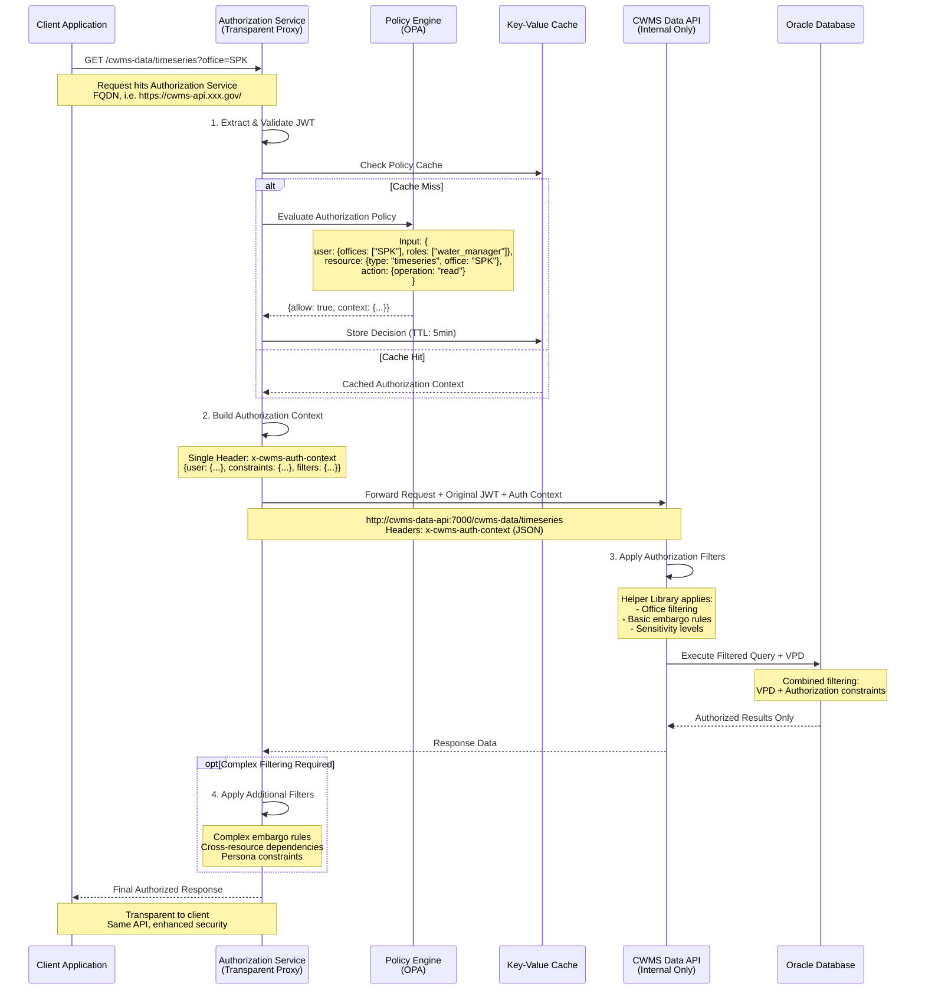
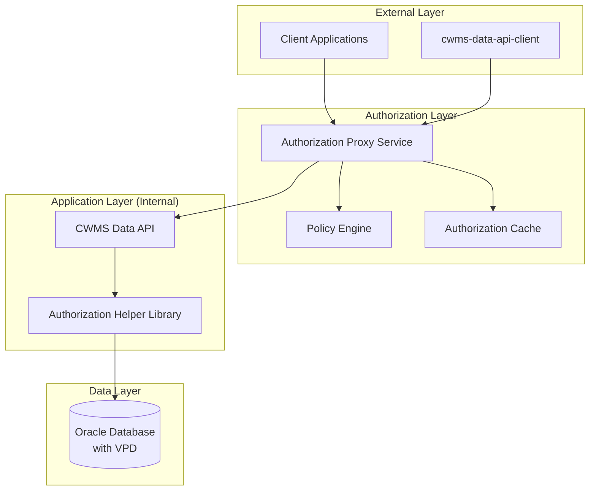

# Authorization Middleware Implementation

| Status         | Proposed                                                                                                                   |
| :------------- | :------------------------------------------------------------------------------------------------------------------------- |
| **RFC #**      | 0001                                                                                                                       |
| **Author(s)**  | Solid Logix Team<br/>•  [J. Hassan](https://github.com/jolitinh)<br/>• [R. Cunningham](https://github.com/cunningryan)<br/>• [V. Laxman](https://github.com/vairav)<br/>• [M. Valenzuela](https://github.com/milver)<br/>• [T. Boss](https://github.com/toddeboss)<br/>• [C. Whitehead](https://github.com/ChristinaWhitehead) |
| **Sponsor**    | HEC/USACE                                                                                                                  |
| **Date**       | 7/6/2025                                                                                                                   |
| **Supersedes** | Initial RFC draft                                                                                                          |

## Objective

Implement a high-performance TypeScript-based authorization middleware service for the CWMS Data API that provides fine-grained, office-based access control to support HEC's transition from Oracle VPD to API-level authorization. The solution must support multiple user personas, maintain compatibility with existing authentication systems, and enable gradual migration from the current 32-database architecture to a single cloud-based system.

**Scope**: While the CWMS Data API comprises 279 REST endpoints across 96 controller classes, this implementation focuses exclusively on timeseries resource endpoints. This targeted approach will establish the foundational authorization patterns and infrastructure that can be systematically extended to cover all remaining resources (locations, ratings, forecasts, water supply, etc.) in future phases.

## Motivation

### Current Limitations

The existing Oracle VPD-based authorization system cannot support HEC's evolving requirements:

- Limited to two Q-38 roles (modifier and admin)
- Cannot enforce the 7 distinct user personas defined in PWS Exhibit 3
- No support for time-based embargo rules (7-day default) at API level
- Cannot implement data source restrictions (MANUAL vs AUTOMATED)
- No append-only enforcement for automated collection systems
- Cannot enforce 24-hour modification windows for Dam Operators
- No shift-hour validation (6am-6pm) for operational constraints
- No parameter-level filtering for external cooperators

### Business Drivers

- **Consolidation**: Moving from 32 independent databases to single cloud-based system
- **API-First**: Transition from direct database access to REST API only
- **Security**: Enhanced access control for critical water management infrastructure
- **Compliance**: NIST RMF and OWASP security requirements
- **Scalability**: Support for future growth and additional user types

## User Benefit

### Transparent to End Users

- No changes to existing API endpoints or client applications
- Same authentication flows (API keys, JWT tokens)
- Backward compatibility during migration period

### Enhanced for Administrators

- Web-based permission management interface
- Granular office-based access controls
- Real-time policy updates without code changes
- Comprehensive audit trails for compliance
- Time-based embargo rule configuration (7-day default)
- User persona management for 7 distinct roles
- Data source tracking and enforcement

### Operational Benefits

- Independent scaling of authorization service
- Faster policy changes without database modifications
- Better performance through intelligent caching
- Detailed authorization decision logging

## Design Proposal

### Architecture Overview



### Transparent Proxy Data Flow



### Core Components

#### 1. Authorization Middleware Service

**Technology Stack:**

- Node.js 22.x LTS or greater runtime
- TypeScript 5.x for type safety
- Fastify framework for high-performance HTTP handling
- Prometheus metrics for monitoring
- Pino for high-performance structured logging

**Primary Modules:**

- **Transparent Proxy Handler**: Generic HTTP proxy for timeseries-related CWMS API endpoints
- **Policy Evaluator**: OPA integration for authorization decisions with intelligent caching
- **Authorization Context Builder**: Creates structured authorization context for Java API integration
- **Selective Response Filter**: Applies complex filtering only when required (embargo, cross-resource, persona constraints)
- **Audit Logger**: Complete authorization decision tracking with request correlation

#### 2. Policy Engine Integration (Open Policy Agent)

**Policy Structure:**

- Office-based access control (primary filtering mechanism)
- Role-based permissions for CRUD operations
- Time-based embargo rules with override capabilities (7-day default)
- Resource sensitivity filtering (public, internal, restricted, classified data)
- Persona-specific constraints per PWS Exhibit 3

**7 User Personas (PWS Exhibit 3):**

1. **Anonymous/Public User**: Read-only access to public data after embargo period
2. **Dam Operator**: Manual data entry only, 24-hour modification window, shift hours (6am-6pm)
3. **Water Manager**: Embargo override capability, multi-office access, emergency operations
4. **Data Manager**: Bulk operations, cross-office access, delete permissions with justification
5. **Automated Collection System**: Append-only constraints, API key authentication, no historical edits
6. **Automated Processing System**: Derived data generation, cross-office read access, no raw data modification
7. **External Cooperator**: Parameter-specific access based on partnership agreements

**Policy Data Management:**

- Office configuration with embargo hours and regional groupings
- Permission matrices mapping roles to operations by resource type
- User persona definitions with specific constraints and capabilities
- Dynamic policy updates without code deployment

**Specific Policy Requirements:**

- **Time-based Embargo**: 7-day default embargo period, immediate access for Dam Operators
- **Data Source Validation**: Enforce MANUAL vs AUTOMATED data restrictions per persona
- **Append-Only Constraints**: Prevent historical data modification for automated systems
- **24-Hour Modification Window**: Allow Dam Operators to correct manual entries within 24 hours
- **Shift Hour Validation**: Restrict Dam Operator actions to 6am-6pm operational hours
- **Parameter-Level Filtering**: Whitelist specific parameters for external cooperators
- **Cross-Office Rules**: Enable multi-office access for Water Managers during emergencies
- **Audit Requirements**: Capture justification for Data Manager delete operations

#### 3. Integration with Existing Systems

**Current Authorization Architecture:**
- **CdaAccessManager**: Central authorization point for all 279 API requests
- **AuthDao**: Handles permission validation and VPD context setup across 96 controllers
- **Implementation Focus**: Timeseries endpoints (`/timeseries/*`) as foundation
- **VPD Integration**: Via `cwms_env.set_session_user_direct()` calls
- **Future Coverage**: Same architecture will extend to all 279 endpoints

**CWMS Data API Integration:**

- **Industry Standard Pattern**: Original JWT preserved in Authorization header
- **Enhanced Context**: Policy decisions in separate `x-cwms-auth-context` header
- **Zero Breaking Changes**: Existing JWT validation code remains unchanged
- **Authorization Helper Library**: Integration focused on timeseries controller endpoints

**Authentication System Integration:**

- **JWT Pass-Through**: Original Keycloak JWT forwarded unchanged
- **Existing Validation**: Current JWT validation code continues working
- **Enhanced Authorization**: Policy decisions added via separate header
- **API Key Support**: Existing authentication methods preserved
- **OAuth2 Compatibility**: Standard header patterns for future migration

**Database Compatibility:**

- Oracle VPD session context integration
- PostgreSQL RLS preparation with same integration pattern
- Database-agnostic context management
- Smooth migration path between database systems

### Implementation Approach

#### Phase 1: Transparent Proxy Foundation

**Priority**: Authorization layer for timeseries endpoints

- Fastify transparent proxy infrastructure with Pino logging
- Generic proxy handler supporting timeseries CWMS API endpoints
- Keycloak and OPA integration with intelligent caching
- Authorization Helper Library for timeseries controller integration
- Local development setup with Podman/Docker

**Key Use Cases:**

- **Manual Data Entry**: Dam Operator enters gate positions with 24-hour correction window
- **Automated Collection**: Sensor system appends readings without modifying historical data
- **Cross-Office Processing**: Automated system reads data from multiple offices for regional analysis
- **Partner Access**: External cooperator accesses specific parameters based on agreement

#### Phase 2: Resource Extension (Future)

Building on the timeseries foundation:

- **Locations**: Apply same pattern to location endpoints
- **Ratings**: Extend authorization to rating curves and tables
- **Forecasts**: Add policies for forecast data access
- **Water Supply**: Implement accounting-specific rules
- **Administrative**: Secure configuration and metadata endpoints

Each resource type will follow the established pattern, reusing the core infrastructure while adding resource-specific policies.

**Key Use Cases:**

- **Emergency Override**: Water Manager bypasses 7-day embargo during flood event

#### Phase 3: Administration and Optimization

- React-based admin UI for policy management
- VPD migration validation tools
- Advanced monitoring and analytics
- Preparation for potential data-api rebuild integration

### Alternatives Considered

#### Option 1: Traditional RBAC/ABAC (Database Tables)

- **Pros**: Familiar patterns, database-backed permissions
- **Cons**: Cannot express complex time-based rules, difficult persona constraints
- **Rejected**: Insufficient for 7-day embargo, shift hours, append-only constraints
- **Technical Gap**: No native support for contextual decisions (emergency overrides)

#### Option 2: Database-Level Enhancement (VPD Extension)

- **Pros**: Familiar Oracle patterns, minimal API changes
- **Cons**: Cannot support API-level policies, migration complexity
- **Rejected**: Doesn't address API-first architecture requirements

#### Option 3: API Gateway Plugins

- **Pros**: Vendor support, no custom development
- **Cons**: Limited policy expressiveness, vendor lock-in
- **Rejected**: Cannot handle complex office-based ABAC requirements

#### Option 4: Policy-Based Authorization with OPA (Selected)

- **Pros**: Clean separation, policy-as-code, sub-5ms decisions, Git version control
- **Cons**: Additional service complexity, new technology stack
- **Selected**: Best alignment with PWS requirements and complex persona rules
- **Why OPA**:
  - Expresses complex time-based rules (embargo, shift hours) naturally
  - Supports contextual decisions (emergency overrides) with input data
  - Policy testing with OPA Conftest ensures correctness
  - Used by Netflix, Goldman Sachs, Pinterest for similar scale
  - Performance: 1M+ decisions/second with proper caching

### Performance Implications

**Performance Targets:**

- Authorization decision: <5ms (cached), <20ms (uncached)
- Response filtering: <10ms for complex rules
- Cache hit ratio: >95%
- Throughput: 15,000+ requests/second (Fastify capability: 48,000+ req/s)

**Optimization Strategy:**

- **Intelligent Caching**: Redis/ValKey for policy decisions, in-memory for static policies
- **Selective Filtering**: Apply response filtering only when required (strategy-based)
- **Connection Pooling**: HTTP/2 connection reuse to CWMS Data API
- **Streaming Responses**: For large datasets to minimize memory usage

**Monitoring & Alerting:**

- Real-time performance metrics
- Cache effectiveness monitoring
- Policy evaluation time tracking
- Error rate alerting

### Dependencies

**New Components:**

- Open Policy Agent (OPA) - Policy engine
- Key-Value Cache (Redis, ValKey, etc.) - Distributed caching
- Transparent Proxy Service - Node.js 22.x LTS runtime environment

**Existing Integration:**

- Keycloak (Identity Provider) - No changes
- Traefik (API Gateway) - Configuration updates only
- Oracle Database - Parallel operation with VPD
- CWMS Data API - Minimal header-based integration

**Development Dependencies:**

- Jest for testing framework
- Supertest for API testing
- OPA Conftest for policy testing
- JMeter for load testing

### Engineering Impact

**Deployment:**

- Separate Docker container (~100MB)
- Kubernetes-ready deployment manifests
- Independent CI/CD pipeline
- Blue-green deployment capability

**Maintenance:**

- Dedicated GitHub repository
- Semantic versioning
- API documentation with OpenAPI 3.0

**Testing Strategy:**

- Unit tests: Policy logic validation
- Integration tests: End-to-end authorization flows
- Performance tests: Load and stress testing
- Security tests: OWASP compliance validation

### Platforms and Environments

**Local Development Environment Only:**

- Podman/Docker containers
- ARM64/AMD64 multi-architecture support
- Resource requirements: 1-2 CPU cores, 1-2GB RAM
- All testing and validation in local environment

**Development Tools:**

- macOS/Linux development support
- Docker/Podman Compose for local orchestration
- Hot-reloading for rapid iteration
- Local testing with sample timeseries data

### Best Practices

**Security Best Practices:**

- Default deny authorization stance
- Principle of least privilege
- Complete audit trail (immutable logs)
- Regular policy audits and reviews
- NIST RMF compliance

**Operational Best Practices:**

- Policy-as-code in Git repositories
- Automated policy testing in CI/CD
- Feature flag controlled rollouts
- Comprehensive monitoring and alerting

### Compatibility

**Backward Compatibility:**

- No changes to existing API contracts
- All current authentication methods preserved
- VPD remains active during migration
- Gradual feature rollout with rollback capability

**Forward Compatibility:**

- PostgreSQL migration ready
- Cloud-native architecture
- Standard protocols (OAuth2, OIDC, REST)
- Extensible policy framework

**Migration Compatibility:**

- Parallel operation with existing VPD
- Office-by-office migration capability
- Emergency fallback to VPD-only mode
- Data consistency validation tools

### User Impact

**End Users (Zero Impact):**

- Same API endpoints and authentication
- No client application changes required
- Transparent authorization enhancement

**Data Administrators:**

- New web-based access management UI
- Enhanced granular access controls
- Real-time policy updates
- Improved audit and reporting capabilities

**Operations Team:**

- New service to monitor and maintain
- Enhanced security posture
- Better troubleshooting capabilities
- Standardized policy management

### Local Development & Testing Plan

1. **Local Environment Setup**

   - Deploy using Docker/Podman Compose
   - Configure all services (Database, API, Auth Service, OPA)
   - Load sample timeseries test data
   - Verify end-to-end connectivity

2. **Timeseries Authorization Testing**

   - Implement authorization for timeseries endpoints
   - Test all 7 user personas with timeseries data
   - Validate embargo rules and time-based constraints
   - Performance benchmarking in local environment

3. **Integration Validation**

   - Test Authorization Helper Library with timeseries controllers
   - Validate JWT pass-through and context headers
   - Ensure VPD compatibility during transition
   - Document integration patterns for future resources

## Detailed Design

### Implementation Strategy

**Transparent Proxy Pattern:**

- Authorization layer for `/cwms-data/timeseries/*` endpoints
- Policy-based access control with intelligent caching
- Single structured header for authorization context
- Selective response filtering for embargo and persona rules

**Java API Integration:**

- Authorization Helper Library for timeseries controllers
- Minimal changes to TimeSeriesController (2-3 lines)
- Structured authorization context via single HTTP header
- Focus on demonstrating pattern for future resources

### Java API Integration Approach

**Authorization Helper Library Pattern:**

```java
@RestController
public class TimeSeriesController {
    @Autowired
    private CwmsAuthorizationHelper authHelper;

    @GetMapping("/timeseries")
    public ResponseEntity<List<TimeSeries>> getTimeSeries(
            String office, Context ctx) {

        QueryBuilder query = QueryBuilder.create().table("cwms_ts_data");
        query = authHelper.applyAuthorization(query, ctx);  // Authorization applied

        List<TimeSeries> results = timeSeriesDao.execute(query);
        results = authHelper.applyResponseFiltering(results, ctx);  // Response filtering applied

        return ResponseEntity.ok(results);
    }
}
```

**Integration Options:**

1. **Dependency Injection**: `@Autowired` helper in controllers
2. **Annotation-Based**: `@CwmsAuthorized` with AOP interceptors
3. **Filter-Based**: Servlet filter for automatic processing

_Detailed implementation patterns documented in separate design document._

### Future Architecture Considerations

**Current Implementation**: Transparent proxy approach minimizing changes to existing Java API

**Strategic Benefits**:

- Compatible authorization patterns for future migration
- Policy consistency across implementations
- Team expertise development in modern authorization patterns

## Implementation Scope

### **Coverage (Current Scope)**

- **API Endpoints**: Timeseries endpoints only (`/timeseries/*`)
- **Integration**: TimeSeriesController class demonstration
- **Client Compatibility**: Zero impact on existing cwms-data-api-client library
- **Environment**: Local development with Podman/Docker only

### **Local Development Strategy**

- **Helper Library**: Local JAR for timeseries integration
- **Docker Compose**: Complete local environment setup
- **Test Data**: Sample timeseries for all 7 personas
- **Documentation**: Integration guide for future resources

## Success Criteria

### **Functional Requirements**

- Support all 7 user personas for timeseries data access
- Cover timeseries endpoints with consistent authorization
- Zero impact on existing cwms-data-api-client consumers
- Demonstrate integration pattern with TimeSeriesController

### **Performance Requirements (Local Testing)**

- Authorization decision: <5ms (cached), <20ms (uncached)
- API response time: <50ms total for timeseries queries
- Local throughput: 1,000+ requests/second
- Cache hit ratio: >95%
- Stable operation in local Docker/Podman environment

### **Security Requirements**

- Zero unauthorized access incidents
- Complete NIST RMF compliance
- Comprehensive audit trail for all authorization decisions
- Policy-driven access control with real-time updates

### **Integration Requirements**

- Transparent operation for timeseries API consumers
- Minimal changes to TimeSeriesController (<10 lines)
- Backward compatibility with existing authentication
- Clear pattern for extending to other resources

## Conclusion

This RFC addresses HEC's need for enterprise-scale authorization, demonstrated through a focused implementation for timeseries endpoints. The transparent proxy approach with Authorization Helper Library provides:

### **Immediate Benefits**

- **Zero Consumer Impact**: Existing timeseries clients work unchanged
- **Minimal Development Effort**: Simple integration pattern demonstrated
- **Local Testing**: Complete validation in Docker/Podman environment
- **Comprehensive Security**: Policy-driven access for 7 user personas

### **Strategic Advantages**

- **Proof of Concept**: Validates approach with timeseries data
- **Scalable Pattern**: Can extend to other resources as needed
- **Maintainable**: Clear separation of authorization concerns
- **Local First**: All development and testing in controlled environment

### **Foundation for Full Coverage**

This timeseries-focused implementation establishes:

- **Reusable Infrastructure**: The authorization service, OPA integration, and caching layer work for all resources
- **Proven Patterns**: The Authorization Helper Library pattern demonstrated with TimeSeriesController can be replicated across all 96 controllers
- **Policy Framework**: OPA policies for timeseries establish templates for locations, ratings, forecasts, and other resources
- **Integration Blueprint**: The transparent proxy and header-based context passing will seamlessly support the remaining 278 endpoints

By proving the authorization model with timeseries - the most complex and high-volume resource type - we create a solid foundation for systematically extending authorization to all CWMS Data API resources.

### **Technical Excellence**

- **Modern Stack**: Node.js 22.x LTS, Fastify, OPA for authorization
- **Industry Patterns**: Transparent proxy pattern proven at scale
- **Clean Integration**: Single header pattern for timeseries endpoints
- **Local Development**: Docker/Podman based development workflow

This focused implementation on timeseries endpoints provides a solid foundation for validating the authorization approach while maintaining scope constraints for local development and testing. Once proven with timeseries, this exact same infrastructure and pattern can be systematically applied to authorize all 279 endpoints across the entire CWMS Data API, delivering comprehensive authorization coverage with minimal incremental effort.
